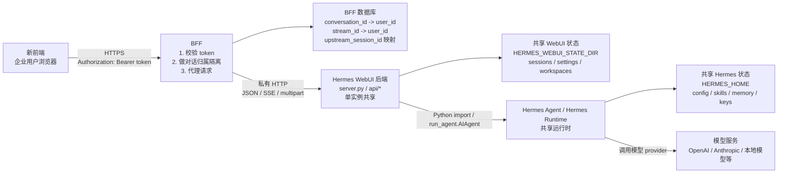
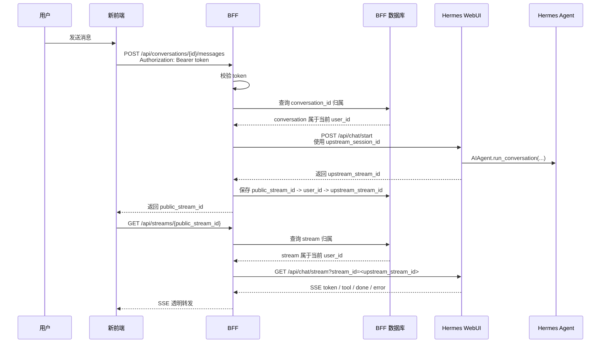

# 共享 Hermes 后端的 Token 鉴权与对话隔离设计

日期：2026-07-27

## 摘要

这份设计只覆盖一个轻量版本：新的前端通过 BFF 调用现有 Hermes WebUI
后端。BFF 只做 token 鉴权和用户级对话隔离，不做完整的租户隔离、workspace
隔离、skill 隔离、provider key 隔离或 memory 隔离。

所有已授权账号共享同一个 Hermes WebUI 后端、同一个 `HERMES_HOME`、同一个
`HERMES_WEBUI_STATE_DIR` 和同一套 Hermes 配置。不同用户之间只隔离聊天会话：
用户只能看到、继续、stream 和取消自己创建的对话。

这不是多租户强隔离设计。它适合企业内部可信账号使用同一个 Hermes 工作区，
同时希望聊天记录在账号之间不可见的第一阶段集成。

## 目标

- 新前端使用 `Authorization: Bearer <token>` 调用 BFF。
- BFF 校验 token，token 有效才允许访问 Hermes WebUI API。
- 所有用户共用一个 Hermes WebUI 后端实例。
- BFF 维护用户和对话的归属关系。
- 用户只能访问自己名下的对话和 stream。
- 保留 Hermes WebUI 现有 JSON API、multipart 上传和 SSE streaming 行为。
- 尽量不改 Hermes WebUI，只在 BFF 增加准入和对话归属控制。

## 非目标

- 不做一个用户一个 Hermes WebUI 进程。
- 不做一个租户一个 Hermes WebUI 进程。
- 不隔离 `HERMES_HOME`。
- 不隔离 `HERMES_WEBUI_STATE_DIR`。
- 不隔离 skills、memory、provider keys、profiles、cron jobs。
- 不做 workspace 的用户级文件权限系统。
- 不把 token 鉴权直接加进 Hermes WebUI。
- 不重写 Hermes Agent 或 Hermes WebUI 的核心 API。

## 架构

```text
user A ┐
user B ├─> 新前端 -> BFF -> 一个 Hermes WebUI -> 一个 Hermes Agent 状态
user C ┘
```

运行时只有一套：

```text
Hermes WebUI
  HERMES_HOME=/data/hermes/shared/hermes
  HERMES_WEBUI_STATE_DIR=/data/hermes/shared/webui
```

BFF 是公网或企业内网暴露的 API 边界。Hermes WebUI 只监听 `127.0.0.1` 或私有
容器网络，不能被浏览器绕过 BFF 直接访问。

组件关系如下：



## 共享内容

这一版明确允许所有有效账号共享：

- 模型配置
- provider keys
- skills
- Hermes memory
- profiles
- cron jobs
- workspace 列表和 workspace 文件访问能力
- Hermes WebUI 后端进程
- Hermes WebUI 状态目录

这意味着：只要用户 token 有效，他就可以使用同一个 Hermes 运行环境。BFF 不负责
判断某个用户是否可以使用某个模型、skill、provider 或 workspace。

## 隔离内容

这一版只隔离对话。

用户 A 不能：

- 在会话列表里看到用户 B 的对话
- 读取用户 B 的 `session_id`
- 继续用户 B 的对话
- 订阅用户 B 的 SSE stream
- 取消用户 B 的 stream

BFF 应该把外部对话 ID 和 Hermes WebUI 内部 session ID 分开：

```text
frontend conversation_id -> BFF -> upstream Hermes session_id
```

前端只使用 `conversation_id`。Hermes WebUI 的 `session_id` 是 BFF 内部实现细节。

## BFF 数据模型

BFF 需要自己的持久化表或集合。

### conversations

```text
conversation_id
user_id
tenant_id
upstream_session_id
title
status
created_at
updated_at
last_message_at
```

### streams

```text
public_stream_id
user_id
tenant_id
conversation_id
upstream_stream_id
created_at
expires_at
status
```

`public_stream_id` 是 BFF 返回给前端的 stream ID。`upstream_stream_id` 是
Hermes WebUI 返回的真实 stream ID。

## BFF 存储位置

conversation 和 stream 映射表存放在 BFF 自己的持久化存储里。

它们不应该存放在：

- Hermes WebUI 的 `HERMES_WEBUI_STATE_DIR`
- Hermes Agent 的 `HERMES_HOME`
- 浏览器 localStorage、sessionStorage 或 cookie
- 前端可直接修改的任何客户端状态

推荐第一阶段使用 BFF 自己的数据库：

```text
BFF_DATABASE_URL=sqlite:////data/bff/state/conversations.db
```

如果 BFF 只有一个实例，SQLite 足够支撑企业内部百人以内账号规模。这个数据库跟随
BFF 部署，专门保存 token 主体和 Hermes WebUI session/stream 的映射关系。

如果 BFF 需要多副本部署、滚动发布不中断、或后续接入更完整的审计和报表，则改用
Postgres：

```text
BFF_DATABASE_URL=postgres://...
```

无论使用 SQLite 还是 Postgres，Hermes WebUI 都不直接读写这张表。只有 BFF 可以
读写 conversation ownership 和 stream ownership 数据。

`conversations` 必须持久化保存，因为它决定用户刷新页面后能看到哪些对话。
`streams` 可以设置较短 TTL，但也建议放在同一个 BFF 数据库里，保证发送消息和订阅
SSE 这两个请求之间能正确关联。

## 请求流程

消息发送和 SSE streaming 的总体流程如下：



### 创建对话

```text
POST /api/conversations
  -> BFF 校验 token
  -> BFF 调用 Hermes WebUI /api/session/new
  -> Hermes WebUI 返回 upstream_session_id
  -> BFF 保存 conversation_id -> upstream_session_id -> user_id
  -> BFF 返回 conversation_id
```

### 获取对话列表

```text
GET /api/conversations
  -> BFF 校验 token
  -> BFF 只查询当前 user_id 的 conversations
  -> BFF 返回当前用户自己的对话列表
```

BFF 不应该直接把 Hermes WebUI `/api/sessions` 的完整结果返回给前端，因为那会泄露
其他用户的对话。

### 获取单个对话

```text
GET /api/conversations/{conversation_id}
  -> BFF 校验 token
  -> BFF 校验 conversation_id 属于当前 user_id
  -> BFF 使用 upstream_session_id 调用 Hermes WebUI /api/session
  -> BFF 返回结果
```

如果对话不属于当前用户，返回 `404`。这样可以避免泄露“这个对话存在但你无权访问”
的信息。

### 发送消息

```text
POST /api/conversations/{conversation_id}/messages
  -> BFF 校验 token
  -> BFF 校验 conversation_id 属于当前 user_id
  -> BFF 调用 Hermes WebUI /api/chat/start
  -> Hermes WebUI 返回 upstream_stream_id
  -> BFF 保存 public_stream_id -> upstream_stream_id -> user_id
  -> BFF 返回 public_stream_id
```

### 订阅 stream

```text
GET /api/streams/{public_stream_id}
  -> BFF 校验 token
  -> BFF 校验 public_stream_id 属于当前 user_id
  -> BFF 调用 Hermes WebUI /api/chat/stream?stream_id=<upstream_stream_id>
  -> BFF 透明转发 SSE
```

BFF 必须保留 SSE 的增量转发，不能等完整响应结束后再返回。

### 取消 stream

```text
POST /api/streams/{public_stream_id}/cancel
  -> BFF 校验 token
  -> BFF 校验 public_stream_id 属于当前 user_id
  -> BFF 调用 Hermes WebUI 对应 cancel API
```

## 路由暴露

建议前端优先使用 BFF 自己定义的对话 API，而不是直接暴露 Hermes WebUI 的 session
API。

第一阶段建议暴露：

- `GET /api/models`
- `GET /api/skills`
- `GET /api/skills/content`
- `GET /api/conversations`
- `POST /api/conversations`
- `GET /api/conversations/{conversation_id}`
- `POST /api/conversations/{conversation_id}/messages`
- `GET /api/streams/{public_stream_id}`
- `POST /api/streams/{public_stream_id}/cancel`
- `POST /api/upload`，仅当新前端需要附件时开放

对于只读共享资源，例如 models 和 skills，可以直接代理到 Hermes WebUI。对于对话相关
路由，必须经过 BFF 的 conversation ownership 检查。

## BFF 职责

BFF 应该：

- 校验 bearer token。
- 从 token 中解析 `user_id` 和 `tenant_id`。
- 记录访问日志，但不能记录 bearer token。
- 代理 JSON API、multipart 上传和 SSE。
- 将 conversation 和 stream 映射保存在 BFF 自己的数据库中。
- 维护 `conversation_id -> user_id -> upstream_session_id` 映射。
- 维护 `public_stream_id -> user_id -> upstream_stream_id` 映射。
- 对所有对话相关请求做 ownership 检查。
- 对不属于当前用户的 conversation 或 stream 返回 `404`。
- 保持 Hermes WebUI 私有，只允许 BFF 访问。

BFF 不应该：

- 把 Hermes WebUI 直接暴露给浏览器。
- 直接向前端返回完整 `/api/sessions` 列表。
- 信任前端传来的 `upstream_session_id` 或 `upstream_stream_id`。
- 做 workspace、skill、provider key、memory 的用户级隔离。
- 把所有 Hermes WebUI 路由无条件暴露给新前端。

## Token 校验

前端请求 BFF 时携带：

```http
Authorization: Bearer <access_token>
```

BFF 至少校验：

- token 签名
- issuer
- audience
- 过期时间
- `user_id`
- `tenant_id`

如果 token 缺失或无效，返回 `401`。

## 错误处理

- `401`：token 缺失、无效或过期。
- `404`：conversation 或 stream 不属于当前用户，或不存在。
- `409`：conversation 当前已有进行中的 stream，且产品不允许并发发送。
- `413`：上传体积超过限制。
- `502`：Hermes WebUI 不可达或返回异常。
- `504`：Hermes WebUI 请求超时。

对于 SSE，上游错误应尽量转换成 SSE `error` 事件，然后关闭连接。

## 安全边界

这一版的安全边界很窄：

```text
token 准入 + 对话归属
```

它不提供完整用户权限隔离。用户之间虽然看不到彼此的聊天记录，但仍然共享同一个
Hermes 运行环境。

需要特别接受这些结果：

- 一个用户对 shared workspace 的操作可能影响其他用户。
- 一个用户新增、修改或删除 skill 可能影响其他用户。
- provider key 是共享的，不区分用户。
- Hermes memory 是共享的，不区分用户。
- 模型配置是共享的，不区分用户。

如果这些共享行为不可接受，就应该切换到租户级 runtime 隔离或完整多租户后端设计。

## 测试计划

单元测试：

- token 校验接受合法 token。
- token 校验拒绝缺失、过期、issuer 错误、audience 错误的 token。
- 用户只能查询自己的 conversations。
- 用户不能读取其他用户的 conversation。
- 用户不能使用其他用户的 stream。
- BFF 不信任前端传入的 upstream session 或 upstream stream ID。

集成测试：

- 用户 A 创建 conversation 后，用户 A 可以读取。
- 用户 A 创建 conversation 后，用户 B 的列表中看不到。
- 用户 B 访问用户 A 的 conversation 返回 `404`。
- 用户 A 发送消息后可以订阅自己的 SSE stream。
- 用户 B 订阅用户 A 的 stream 返回 `404`。
- Hermes WebUI 不可用时，BFF 返回 `502` 或 `504`，且不泄露内部路径。

手动检查：

- 新前端可以加载共享模型列表。
- 新前端可以加载共享 skill 列表。
- 不同用户登录后只能看到自己的对话列表。
- 刷新页面后，对话归属仍然正确。
- 长连接 stream 断开后不会把 stream 归属遗留成可复用状态。

## 上线计划

1. 私有部署一个 Hermes WebUI 后端。
2. 新增 BFF token 校验。
3. 准备 BFF 数据库，用于保存 conversation 和 stream 映射。
4. 先开放 models、skills 只读代理。
5. 开放 conversation 创建、列表、详情。
6. 开放 chat start 和 SSE stream 代理。
7. 增加取消 stream 和上传能力。
8. 明确标注这一版不隔离 workspace、skills、provider keys 和 memory。

## 推荐结论

第一阶段采用共享 Hermes 后端和用户级对话隔离。

这版只有一个 Hermes WebUI runtime，运维简单，对现有 Hermes WebUI 改动小。BFF
负责 token 准入和 conversation ownership，不做完整权限系统。

如果后续企业要求 workspace、skills、provider keys 或 memory 也按账号隔离，再升级到
租户级 runtime 隔离或真正的多租户 Hermes API 后端。
