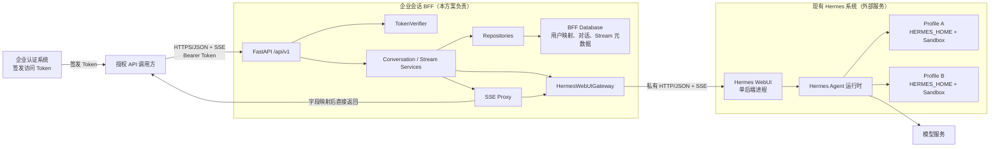
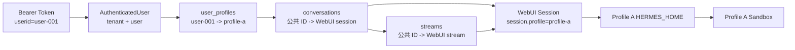
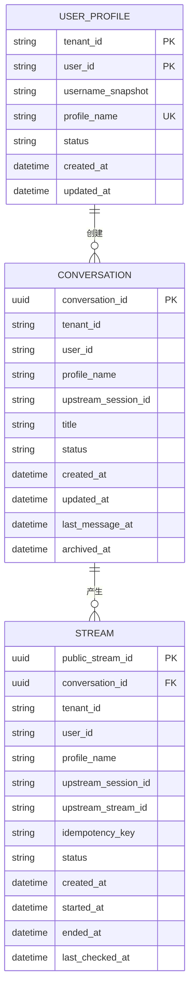
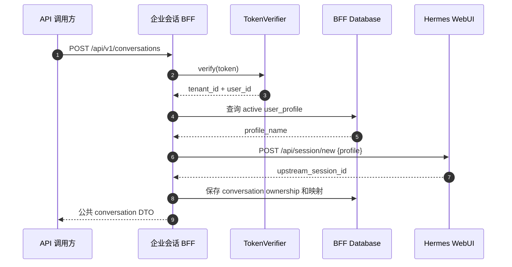
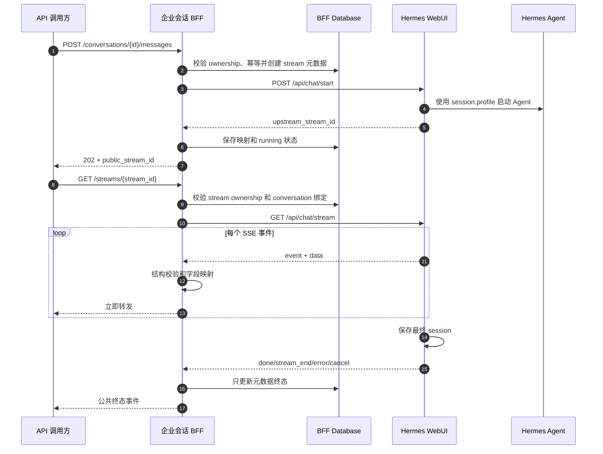
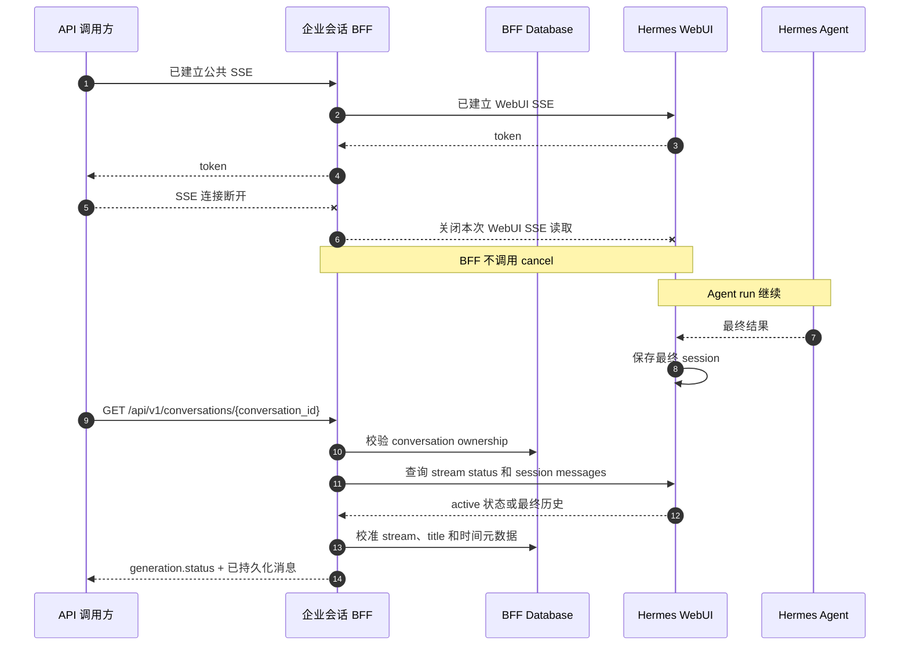
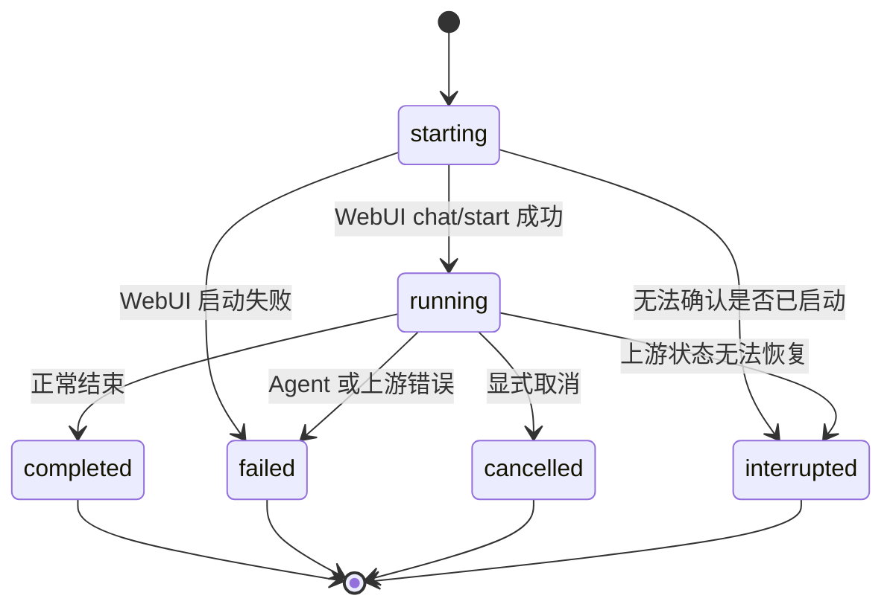
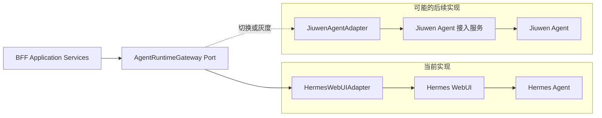

# 企业会话 BFF 设计串讲稿

日期：2026-08-05

状态：串讲评审稿

对应正式设计：
[企业会话 BFF 对接单 Hermes WebUI 的 Profile + Sandbox 隔离设计](../../docs/superpowers/specs/2026-07-27-shared-hermes-conversation-isolation-design.zh-CN.md)

## 一、需求背景与关键约束

### 1.1 需求背景

现有 Hermes WebUI 能够创建 session、调用 Hermes Agent、管理 profile，并通过 SSE
输出 Agent 结果，但它不认识企业 token，也没有基于企业 `userid` 的资源权限模型。

企业调用场景要求：

- 每个请求必须校验 token。
- 不同用户只能看到自己的历史对话。
- 不同用户使用不同 Hermes profile 和 sandbox。
- 对外不能暴露 WebUI 的内部 session ID、stream ID 和 profile 路径。
- Hermes 返回仍然使用流式接口。
- API 调用方与 BFF 的 SSE 连接断开后，不要求逐 token 续传；重新读取对话详情即可。

### 1.2 已确认约束

- 当前服务一个企业，账号不超过一百个。
- `tenant_id` 由 BFF 服务端配置固定提供。
- token 中有稳定且企业内唯一的 `userid`，以及展示用的 `username`。
- 每个用户固定绑定一个 Hermes profile。
- 只有一个 Hermes WebUI 后端进程。
- Hermes Agent 在 WebUI 进程空间中被调用。
- 不按用户启动独立 WebUI/Hermes 进程。
- BFF 和 WebUI 是两个独立服务，具有独立配置、进程和发布生命周期。
- Hermes WebUI 必须处在外部调用方不能直接访问的私有网络边界。

## 二、整体架构

### 2.1 总体架构图



### 2.2 服务关系

```text
企业会话 BFF
  是独立后端服务
  通过 HTTP/SSE 使用 WebUI

Hermes WebUI
  是 BFF 的私有服务端依赖
  管理 session 和 Agent run
  不识别企业 token 和 userid

Hermes Agent
  是 WebUI 的运行时依赖
  根据 session.profile 选择 HERMES_HOME 和 sandbox
```

### 2.3 各组件职责

| 组件 | 职责 |
| --- | --- |
| FastAPI Routes | 请求解析、DTO、鉴权依赖、HTTP/SSE 响应 |
| TokenVerifier | 验证 bearer token，输出可信身份 |
| ConversationService | 历史、新建、详情、发送消息用例 |
| StreamService | stream 归属、订阅、取消、状态校准 |
| Repositories | 带 tenant/user 条件的数据读写 |
| HermesWebUIGateway | WebUI JSON/SSE 请求、超时、响应校验 |
| SSE Proxy | 事件解析、字段白名单、直接转发 |
| BFF Database | 用户/profile、conversation、stream 元数据 |
| Hermes WebUI | session、stream、Agent 生命周期和历史持久化 |
| Hermes Agent | 模型和工具执行 |

## 三、核心概念与隔离关系

### 3.1 四个核心概念

| 概念 | 含义 | 数量关系 |
| --- | --- | --- |
| User | token 中的企业用户 | 一个用户固定绑定一个 profile |
| Profile | 一套独立 Hermes Home | 一个 profile 只绑定一个企业用户 |
| Conversation | BFF 对外暴露的对话 | 一个用户可以有多个 conversation |
| Stream | 一次消息触发的生成任务 | 一个 conversation 可以有多个 stream |

### 3.2 Profile 的实际形式

Hermes profile 不是账号对象，而是一套独立目录：

```text
~/.hermes/profiles/<profile_name>/
├── config.yaml
├── .env
├── SOUL.md
├── memories/
├── sessions/
├── skills/
├── skins/
├── logs/
├── plans/
├── workspace/
├── cron/
└── home/
```

它负责隔离模型配置、密钥、Memory、Skill、Hermes core session、工作目录以及终端工具
的 HOME。sandbox 不通过 BFF API body 传入，而是由该 profile 的运行配置生效。

例如可以在 profile `.env` 中配置：

```text
TERMINAL_SANDBOX_DIR=/data/hermes/sandboxes/enterprise-u001
```

### 3.3 Profile 不是企业权限边界

Profile 提供的是配置和文件目录隔离，不提供企业用户授权：

- WebUI 不知道 token 中的 `userid`。
- `hermes_profile` cookie 是 profile 选择，不是权限凭证。
- WebUI session 列表默认按 profile 过滤，但支持聚合查看。
- WebUI 单 session 查询根据 session ID 读取，没有企业 user ownership 校验。

因此不能把 WebUI 直接暴露给企业调用方。用户是否有权访问某个 session，必须由 BFF
根据 token 和数据库 ownership 决定。

### 3.4 完整隔离链路



固定规则：

1. token 决定 `tenant_id + user_id`。
2. 用户映射表决定 `profile_name`。
3. conversation 表决定用户可以访问哪个 WebUI session。
4. stream 表决定用户可以访问或取消哪个 WebUI stream。
5. WebUI session 保存 `session.profile`。
6. Agent run 根据 `session.profile` 解析 HERMES_HOME 和 sandbox。
7. BFF 记录与 WebUI session 的 profile 不一致时，按上游数据异常拒绝请求。

## 四、功能清单

| 功能 | 公开接口 | 核心设计 |
| --- | --- | --- |
| Token 鉴权 | 所有 `/api/v1` 业务接口 | TokenVerifier 输出 tenant/user 身份 |
| 用户 Profile 绑定 | 管理命令，不开放远程 API | `user_profiles` 固定映射 |
| 查询历史列表 | `GET /api/v1/conversations` | 只查询当前 tenant/user 的 BFF 记录 |
| 获取对话详情 | `GET /api/v1/conversations/{id}` | 归属校验后读取 WebUI session |
| 新建对话 | `POST /api/v1/conversations` | BFF 注入 profile 创建 WebUI session |
| 发送消息 | `POST /api/v1/conversations/{id}/messages` | 幂等启动 WebUI Agent stream |
| 订阅流 | `GET /api/v1/streams/{id}` | 校验归属后直接代理 WebUI SSE |
| 停止生成 | `POST /api/v1/streams/{id}/cancel` | 公共 stream ID 映射到上游 stream ID |
| 断线后读取 | `GET /api/v1/conversations/{id}` | 不重放 token，读取最终 session |
| 存活检查 | `GET /api/v1/health` | 只检查 BFF 进程 |
| 就绪检查 | `GET /api/v1/ready` | 检查数据库和 WebUI 可用性 |

## 五、数据库设计

### 5.1 数据关系图



### 5.2 `user_profiles`

作用：把企业用户固定映射到 Hermes profile。

| 字段 | 说明 |
| --- | --- |
| `tenant_id` | 当前企业范围，由服务端提供 |
| `user_id` | token 的稳定 userid |
| `username_snapshot` | 最近一次看到的展示名，不参与权限判断 |
| `profile_name` | Hermes profile 内部名称 |
| `status` | `active` 或 `disabled` |
| `created_at`、`updated_at` | UTC 时间 |

约束：

- 主键为 `(tenant_id, user_id)`。
- `profile_name` 全局唯一。
- username 变化不能改变用户归属。
- profile 由管理员提前创建，再通过管理命令建立绑定。
- API 调用方不能创建、选择或修改 profile。

示例：

```text
default-enterprise / user-001 -> enterprise-u001
default-enterprise / user-002 -> enterprise-u002
```

### 5.3 `conversations`

作用：建立“企业用户的公共对话”和“WebUI 内部 session”的映射。

| 字段 | 说明 |
| --- | --- |
| `conversation_id` | BFF UUID，对外暴露 |
| `tenant_id`、`user_id` | 对话归属 |
| `profile_name` | 创建时的 profile 快照 |
| `upstream_session_id` | WebUI session ID，只在服务端保存 |
| `title` | 历史列表标题缓存 |
| `status` | `active`、`archived`、`upstream_missing` |
| `created_at`、`updated_at` | UTC 时间 |
| `last_message_at` | 最近一次消息时间 |
| `archived_at` | 可空 |

所有资源查询必须直接使用：

```sql
WHERE tenant_id = :tenant_id
  AND user_id = :user_id
  AND conversation_id = :conversation_id
```

不能先按 `conversation_id` 查询，再在 application 内存中判断归属。

推荐索引：

```text
PK(conversation_id)
INDEX(tenant_id, user_id, last_message_at DESC, conversation_id DESC)
UNIQUE(upstream_session_id)
```

### 5.4 `streams`

作用：记录一个 conversation 中每一次流式生成任务，而不是记录每一个 SSE 事件。

例如：

```text
conversation A
├── stream 1：第一次消息生成，completed
├── stream 2：第二次消息生成，completed
└── stream 3：第三次消息生成，running
```

| 字段 | 说明 |
| --- | --- |
| `public_stream_id` | BFF UUID，对外暴露 |
| `conversation_id` | 所属公共 conversation |
| `tenant_id`、`user_id` | stream 归属 |
| `profile_name` | 本次 run 的 profile 快照 |
| `upstream_session_id` | 本次 run 的 WebUI session 快照 |
| `upstream_stream_id` | WebUI stream ID，只在服务端保存 |
| `idempotency_key` | 防止同一消息重复启动 |
| `status` | `starting/running/completed/failed/cancelled/interrupted` |
| 时间字段 | 启动、结束、最近状态校准时间 |

主要用途：

- 在“发送消息”和“订阅 SSE”两个 HTTP 请求之间保存 stream 映射。
- 校验 stream 是否属于当前用户和指定 conversation。
- 把公共 stream ID 转换成 WebUI stream ID。
- 取消生成。
- 防止相同消息请求重复启动 Hermes。
- SSE 断开或 BFF 重启后校准 run 状态。

数据库约束：

```text
UNIQUE(tenant_id, user_id, idempotency_key)

同一个 tenant_id + user_id + conversation_id
最多只能有一个 starting 或 running stream
```

### 5.5 消息与流数据的存储边界

数据按职责分别存储：

| 数据 | 存储位置 |
| --- | --- |
| 用户消息、模型最终回答和 Agent 运行结果 | WebUI/Hermes session |
| 用户与 profile 映射 | BFF `user_profiles` |
| 对话归属和 session ID 映射 | BFF `conversations` |
| 生成任务归属、stream ID 映射和运行状态 | BFF `streams` |

SSE 增量事件完成字段映射后直接转发，不执行逐事件数据库写入。连接断开后，调用方通过
对话详情接口读取 WebUI/Hermes session 中的最终消息。

## 六、身份与鉴权设计

### 6.1 可信身份对象

业务层只使用已经验证的身份对象：

```python
@dataclass(frozen=True, slots=True)
class AuthenticatedUser:
    tenant_id: str
    user_id: str
    username: str
```

字段来源：

```text
tenant_id <- BFF_TENANT_ID 服务端配置
user_id   <- token.userid
username  <- token.username
```

`username` 只用于展示和审计快照，不能作为数据库归属键。

### 6.2 TokenVerifier 端口

```python
class TokenVerifier(Protocol):
    async def verify(self, bearer_token: str) -> VerifiedTokenClaims:
        ...
```

本期正式 token 算法尚未确定，因此通过端口隔离：

- application service 不解析 JWT。
- application service 不知道 JWKS、共享密钥或 introspection。
- 开发模式可以使用显式测试 token 映射。
- 开发 token 只允许在 `BFF_ENV=development` 使用。
- 生产没有正式 verifier 时，应用启动必须失败。
- 生产禁止只解码但不验签 JWT。

### 6.3 每个请求的固定校验顺序

```text
1. 验证 bearer token
2. 建立 tenant_id + user_id
3. 查询 active user_profile
4. 带 tenant_id + user_id 查询 conversation/stream ownership
5. ownership 成功后才能取得上游 ID
6. 使用数据库 profile 调用 WebUI
7. 核对 WebUI session.profile
```

不存在和属于其他用户的资源统一返回 `404`，避免泄露资源是否存在。

## 七、BFF 公开接口

### 7.1 接口总览

| 方法 | 路径 | 功能 |
| --- | --- | --- |
| `GET` | `/api/v1/conversations` | 查询当前用户历史列表 |
| `GET` | `/api/v1/conversations/{conversation_id}` | 查询对话详情和生成状态 |
| `POST` | `/api/v1/conversations` | 新建对话 |
| `POST` | `/api/v1/conversations/{conversation_id}/messages` | 发送消息并启动生成 |
| `GET` | `/api/v1/streams/{public_stream_id}` | 订阅公共 SSE |
| `POST` | `/api/v1/streams/{public_stream_id}/cancel` | 停止生成 |
| `GET` | `/api/v1/health` | 存活检查 |
| `GET` | `/api/v1/ready` | 就绪检查 |

所有业务接口要求：

```http
Authorization: Bearer <token>
```

### 7.2 通用错误格式

```json
{
  "error": {
    "code": "conversation_not_found",
    "message": "Conversation was not found.",
    "request_id": "request-id"
  }
}
```

错误响应不能包含：

- WebUI session ID。
- WebUI stream ID。
- profile 名称和目录。
- sandbox 路径。
- bearer token。
- 原始异常堆栈。

### 7.3 CORS

- 使用精确 `BFF_CORS_ALLOWED_ORIGINS` 白名单。
- 正式环境禁止 `*`。
- 允许方法为 `GET`、`POST`、`OPTIONS`。
- 允许请求头包括 `Authorization`、`Content-Type`、`Idempotency-Key`、
  `X-Request-ID`。
- 不使用认证 cookie，因此 `allow_credentials=false`。
- 合法 origin 的 OPTIONS 不要求 token，但实际业务请求必须鉴权。
- JSON、SSE、401 和 5xx 响应使用相同 CORS 策略。

## 八、依赖的 WebUI 接口

| 能力 | WebUI 接口 | BFF 使用方式 |
| --- | --- | --- |
| 创建 session | `POST /api/session/new` | body 注入数据库查出的 profile |
| 读取 session | `GET /api/session?session_id=...&messages=0/1` | ownership 成功后调用 |
| 启动 Agent | `POST /api/chat/start` | body 传内部 session/profile/message |
| 订阅 SSE | `GET /api/chat/stream?stream_id=...` | 字段映射后直接代理 |
| 查询 stream 状态 | `GET /api/chat/stream/status?stream_id=...` | 刷新和重启校准 |
| 取消 stream | `GET /api/chat/cancel?stream_id=...` | BFF 对外包装为 POST |
| 删除空 session | `POST /api/session/delete` | 新建对话失败补偿 |

## 九、功能详细设计

### 9.1 用户 Profile 绑定

前置条件：Hermes 平台已经为用户创建 profile 和 sandbox。

绑定通过 BFF 管理命令完成：

```text
tenant_id + user_id -> profile_name
```

处理规则：

- 一个用户只能有一个 active profile。
- 一个 profile 不能同时绑定多个企业用户。
- profile 不存在时禁止建立映射。
- disabled 映射返回 `403 profile_not_available`。
- username 变化只更新 `username_snapshot`。
- Profile 绑定只通过 BFF 管理命令维护。

#### 新用户首次访问

当前一期不根据 `username`、`userid` 或请求参数自动创建 profile。新用户携带合法 token
首次访问时，处理流程如下：

```text
TokenVerifier 验证成功
  -> 得到 tenant_id + user_id
  -> 查询 user_profiles
  -> 没有映射
  -> 返回 403 profile_not_provisioned
```

随后由管理侧完成开户：

1. 使用稳定的 `tenant_id + user_id` 生成内部 profile 名称。
2. 在 Hermes 侧创建 profile、sandbox 和初始配置。
3. 校验 profile 目录、模型配置和 sandbox 均可用。
4. 通过 BFF 管理命令写入 `user_profiles`，状态设为 `active`。
5. 用户重新请求后，BFF 使用已经建立的固定映射。

profile 名称不能直接使用 username。建议使用符合 Hermes 命名规则的内部标识，例如：

```text
ent-a-u-7f3a8c21
```

这个名称必须稳定、不可由调用方选择，并且不能因为 username 修改而变化。百人以内规模
下，一期使用预创建和管理命令绑定可以控制复杂度；是否改成首次访问自动开户，作为后续
遗留问题单独决策。

### 9.2 查询历史列表

接口：

```http
GET /api/v1/conversations?limit=30&cursor=<opaque-cursor>
Authorization: Bearer <token>
```

流程：

1. 验证 token。
2. 使用 `tenant_id + user_id` 查询 conversations。
3. 按 `last_message_at DESC, conversation_id DESC` 排序。
4. 返回公共 conversation ID、标题、状态和时间。
5. 不扫描 WebUI 全量 session。

分页规则：

- 默认 30 条，最大 100 条。
- cursor 由 BFF 生成并校验。
- cursor 不能包含 WebUI session ID。

隔离保证：用户 A 的查询 SQL 不可能返回用户 B 的 conversation。

### 9.3 获取对话详情

接口：

```http
GET /api/v1/conversations/{conversation_id}
Authorization: Bearer <token>
```

流程：

1. 带 `tenant_id + user_id + conversation_id` 查询 ownership。
2. 查询该 conversation 最近的 `starting/running` stream 元数据。
3. 必要时调用 WebUI stream status 校准生成状态。
4. 使用内部 session ID 调用 WebUI session detail。
5. 核对 `session.profile == conversations.profile_name`。
6. 映射消息 DTO，删除上游 ID、profile、workspace 和内部字段。
7. 更新 title、last_message_at 和 stream 状态等元数据。
8. 返回完整消息和公共 `generation.status`。

返回结构示例：

```json
{
  "conversation": {
    "id": "conversation-uuid",
    "title": "示例对话",
    "status": "active",
    "created_at": "2026-08-05T10:00:00Z",
    "updated_at": "2026-08-05T10:02:00Z"
  },
  "generation": {
    "status": "completed"
  },
  "messages": [
    {"role": "user", "content": "你好"},
    {"role": "assistant", "content": "你好，有什么可以帮助你？"}
  ]
}
```

`generation.status` 取值：

```text
idle
starting
running
completed
failed
cancelled
interrupted
```

### 9.4 新建对话

接口：

```http
POST /api/v1/conversations
Authorization: Bearer <token>
Content-Type: application/json

{}
```

API 不接收 profile、workspace、WebUI session ID。



失败补偿：

- WebUI 创建失败：不写 conversations，返回 `502/504`。
- WebUI 创建成功但数据库提交失败：调用 `/api/session/delete` 删除刚创建的空 session。
- 删除补偿失败：只记录脱敏错误，由启动补偿扫描或管理命令处理。
- 响应中永远不返回上游 session ID。

### 9.5 发送消息

接口：

```http
POST /api/v1/conversations/{conversation_id}/messages
Authorization: Bearer <token>
Idempotency-Key: <request-uuid>
Content-Type: application/json

{
  "message": "你好"
}
```

流程：

1. 验证 token 和 message 长度。
2. 带 tenant/user 查询 conversation ownership。
3. 在数据库事务中检查幂等键和活动 stream。
4. 插入 `status=starting` 的 stream 预留记录。
5. 如果幂等键已存在，返回原 public stream，不调用 WebUI。
6. 提交事务后调用 WebUI `/api/chat/start`。
7. body 使用 conversation 中的 session/profile，不信任请求参数。
8. WebUI 成功后保存 upstream stream ID，更新为 `running`。
9. WebUI 失败时更新为 `failed`。
10. 返回 `202 Accepted + public_stream_id`。

返回示例：

```json
{
  "stream": {
    "id": "public-stream-uuid",
    "conversation_id": "conversation-uuid",
    "status": "running"
  }
}
```

并发规则：

- 同一个 conversation 同时最多一个 `starting/running` stream。
- 第二个不同消息请求返回 `409 conversation_busy`。
- 相同 `Idempotency-Key` 返回第一次的 public stream。
- BFF 不自动重试 `/api/chat/start`，避免重复启动 Hermes run。

### 9.6 订阅 SSE

接口：

```http
GET /api/v1/streams/{public_stream_id}?conversation_id={conversation_id}
Authorization: Bearer <token>
Accept: text/event-stream
```

流程：

1. 验证 token。
2. 使用 tenant/user/public stream/conversation 四个条件查询 stream。
3. 确认 stream 和 conversation 绑定一致。
4. 取得内部 upstream stream ID。
5. 打开 WebUI `/api/chat/stream`。
6. 按完整 SSE event 解析。
7. 校验事件结构并删除内部字段。
8. 立即写入当前 SSE 响应。
9. 收到终态事件后只更新 stream/conversation 元数据。
10. 关闭连接。



只有 `running` stream 可以建立订阅：

- `starting` 返回 `409 stream_not_ready`，可以稍后重试订阅。
- 已终止返回 `409 stream_not_active`，调用方应读取 conversation 详情。
- SSE 建立后 WebUI 断开，BFF 返回公共 error 事件并关闭连接。
- 公共 SSE 采用实时代理协议，不定义事件序号和 `Last-Event-ID` 重放语义。
- 连接中断后的恢复入口是 conversation 详情接口。

背压限制：

- 按事件处理，不在内存拼接整段回答。
- 限制单个 SSE event 大小。
- 调用方长期不读取导致写超时时，关闭两侧 SSE 连接。
- 关闭 SSE 连接不等于取消 Hermes run。

### 9.7 SSE 事件契约

| 公共事件 | 允许字段 | 说明 |
| --- | --- | --- |
| `token` | `text` | 模型文本增量，内容保持不变 |
| `reasoning` | 允许展示的文本字段 | reasoning 增量，内容保持不变 |
| `tool` | `name`、公共状态、必要摘要 | 不返回服务器路径和完整内部参数 |
| `tool_complete` | `name`、公共状态、必要摘要 | 工具完成 |
| `warning` | `code`、`message` | 公共警告 |
| `title` | `conversation_id`、`title` | 只使用公共 conversation ID |
| `done` | 公共 conversation/stream ID、状态 | 不透传完整 WebUI session |
| `stream_end` | 公共 ID、状态 | 正常连接终态 |
| `error` | `code`、`message`、`request_id` | 上游 `apperror` 映射为公共 error |
| `cancel` | 公共 ID、状态 | 取消终态 |
| `heartbeat` | 无业务数据 | 保持长连接 |

这里的“转换”只固定公开协议，不改写模型文本。BFF 删除：

- upstream session ID。
- upstream stream ID。
- profile 和 HERMES_HOME。
- workspace 和 sandbox 路径。
- 原始异常堆栈。
- WebUI `done` 中的完整 session。

转换后立即转发，不写数据库。

### 9.8 停止生成

接口：

```http
POST /api/v1/streams/{public_stream_id}/cancel?conversation_id={conversation_id}
Authorization: Bearer <token>
```

流程：

1. 验证 token。
2. 带 tenant/user 查询 public stream。
3. 验证 stream 确实属于 query 中的 conversation。
4. 取得 upstream stream ID。
5. 调用 WebUI `/api/chat/cancel`。
6. 将本地状态幂等更新为 `cancelled`。
7. 重复取消返回已有最终状态。

取消接口不能只根据 public stream ID 调用上游，必须同时校验用户归属和 conversation
绑定。

### 9.9 SSE 断开与刷新读取

本方案中的断线特指：API 调用方与 BFF 的 SSE 连接断开。



处理规则：

- BFF 感知调用方断开后，关闭对应的 WebUI SSE 读取。
- BFF 不调用 WebUI cancel。
- WebUI 的 Agent worker 独立继续执行。
- WebUI 完成后把最终结果保存到 session。
- 调用方重新读取 conversation 详情，以 WebUI/Hermes session 中的最终消息恢复展示。
- WebUI 仍 active 时返回 `generation.status=running`，稍后再次读取。
- WebUI 已结束时返回最终消息并校准 stream 终态。
- 调用方不能通过重复发送消息恢复显示。
- 相同幂等键不会启动第二次 run。

WebUI 当前可能为没有订阅者的活动 stream 保留进程内增量，但该缓冲不是持久化契约。
WebUI 完成清理或重启后，缺失增量不能重放，最终 session 才是恢复依据。

### 9.10 BFF 重启后的状态校准

BFF 启动时扫描 `starting/running` stream 元数据，不恢复 SSE 消费任务：

- `starting` 且没有 upstream stream ID：读取 WebUI session 的 active stream 信息；
  能确认则补齐映射，否则标记 `interrupted`。
- `running` 且 WebUI 仍 active：保留 `running`。
- `running` 但 WebUI 已不 active：读取最终 session，校准为
  `completed/failed/cancelled`。
- 任何情况下都不得自动重发原消息。

### 9.11 健康检查

```text
GET /api/v1/health
```

只检查 BFF 进程是否可响应，不访问数据库和 WebUI。

```text
GET /api/v1/ready
```

检查：

- 数据库连接和 schema 是否可用。
- Hermes WebUI 是否可访问。
- 生产 TokenVerifier 是否已正确配置。

## 十、状态机与一致性

### 10.1 Stream 状态机



### 10.2 事务边界

发送消息时不能把数据库事务跨 WebUI HTTP 调用长时间保持：

```text
事务一：
  校验 ownership、幂等键、活动 stream
  插入 starting 记录
  提交

外部调用：
  WebUI /api/chat/start

事务二：
  成功 -> 保存 upstream ID，更新 running
  失败 -> 更新 failed
```

### 10.3 幂等设计

`Idempotency-Key` 解决的是“调用方不知道第一次请求是否成功”问题：

```text
同用户 + 同 Idempotency-Key
  第一次：启动 Hermes，创建 stream
  后续重试：返回原 stream
```

幂等键不能由 BFF 每次随机生成，否则无法识别调用方重试。

### 10.4 权威数据来源

| 数据 | 权威来源 |
| --- | --- |
| token 是否有效 | 企业认证系统 / TokenVerifier |
| 用户属于哪个 profile | BFF `user_profiles` |
| 用户拥有哪个公共对话 | BFF `conversations` |
| 用户拥有哪个生成任务 | BFF `streams` |
| 完整消息历史 | WebUI/Hermes session |
| 当前 Agent 是否 active | WebUI stream status/session 状态 |

## 十一、错误处理

| HTTP 状态码 | BFF 语义 |
| --- | --- |
| `400` | 请求格式、cursor 或消息内容非法 |
| `401` | token 缺失、过期或验签失败 |
| `403` | 用户尚未配置 profile，或绑定的 profile 不可用 |
| `404` | conversation/stream 不存在或不属于当前用户 |
| `409` | conversation busy、stream not ready、stream not active |
| `422` | DTO 字段校验失败 |
| `502` | WebUI 不可达、响应非法或 profile/session 异常 |
| `504` | WebUI 普通请求超时 |

SSE 响应头发送后发生错误时：

```text
event: error
data: {"code":"upstream_stream_disconnected","message":"...","request_id":"..."}
```

随后关闭 SSE。错误事件不包含上游 ID、profile、服务器路径或异常堆栈。

## 十二、安全设计

### 12.1 信任边界

```text
可信：
  TokenVerifier 输出的 tenant_id/user_id
  BFF 数据库中的 profile 和上游 ID 映射

不可信：
  请求中的 conversation_id
  请求中的 public_stream_id
  请求中的 Idempotency-Key
  请求中的 Origin
  WebUI 返回的未经校验字段
```

### 12.2 主要风险与控制

| 风险 | 控制措施 |
| --- | --- |
| 用户猜测其他 conversation ID | 所有查询带 tenant/user 条件，未命中统一 404 |
| 用户订阅或取消其他 stream | 同时校验 user、stream、conversation 绑定 |
| 用户选择其他 profile | 公开 DTO 不接收 profile，只从数据库读取 |
| 用户绕过 BFF 调用 WebUI | WebUI 只允许私有网络访问 |
| 暴露上游 ID | 只对外暴露 BFF UUID，错误和日志脱敏 |
| 重复启动模型任务 | Idempotency-Key + 活动 stream 唯一约束 |
| SSE 内容形成第二份敏感数据 | SSE 字段映射后直接代理，数据库只记录 stream 元数据 |
| 生产 token 未验签 | 未配置生产 verifier 时启动失败 |
| profile runtime 串用 | 上线前执行双用户并发契约测试 |

## 十三、Profile 并发运行风险

当前 WebUI 已经具备：

- session 固定保存 profile。
- 请求级 thread-local profile。
- Agent run 根据 session.profile 解析 profile home。
- 每个 profile 独立 config、Memory、Skill 和 session 目录。
- 每个 run 构造 profile runtime env。

但 profile 目录本身不是 OS 安全边界，且部分 Hermes/WebUI 模块仍可能使用进程级
`os.environ` 或全局缓存。当前源码还明确记录了 MCP registry 可能按 server name
全局复用的问题。

因此上线前必须验证：

1. 用户 A 和用户 B 同时运行时，模型配置不串用。
2. `HERMES_HOME` 和 `.env` 不串用。
3. Terminal、workspace 和 sandbox 不串用。
4. Skill、Memory 和 MCP server 不串用。
5. 取消 A 的 stream 不影响 B。
6. WebUI session.profile 与 BFF profile 映射始终一致。

如果当前 Hermes 版本不能保证这些并发条件，需要由 Hermes 侧修复运行上下文缓存，或
在问题修复前串行化不同 profile 的 Agent run。不能仅凭“目录不同”宣称完成强隔离。

## 十四、配置项

```text
BFF_ENV=development
BFF_HOST=127.0.0.1
BFF_PORT=8080
BFF_TENANT_ID=default-enterprise
BFF_DATABASE_URL=sqlite+aiosqlite:////data/bff/state/enterprise-chat.db

HERMES_WEBUI_BASE_URL=http://127.0.0.1:8787
HERMES_WEBUI_CONNECT_TIMEOUT_SECONDS=5
HERMES_WEBUI_REQUEST_TIMEOUT_SECONDS=30
HERMES_WEBUI_SSE_READ_TIMEOUT_SECONDS=45

BFF_SSE_WRITE_TIMEOUT_SECONDS=15
BFF_SSE_MAX_EVENT_BYTES=1048576
BFF_MAX_MESSAGE_LENGTH=50000

BFF_AUTH_MODE=development
BFF_CORS_ALLOWED_ORIGINS=https://caller.example.com
BFF_CORS_MAX_AGE_SECONDS=600
```

配置约束：

- 真实 token、密钥和 profile `.env` 不能提交到仓库。
- 生产环境不能使用 development token verifier。
- 正式 CORS origin 必须逐项配置，不能使用示例值或通配符。
- BFF 数据目录不能与 WebUI state 或任一 profile HERMES_HOME 共用。

## 十五、测试与验收

### 15.1 单元测试

- token claims 正确转换为固定 tenant 的身份。
- username 修改不改变 ownership。
- 新用户没有 profile 映射时返回 `403 profile_not_provisioned`，且不自动创建 profile。
- conversation/stream 查询始终携带 tenant/user。
- 跨用户访问统一返回 404。
- profile 只能从 `user_profiles` 取得。
- 幂等键不会重复调用 WebUI。
- 同 conversation 第二个活动 stream 返回 409。
- SSE 字段映射保留 token/reasoning 文本，删除内部字段。
- SSE 代理只转发公共字段，repository 只维护 stream 元数据。
- 错误统一映射为公共 envelope。

### 15.2 集成测试

- 新建对话向 `/api/session/new` 注入正确 profile。
- 发送消息使用相同 profile 和 session。
- SSE 事件直接转发，不写数据库。
- subscribe/cancel 同时校验用户和 conversation 绑定。
- SSE 断开关闭读取但不调用 WebUI cancel。
- WebUI 完成后重新读取详情可以得到最终历史。
- WebUI 仍运行时详情返回 `generation.status=running`。
- BFF 重启后校准 running stream，不重发消息。
- 响应和日志不泄露上游 ID、profile 和路径。

### 15.3 双用户隔离测试

使用用户 A 和用户 B 同时验证：

- 两个用户只看到自己的历史列表。
- B 不能读取 A 的 conversation ID。
- B 不能订阅或取消 A 的 stream ID。
- 两个用户的新 session 使用不同 profile。
- 两个 Agent run 使用不同 HERMES_HOME 和 sandbox。
- A 的模型、Skill、Memory、MCP、workspace 不出现在 B 的运行环境。
- 主动断开 A 的 SSE 不影响 A 的 Hermes run，也不影响 B。

### 15.4 验收标准

- BFF 是独立服务，不导入或启动 WebUI/Hermes。
- 对外只暴露公共 conversation/stream ID。
- 所有资源查询都有 tenant/user ownership 条件。
- 创建和发送始终使用用户绑定的 profile。
- stream 订阅和取消校验 stream/conversation 绑定。
- WebUI 不能被外部调用方绕过访问。
- BFF 数据库只保存 ownership、ID 映射和运行状态元数据。
- SSE 断开不取消 Hermes run。
- Hermes 完成后重新读取详情可以获得最终历史。
- 双用户并发运行不存在 profile 或 sandbox 串用。
- 单元、集成、API 契约、Ruff 和 Mypy 检查通过。

## 十六、串讲时需要重点强调的取舍

### 16.1 为什么需要 BFF 数据库

因为 WebUI 不认识企业用户。BFF 必须保存：

```text
用户是谁 -> 使用哪个 profile
用户拥有哪个 conversation -> 对应哪个 WebUI session
用户拥有哪个 stream -> 对应哪个 WebUI stream
```

否则无法可靠完成历史隔离、订阅授权和取消授权。

### 16.2 为什么不能只靠 Profile 隔离历史

Profile 负责 Hermes 数据目录和运行上下文分组，不负责企业用户授权。WebUI 的单 session
接口没有 `userid` ownership 校验，因此必须由 BFF 先验证 conversation 归属。

### 16.3 为什么需要 `streams` 表

因为发送消息和订阅 SSE 是两个请求，同时还需要：

- 隐藏上游 stream ID。
- 校验订阅和取消权限。
- 防止重复启动模型任务。
- 限制同 conversation 并发生成。
- 断线和重启后校准状态。

一条 stream 记录代表一次生成任务，不代表一条 token 事件。

### 16.4 为什么 SSE 数据采用直接代理

调用方已经接受断线后重新读取最终历史，不要求逐 token 恢复。直接代理可以避免：

- 模型输出重复存储。
- 大量数据库写入。
- 更大的敏感数据范围。
- 事件顺序、保留期和清理复杂度。

最终消息由 WebUI/Hermes session 持久化，BFF 只维护 stream 归属和状态。

### 16.5 为什么断线后不取消 Hermes

SSE 连接只是结果传输通道，不应该决定 Agent 任务生命周期。调用方网络抖动时，Hermes
仍然应该完成任务并保存 session。只有显式调用 cancel API 才停止生成。

## 十七、常见评审问题

### Q1：一个用户是否对应一个 WebUI 进程？

不是。所有用户共享一个 WebUI/Hermes 进程，每个用户对应一个 profile 目录和 sandbox。

### Q2：Profile 是否等于企业用户？

不是。Profile 是 Hermes Home。企业用户由 token 和 BFF ownership 表示，BFF 再把用户
固定映射到 profile。

### Q3：历史消息存在哪里？

完整消息存储在 WebUI/Hermes session。BFF conversations 表只保存归属、公共 ID、
上游 session ID 和列表元数据。

### Q4：`streams` 表是否保存每个 token？

一条 streams 记录对应一次完整生成任务；事件内容由 WebUI/Hermes session 负责持久化。

### Q5：SSE 断开后丢失的 token 怎么处理？

不重放。Hermes 继续执行，完成后调用方重新读取 conversation 详情，获得最终历史。

### Q6：为什么不能直接使用 WebUI session ID？

它是内部 ID，直接暴露会绕过 BFF 的公共资源模型，并增加越权和上游实现耦合风险。

### Q7：为什么需要 Idempotency-Key？

调用方在超时后无法确认第一次消息请求是否成功。幂等键保证重试不会再次启动模型任务。

### Q8：一百个用户是否需要 PostgreSQL？

单 BFF 实例、低频元数据写入的前提下，SQLite 足够。需要多副本、滚动发布或集中审计
时再切换 PostgreSQL。

### Q9：Profile 目录不同是否已经是强安全隔离？

不是。它是文件和配置隔离。强隔离还依赖 BFF 授权、sandbox，以及 Hermes 运行时不
跨 profile 复用进程级环境或缓存。

### Q10：BFF 和 WebUI 谁是消息历史的权威来源？

WebUI/Hermes session 是消息权威来源；BFF 是企业用户 ownership 和公共 ID 的权威来源。

### Q11：新用户第一次访问时，Profile 从哪里来？

一期不自动推导或创建。没有映射时返回 `403 profile_not_provisioned`；管理侧创建 profile、
sandbox 和默认配置并写入 `user_profiles` 后，用户才能创建 conversation。

### Q12：以后切换 Jiuwen 是否要推翻 BFF？

不需要推翻公开鉴权、ownership 和 API 契约，但需要实现 Jiuwen adapter；如果 Jiuwen
没有 session、SSE、status、cancel 和历史持久化接口，还需要建设 Jiuwen Agent 接入
服务，并确定 Hermes 历史迁移方案。

### Q13：当前这些接口是否就是最终全部接口？

当前接口是已确认的核心对话能力。新增接口待页面与交互设计确定后，通过功能清单和接口
缺口分析另行确认。

## 十八、串讲收尾结论

本方案把职责拆成三层：

```text
BFF 鉴权和 Ownership
  解决“谁能访问什么”

Hermes Profile + Sandbox
  解决“这个 Agent run 使用哪套配置和执行环境”

WebUI/Hermes Session
  解决“消息历史和最终结果存在哪里”
```

最终采用：

```text
独立 FastAPI BFF
+ 三张元数据表
+ 单 Hermes WebUI 进程
+ 每用户固定 Profile/Sandbox
+ 直接 SSE 代理
+ 断线后读取最终 Session
```

这个设计满足百人以内单企业场景，同时避免按用户启动进程和重复保存模型输出。上线前
最重要的技术前置条件，是确认当前 Hermes/WebUI 版本在不同 profile 并发运行时不会
串用 HERMES_HOME、Terminal、Sandbox、Skill、Memory 或 MCP 缓存。

---

## 十九、遗留问题（待决策）

> **状态：待决策。** 以下事项不属于当前一期已确认范围，需要后续单独评审和立项。


### 19.1 Agent 框架从 Hermes 切换到 Jiuwen

当前方案的 Agent 框架使用 Hermes，但公司内部已有 Jiuwen Agent 框架。后续是否从
Hermes 切换到 Jiuwen，需要在 Agent 能力、公司技术规范、维护成本和迁移成本明确后
单独决策。

当前 BFF 与 Hermes 的直接耦合主要集中在：

- Hermes profile 和 HERMES_HOME 语义。
- Hermes WebUI session 创建和历史查询接口。
- Hermes WebUI chat start、SSE、status 和 cancel 接口。
- Hermes SSE 事件名称和 payload 结构。
- Hermes profile 下的 Memory、Skill、MCP、workspace 和 sandbox 组织方式。

不能假设 Jiuwen 与这些概念一一对应。切换前至少需要确认：

1. Jiuwen 如何表示用户运行空间，是否有 profile 或等价概念。
2. Jiuwen 的 session 和消息历史由谁持久化。
3. Jiuwen 如何启动一次 Agent run 并返回流式事件。
4. Jiuwen 是否支持查询运行状态和显式取消。
5. Jiuwen 的工具、Memory、Skill、MCP 和 sandbox 如何隔离。
6. Hermes 历史 session 是否需要迁移、只读保留或停止访问。
7. 切换期间是否需要 Hermes/Jiuwen 双栈运行和灰度路由。

### 19.2 Jiuwen 需要等价的 Agent 接入服务

Hermes WebUI 是围绕 Hermes 定制的服务，除界面能力外，它还承担了本方案实际依赖的
后端职责：session 管理、Agent run 启动、SSE 输出、状态查询、取消和最终历史保存。

如果 Jiuwen 本身没有提供这些稳定的服务端接口，就需要为 Jiuwen 建设一个等价的
“Agent 接入服务”。这里需要的是后端协议适配能力，不是重新建设展示界面。它至少要
提供：

```text
create_session
get_session
start_run
stream_run
get_run_status
cancel_run
delete_empty_session
resolve_user_runtime
```

建议的长期适配边界：



当前设计没有侵入式修改开源 Hermes WebUI，而是通过独立 Gateway 调用它；同时公开 API
只暴露 BFF conversation/stream ID，不暴露 Hermes profile、session ID 和 stream ID。
因此后续切换 Agent 时，可以尽量保留：

- Bearer Token 和 `AuthenticatedUser`。
- conversation/stream ownership 校验。
- BFF 公开 API 和错误协议。
- Idempotency-Key 和活动 run 并发控制。
- SSE 公共事件协议。
- CORS、日志和安全边界。

需要替换或迁移的部分集中在 Agent Gateway、运行空间映射、上游 session/stream 映射、
事件转换和历史数据。该设计能够缩小迁移范围，但不能消除 Jiuwen 与 Hermes 能力差异、
历史迁移和工具运行环境适配的工作量。

后续若 Jiuwen 切换已经进入明确规划，应把 application 层端口从具体的
`HermesWebUIGateway` 提升为 `AgentRuntimeGateway`，由 infrastructure 层分别实现
Hermes 和 Jiuwen adapter。在切换时间和 Jiuwen 协议尚未确认前，不提前重写当前一期
实现。

### 19.3 新用户 Profile 的确定与创建

当前一期已经确定的行为是：

- BFF 只消费 `user_profiles` 中已经存在的映射。
- profile 不能从 username 推导，也不能由 API 调用方传入。
- 没有映射的新用户返回 `403 profile_not_provisioned`。
- 管理侧预创建 Hermes profile、sandbox 和默认配置后，再写入绑定关系。

仍需在后续确认的长期问题：

1. 用户开户事件来自企业 IAM、组织管理系统还是首次 API 请求。
2. profile 和 sandbox 由 Hermes 平台、独立 Provisioner 还是 BFF 创建。
3. 是否需要首次访问即时创建，以及创建过程的超时、重试和失败补偿。
4. 新 profile 使用哪一份模型、Skill、Memory、MCP 和 sandbox 模板。
5. profile 名称生成规则、目录配额和资源限制。
6. 用户禁用、离职或删除后，profile、历史和 sandbox 保留多久。
7. 切换到 Jiuwen 后，`user_profiles.profile_name` 如何迁移为 Jiuwen 的运行空间标识。

如果未来采用自动开户，不建议在普通 conversation 请求中直接执行目录创建。应增加独立
的 Provisioner 状态机，例如：

```text
pending -> provisioning -> active
                      -> failed
active  -> disabled
```

届时需要扩展 `user_profiles.status` 以表达 `pending/provisioning/failed`。只有状态为
`active` 的运行空间才能创建 conversation。Provisioner 需要保证同一
`tenant_id + user_id` 并发开户幂等，并在 Agent 运行空间创建成功、BFF 映射提交失败时
执行补偿或进入可校准状态。

### 19.4 页面设计未确定，扩展接口范围待确认

当前公开接口已经能够完成核心对话闭环：

```text
Token 鉴权
查询历史列表
查询对话详情
新建对话
发送消息
接收流式结果
停止生成
断线后读取最终历史
```

目前页面的信息架构、功能入口和交互流程还没有完成设计，因此扩展接口范围需要在页面
方案确定后再确认：

```text
页面和交互设计确认
  -> 输出页面功能清单
  -> 对照现有 BFF API 做缺口分析
  -> 确定需要补充的 BFF API 和权限规则
  -> 更新 OpenAPI、设计文档和测试范围
```

新增能力统一通过 BFF 公共协议设计和评审，上游 WebUI 接口只作为内部适配依据。当前
BFF API 的承诺范围以已经确认的核心对话能力为准。

### 19.5 遗留问题结论

当前一期按以下边界实施：

```text
Agent 框架：Hermes
Agent 接入服务：Hermes WebUI
用户运行空间：预创建 Hermes Profile + Sandbox
用户绑定：BFF 管理命令写入 user_profiles
新用户未绑定：403 profile_not_provisioned
```

后续需要单独立项确认：

- 是否以及何时切换 Jiuwen。
- Jiuwen Agent 接入服务的协议和职责。
- Hermes 历史数据的迁移策略。
- 新用户运行空间是否自动创建。
- 运行空间 Provisioner 由哪个系统负责。
- 页面设计确定后还需要补充哪些功能接口。
- 扩展接口中哪些属于通用 Agent 能力，哪些属于 Hermes/Jiuwen 特有能力。
