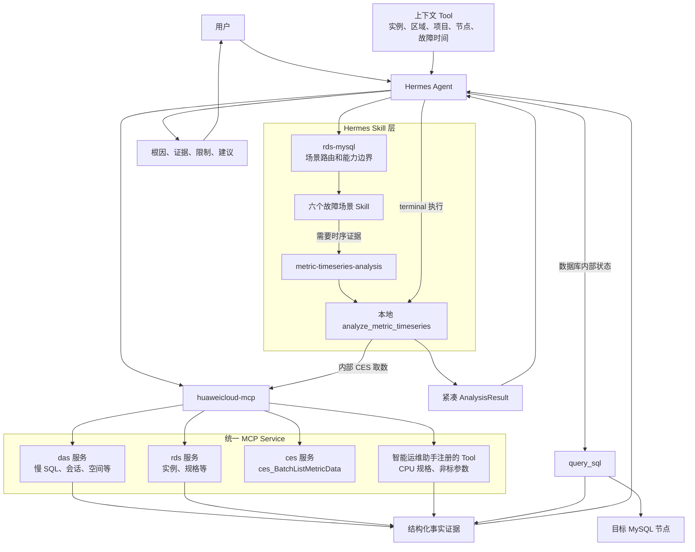
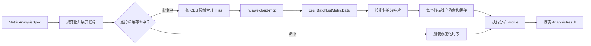
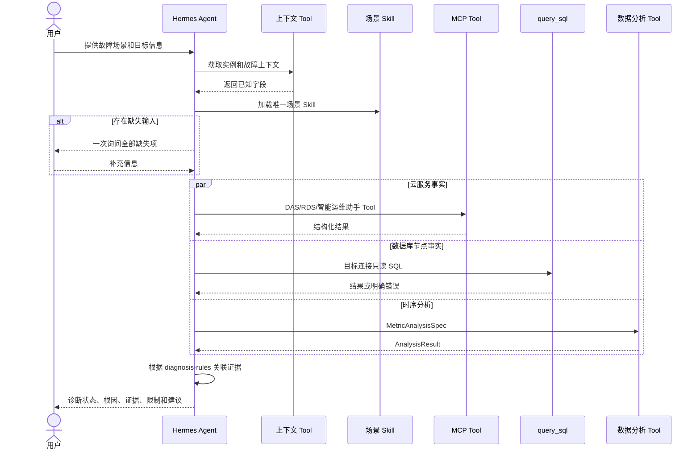

# RDS for MySQL 实时诊断 Skill 化设计串讲稿

日期：2026-08-06

状态：串讲评审稿

对应正式设计：
[RDS for MySQL 实时诊断 Skill 化实现设计](./mysql-metric-analysis-tool-design-zh.md)

## 一、需求背景与关键约束

### 1.1 需求背景

老版本实时诊断 Agent 使用 Python 代码完成：

- 故障场景识别和诊断流程。
- DAS、RDS 等云服务信息查询。
- 直接连接数据库执行 SQL 检查。
- CES 时序数据获取。
- 滑动窗口、异常检测、分位数和趋势预测。
- 根因解析和诊断结果生成。

当前已经切换到 Hermes Agent，需要将原系统按 Hermes 的 Skill 和 Tool 模型改造。

本次迁移原则：

- 不迁移老版本完整 Agent 框架。
- 不重新实现 DAS、RDS 已有能力。
- 通用数据分析逻辑迁入 Hermes，供多个数据库场景复用。
- DAS/RDS 缺少的专有查询由智能运维助手服务开放接口。
- 场景诊断过程使用 Skill 编排，不固化成一个不可扩展的单体诊断 Tool。

### 1.2 支持的故障场景

一期支持六类 RDS for MySQL 实时诊断：

1. CPU 利用率高。
2. 内存超限。
3. 慢 SQL。
4. 复制异常。
5. 复制延迟。
6. 磁盘满。

### 1.3 已确认约束

- service-category 使用 `rds-mysql`。
- 一个故障场景对应一个 Skill，不使用单一总诊断 Skill。
- 通用时序分析继续使用当前已经实现的 `analyze_metric_timeseries`。
- `analyze_metric_timeseries` 是 Hermes 本地 Tool，不是独立数据分析服务。
- DAS 和 RDS 是统一 MCP Service 下已经挂载的两个服务，目前只有部分接口可调用。
- CES 接口直接注册在 MCP Service 的 `ces` 服务下。
- `cpu_specifications` 和 `agent_health_check` 由智能运维助手服务实现，再注册到 MCP Service。
- 数据库内部状态使用 Hermes 插件已有的 `query_sql` 查询。
- 用户、上下文 Tool 或可信 Tool 结果提供诊断输入；上下文缺失时必须询问用户。
- `period` 没有默认值，缺失时询问用户。
- Tool 名称、输入和输出必须能让 LLM 理解。
- Tool 之间不得存在重复业务能力。
- CES 原始数据点不能进入 LLM 上下文。
- SQL 被白名单、安全规则或数据库权限阻断时，禁止在证据不足的情况下直接诊断。

## 二、整体架构

### 2.1 总体架构图



### 2.2 一句话解释每一层

```text
场景 Skill
  决定“当前故障要检查哪些根因、按什么规则组合证据”

DAS/RDS/智能运维助手/query_sql
  回答“当前实例实际是什么状态”

通用数据分析 Tool
  回答“指标是否越界、异常、持续上升或未来会继续增长”

Hermes Agent
  收集输入、调用能力、解释证据并生成最终诊断
```

### 2.3 服务关系

```text
MCP Service
├── das
│   └── 已注册部分 DAS Tool
├── rds
│   └── 已注册部分 RDS Tool
├── ces
│   └── ces_BatchListMetricData
└── 智能运维助手服务对应的服务代码
    ├── cpu_specifications 对应 Tool
    └── agent_health_check 对应 Tool
```

需要特别说明：

- DAS、RDS、CES 是一个 MCP Service 下的服务分类。
- CES 不挂在数据分析能力或智能运维助手服务下。
- 数据分析 Tool 在 Hermes 本地执行，只把 CES 当作内部取数依赖。

### 2.4 能力职责

| 组件 | 负责什么 | 不负责什么 |
| --- | --- | --- |
| `rds-mysql` category | 识别六个场景并路由 Skill | 不执行诊断算法 |
| 场景 Skill | 收集输入、执行诊断项、关联证据 | 不直接获取 CES 原始数据 |
| 数据分析 Tool | CES 获取、缓存、算法和紧凑结果 | 不判断最终 MySQL 根因 |
| DAS/RDS Tool | 云服务控制面和服务侧诊断事实 | 不重复实现通用数值算法 |
| 智能运维助手 Tool | 补齐 DAS/RDS 当前缺少的专有查询 | 不重复 DAS/RDS 已有接口 |
| `query_sql` | 查询当前数据库连接节点内部状态 | 不代表其他未连接节点 |

## 三、核心设计取舍

### 3.1 为什么按故障场景拆 Skill

如果使用一个总 Skill，CPU、内存、复制和磁盘的诊断项会全部堆在同一份提示中，容易出现：

- Agent 选错诊断项。
- 参数要求过多。
- 不同场景规则互相干扰。
- Skill 正文过大，不符合渐进式加载原则。

因此采用六个独立场景 Skill，并由 `rds-mysql/DESCRIPTION.md` 负责场景路由。

### 3.2 为什么不做一个单体诊断 Tool

单体 Tool 会重新把旧系统中的流程、查询和算法耦合在一起。采用 Skill 编排后：

- DAS/RDS 新增能力可以直接替换某个诊断项。
- 算法升级不要求修改场景流程。
- 其他 Agent 引擎也可以读取相同 Skill 做 Tool 编排。
- 每条结论可以追溯到具体 Tool 或 AnalysisResult。

### 3.3 为什么只保留一个通用分析 Tool

所有时序算法共享：

- region、project、指标和时间窗口。
- CES 批量查询。
- DatasetStore 和缓存。
- 统一错误和输出格式。

因此保留一个 `analyze_metric_timeseries`，通过互斥的 `analysis.profile` 选择算法。这样不会为每个算法重复实现 CES 和缓存链路。

### 3.4 为什么不把 CES 原始数据交给 LLM

CES 可能返回大量数据点。让 LLM 在“获取数据 Tool”和“分析 Tool”之间复制时序数组会带来：

- 上下文快速增长。
- terminal 输出截断风险。
- JSON 搬运和参数构造错误。
- 数据分析无法稳定复用缓存。

当前设计在本地数据分析 Tool 内完成获取、存储和分析，LLM 只拿到紧凑结论。

## 四、六个故障场景

### 4.1 场景总览

| 场景 | 主要诊断方向 | 能力来源 |
| --- | --- | --- |
| CPU 利用率高 | 规格、CPU 水位、磁盘时延、QPS/连接并发、慢 SQL、参数、会话 | 智能运维助手、时序分析、DAS |
| 内存超限 | 内存水位、QPS/连接并发、慢 SQL、参数、内存表、Performance Schema、会话 | 时序分析、DAS、智能运维助手、`query_sql` |
| 慢 SQL | SQL 模板、非标参数、实时/慢会话 | DAS、智能运维助手 |
| 复制异常 | 非标参数、复制线程和错误状态 | 智能运维助手、`query_sql` |
| 复制延迟 | 规格、容量、CPU 趋势、长事务、磁盘时延、Query Cache、参数 | RDS、智能运维助手、时序分析、`query_sql` |
| 磁盘满 | 空间分布、磁盘增长预测、TOP 库表 | DAS、时序分析 |

### 4.2 CPU 利用率高

```text
CPU_SPEC
CPU_USAGE
DISK_LATENCY
HIGH_CONCURRENCY_QPS
HIGH_CONCURRENCY_CONN
SLOW_SQL_INFO
AGENT_HEALTH_CHECK
SESSION_INFO
```

重点判断：

- CPU 是否为共享型规格。
- CPU P75 和中位数是否达到异常条件。
- 读写时延是否在滑动窗口内高频越界。
- CPU 与 QPS 是否在故障前 30 分钟同时突增。
- CPU 与活跃连接是否在故障前 30 分钟同时突增。
- 是否存在高频或高耗时 SQL 模板。
- 是否有非标参数和异常会话。

输出不能只复述“CPU 高”，必须指出已经得到证据的根因方向。

### 4.3 内存超限

```text
MEMORY_USAGE
HIGH_CONCURRENCY_QPS
HIGH_CONCURRENCY_CONN
SLOW_SQL_INFO
AGENT_HEALTH_CHECK
MEMORY_TABLE_CHECK
PERFORMANCE_SCHEMA_CHECK
SESSION_INFO
```

除内存水位和高并发外，还需要通过 `query_sql` 判断：

- 是否存在 MEMORY 引擎表。
- 当前连接节点是否开启 `performance_schema`。

这些 SQL 结果只代表实际连接节点。查询无权限时，对应根因必须标为未确认。

### 4.4 慢 SQL

```text
SLOW_SQL_INFO
AGENT_HEALTH_CHECK
SESSION_INFO
```

主要组合：

- DAS 历史慢 SQL 模板。
- 当前实时会话和慢会话。
- 可能导致 SQL 性能退化的非标参数。

如果历史慢 SQL 数据不可用，不能仅凭当前会话断言历史根因。

### 4.5 复制异常

主实例和只读实例都执行：

```text
AGENT_HEALTH_CHECK
SHOW_SLAVE_STATUS
```

关键要求：

- 必须连接实际目标节点。
- 主实例查询结果不能替代只读实例。
- `SHOW SLAVE STATUS` 或 `SHOW REPLICA STATUS` 无权限、无结果时不能判定复制正常。

### 4.6 复制延迟

基础诊断项：

```text
CPU_SPEC
CPU_USAGE_TREND
LONG_TRANSACTION
AGENT_HEALTH_CHECK
DISK_LATENCY
QUERY_CACHE_CHECK
```

只读实例分支额外执行：

```text
CPU_MEM_CAPACITY
```

重点判断：

- CPU 使用率是否持续上升。
- 长事务指标在诊断时间段内是否超过阈值。
- 读写时延是否持续高频越界。
- 目标节点 Query Cache 配置是否异常。
- 只读实例 CPU/内存规格是否不足。

### 4.7 磁盘满

```text
DISK_DISTRIBUTION
DISK_INCREASE_ABNORMAL
TOPDATA_RECENT
```

诊断链路：

```text
DAS 空间分析
  找到主要空间占用

磁盘使用量 Prophet 预测
  判断是否持续增长及未来容量风险

DAS TOP 数据
  找到近期占用或增长靠前的库表
```

磁盘指标不能把 Prophet 预测出的负值解释为真实使用量。当前非负下界约束仍是待补能力。

## 五、通用数据分析 Tool 和 CES

### 5.1 老能力迁移关系

| 老版本能力 | 当前 Profile | 用途 |
| --- | --- | --- |
| `SingleRowDataFrameSlidingWindowRouter` + 部分 `ParseResReadWriteLatency` | `sliding_window_threshold_frequency_detection` | 滑动窗口阈值频次检测 |
| `DetectAbnormalRange` | `spike_drop_detection` | 单指标突增或突降检测 |
| `DetectAbnormalRange` + `ParseResHighConcurrencyQPS` | `coincident_anomaly_detection` | 两个指标故障前关联异常 |
| `GetAbnormalRange` + `ParseResResourceNotEnough` | `median_p75_statistics` | 中位数和 P75 |
| `GetAbnormalTrend` + `ParseResCpuUsageTrend` | `rising_trend_detection` | 数据持续上升判断 |
| `ProphetPredict` + `ParseResDiskUsage` | `trend_prediction` | 未来七天趋势预测 |

还需新增：

```text
interval_threshold_exceedance_detection
```

用于判断 `rds_long_transaction` 在整个诊断时间段内是否至少一次超过阈值。

### 5.2 Tool 输入输出

输入只包含 LLM 能理解并能从上下文、用户或 reference 获得的字段：

```text
region
project_id
metric.namespace
metric.metric_name
metric.dimensions
time_window.from
time_window.to
period
analysis.profile
analysis 的 Profile 专属参数
```

不对 LLM 暴露：

```text
dataset_ref
cache key
cache index
文件路径
CES 原始响应
原始 datapoints
```

成功结果：

```text
success
metric_name
profile
summary
findings
statistics（可选）
forecast（可选）
```

### 5.3 CES 数据流



CES 规则：

- 单次最多 500 个指标。
- 指标数乘以时间跨度再除以粒度不能超过 3000。
- 请求体不能超过 512 KB。
- 多指标超限时按指标拆批，不缩短单指标时间范围。
- CES 一次返回多个指标时，缓存仍按单指标拆分。
- `filter` 内部固定为 `average`。

### 5.4 缓存策略

缓存的是 CES 时序 dataset，不是分析结果。

cache key 使用规范化单指标 CES 查询的 SHA-256，包含：

```text
project_id
region
namespace
metric_name
dimensions
from/to
period
固定 filter
规范化和后端版本
```

淘汰只在两个时机发生：

1. 读取时发现 TTL 或文件完整性失效，惰性淘汰。
2. 写入后超过容量，先删过期项，再按 LRU 淘汰。

不使用后台定时淘汰任务。

## 六、Hermes Agent Skill 设计

### 6.1 目录结构

```text
skills/
  rds-mysql/
    DESCRIPTION.md
    DESCRIPTION.zh-CN.md
    high-cpu-usage-diagnosis/
      SKILL.md
      SKILL.zh-CN.md
      references/diagnosis-rules.md
    memory-limit-exceeded-diagnosis/
      SKILL.md
      SKILL.zh-CN.md
      references/diagnosis-rules.md
    slow-sql-diagnosis/
      SKILL.md
      SKILL.zh-CN.md
      references/diagnosis-rules.md
    replication-exception-diagnosis/
      SKILL.md
      SKILL.zh-CN.md
      references/diagnosis-rules.md
    replication-delay-diagnosis/
      SKILL.md
      SKILL.zh-CN.md
      references/diagnosis-rules.md
    disk-full-diagnosis/
      SKILL.md
      SKILL.zh-CN.md
      references/diagnosis-rules.md
```

### 6.2 各文件职责

| 文件 | 职责 |
| --- | --- |
| `DESCRIPTION.md` | 描述 `rds-mysql` 能做什么、何时使用、六个场景和能力边界 |
| 场景 `SKILL.md` | 描述触发条件、输入收集、诊断项顺序、停止规则和最终输出 |
| `references/diagnosis-rules.md` | 保存场景业务规则、指标语义、Profile、阈值和异常条件 |
| 通用分析 reference | 保存 CES 指标 ID、dimensions、Profile 参数和 AnalysisResult 契约 |

场景 Skill 不复制 CES 指标目录和数据分析代码。

### 6.3 标准执行流程



### 6.4 输入收集

执行前必须确定：

| 输入 | 首选来源 | 缺失处理 |
| --- | --- | --- |
| 故障场景 | 用户描述或告警上下文 | 无法识别时询问六个场景之一 |
| `region` | 上下文 Tool | 询问用户 |
| `project_id` | 上下文 Tool | 询问用户 |
| `instance_id` | 上下文 Tool | 多实例时让用户选择 |
| 目标节点和连接 | 上下文 Tool、`list_database_info` | 主或只读节点不明确时询问 |
| 故障时间范围 | 用户自然语言、上下文 Tool | 一次询问并转换为毫秒时间戳 |
| `period` | 上下文 Tool | 询问用户，不使用默认值 |

不要求用户提供毫秒时间戳。Agent 负责把“最近一小时”“昨天 9 点到 12 点”等自然语言转换为分析输入。

### 6.5 `diagnosis-rules.md`

每个场景只保存本场景规则：

```text
check_item
capability
metric_semantics
profile
required_options
abnormal_condition
dependencies
failure_policy
```

通用 Profile 已经有默认值的算法参数不重复配置。`period` 属于每次诊断输入，不写入规则文件。

## 七、Tool 和接口设计

### 7.1 已有 MCP 服务

| 服务代码 | 当前 Tool 数 | 本次复用能力 |
| --- | ---: | --- |
| `das` | 47 | 慢 SQL、实时会话、空间分析、TOP 数据 |
| `rds` | 33 | 实例和只读节点规格容量 |
| `ces` | 以真实注册为准 | `ces_BatchListMetricData` |

当前已知 Tool：

| 能力 | MCP Tool |
| --- | --- |
| 慢 SQL 模板 | `das_ExportSlowSqlTemplatesDetails` |
| 实时会话、慢会话 | `das_ListProcesses` |
| 实例列表和容量 | `rds_ListInstances` |
| 空间分析 | `das_ListSpaceAnalysis` |
| TOP 库表 | 真实注册名称待确认 |

交付前必须在真实 MCP Service 中核对 Tool 名称和 schema，不在 Skill 中虚构名称。

### 7.2 智能运维助手新增接口

需要新增：

```text
cpu_specifications
agent_health_check
```

这两个接口由智能运维助手服务实现，再注册到 MCP Service。详细 schema 由对应接口设计补充。

公共约束：

- `project_id` 和 `instance_id` 必须位于 URL path。
- 服务端校验当前用户是否有权操作 `instance_id`。
- MCP Tool 名称、description、输入和输出必须表达业务语义。
- 不与 DAS/RDS 已有 Tool 重复。
- 成功结果返回事实，不直接生成最终根因。
- 错误需要区分参数错误、未授权、无权限、资源不存在、下游失败和内部错误。

### 7.3 `query_sql`

现有 Tool 合约：

```text
list_database_info()
  -> instance_id、instance_name、region_id、project_id、database、readonly、connection_id

query_sql(connection_id, sql)
  -> success、columns、rows、affected_rows、duration_ms
```

本次使用：

| 检查项 | SQL 语义 |
| --- | --- |
| 内存表 | 查询 `information_schema.TABLES` 中的 MEMORY 引擎表 |
| Performance Schema | 查询 `performance_schema` 系统变量 |
| Query Cache | 查询实际目标节点支持的 Query Cache 变量 |
| 复制状态 | 按 MySQL 版本查询 Slave 或 Replica 状态 |

## 八、错误、权限和诊断结论

### 8.1 为什么必须有 `inconclusive`

实时诊断不能只有“正常”和“异常”。以下情况都不能判定正常：

- Tool 调用失败。
- SQL 被白名单或安全 Hook 拦截。
- 数据库账号权限不足。
- 连接到了错误节点。
- CES 数据不可用。
- 关键诊断 Profile 尚未部署。

统一状态：

```text
abnormal
  有明确异常证据

normal
  所有必要诊断项成功且无异常

inconclusive
  关键输入、权限或证据缺失
```

### 8.2 Tool 失败处理

| 情况 | Agent 行为 |
| --- | --- |
| 缺少多个输入 | 一次询问所有缺失项，补齐前停止调用 |
| 参数不合法 | 根据 Tool message 修正一次，不试探类名或其他命令 |
| SQL 被拦截 | 不换同义 SQL 绕过，询问用户补充结果或处理权限 |
| 数据量过大 | 请求缩短时间范围或选择更大 `period` |
| CES 获取失败 | 停止该时序诊断项，保留其他证据并说明限制 |
| 内部分析失败 | 返回统一错误，真实堆栈只写内部日志 |
| 节点状态为空 | 结合角色和版本判断，不直接解释为正常 |

### 8.3 最终结果

```text
scenario
target
diagnosis_status
summary
root_causes
evidence
recommendations
limitations
```

每个根因必须能追溯到具体 ToolResult、AnalysisResult 或用户补充事实。

## 九、当前实现状态与交付计划

### 9.1 当前状态

| 工作项 | 状态 |
| --- | --- |
| 通用时序分析 Tool 框架 | 已实现 |
| CES MCP CLI Adapter | 已实现 |
| CES 多指标批量获取和单指标缓存 | 已实现 |
| 滑动窗口、突增突降、关联异常、P75/中位数、持续趋势、Prophet | 已实现 |
| `interval_threshold_exceedance_detection` | 待实现 |
| Prophet 非负指标下界 | 待实现 |
| CES Tool 在真实 MCP Service 的 `ces` 服务注册验证 | 待确认 |
| `cpu_specifications` 接口和 MCP Tool | 由其他 Agent 设计和实现 |
| `agent_health_check` 接口和 MCP Tool | 由其他 Agent 设计和实现 |
| DAS/RDS Tool 最终 schema 盘点 | 待实施 |
| DAS TOP 数据真实 Tool 名称 | 待确认 |
| 六个 `rds-mysql` 场景 Skill | 待实施 |
| 场景业务阈值迁移 | 待实施 |
| 端到端故障案例验证 | 待实施 |

### 9.2 建议交付顺序

```text
1. 确认 CES、DAS、RDS 真实 Tool 名称和 schema
2. 补充长事务区间阈值 Profile
3. 完成智能运维助手两个新接口及 MCP 注册
4. 创建 rds-mysql category 和六个场景 Skill
5. 迁移每个场景的 diagnosis-rules
6. 使用老版本典型故障案例做端到端回归
```

### 9.3 当前主要风险

| 风险 | 影响 | 控制方式 |
| --- | --- | --- |
| 真实 MCP schema 与设计假设不一致 | Skill 调用失败 | 落地前使用 MCP CLI 查询真实 schema 并固化 reference |
| 业务阈值未迁移 | 分析结果无法转成异常结论 | 阈值写入场景 `diagnosis-rules.md`，不让 LLM 推断 |
| 只连接主节点 | Query Cache、复制状态判断错误 | 通过 `readonly` 和 `connection_id` 明确目标节点 |
| SQL 权限不足 | 复制和数据库配置证据缺失 | 输出 `inconclusive` 并一次请求用户补充 |
| CES 大结果进入上下文 | 截断、成本和参数错误 | 数据分析 Tool 内部处理并只返回紧凑结果 |
| Prophet 负预测值 | 磁盘结论不符合物理意义 | 增加指标下界约束，完成前不把负值作为真实用量 |

## 十、测试与验收

### 10.1 场景回归

至少覆盖：

1. CPU 高且 QPS 同期突增。
2. CPU 高但 QPS、活跃连接无异常。
3. 内存超限且存在 MEMORY 表。
4. `query_sql` 无权限查询 Performance Schema。
5. 慢 SQL 历史数据不可用但存在当前慢会话。
6. 主实例和只读实例复制状态不一致。
7. 复制延迟且长事务指标发生阈值越界。
8. 复制延迟但长事务 Profile 尚未部署。
9. 磁盘历史数据不足七天。
10. CES 多指标部分缓存命中。
11. CES 单指标查询超过 3000 点限制。
12. 智能运维助手接口返回实例无权限。

### 10.2 验收标准

- 六个故障场景都能路由到唯一 Skill。
- 原诊断项没有遗漏。
- 场景 Skill 不直接调用 CES。
- CES 原始 datapoints 不进入 LLM 上下文。
- 多个输入缺失时只进行一次完整询问。
- `period` 缺失时不使用默认值。
- CPU/内存与 QPS/连接关联分析一次获取两个指标。
- 多指标响应按单指标缓存。
- 主实例结果不能替代只读实例结果。
- SQL 无权限或被阻断时不输出正常结论。
- 每个根因都能追溯到结构化证据。

## 十一、串讲时需要重点强调的取舍

### 11.1 Skill 编排不是把业务逻辑全部交给 LLM

业务规则仍然是确定的：

```text
哪个场景有哪些诊断项
诊断项使用哪个 Tool 或 Profile
什么结果构成异常
失败时是否允许继续
```

这些规则写在 Skill 和 `diagnosis-rules.md` 中。LLM 负责理解用户、调用能力和解释结构化证据，不自行发明阈值和根因规则。

### 11.2 通用分析能力不绑定 MySQL

数据分析 Tool 只处理指标、时间和算法，不知道“CPU 高故障”或“复制延迟根因”。MySQL 业务语义由 `rds-mysql` 场景 Skill 提供，因此后续其他数据库服务可以复用同一分析能力。

### 11.3 Tool 返回事实，Skill 形成诊断

例如：

```text
DAS 返回慢 SQL 模板
CES 分析返回 CPU 与 QPS 同时突增
query_sql 返回目标节点复制线程状态
智能运维助手返回非标参数
```

这些都是证据。最终“高并发导致 CPU 冲高”由场景 Skill 按规则关联得出，而不是由某个查询 Tool 直接输出。

### 11.4 为什么不重复开放慢 SQL、会话和空间接口

DAS/RDS 已经提供等价能力。重复接口会产生：

- 同一诊断项多个 Tool，不知道该选哪个。
- 输入输出不一致。
- 两套实现结果不一致。
- 后续维护和权限模型重复。

因此只补齐明确缺失的 CPU 规格和非标参数查询。

### 11.5 为什么错误不能自动重试很多次

缺失用户输入、无权限和 SQL 被拦截不是通过换参数就能解决的问题。重复试参会消耗 Tool 调用次数，也可能绕过原本的安全边界。正确行为是一次返回所有缺失项或明确受阻原因，再由用户补充。

## 十二、常见评审问题

### Q1：是不是要再建设一个数据分析服务？

不是。数据分析能力已经作为 Hermes 本地 Skill 和脚本实现，通过 `terminal` 执行。

### Q2：CES 接口挂在哪里？

挂在统一 MCP Service 的 `ces` 服务下，Tool 名称为 `ces_BatchListMetricData`。

### Q3：场景 Skill 会不会直接调用 CES？

不会。场景 Skill 调用通用数据分析 Tool，CES 只在数据分析 Tool 内部使用。

### Q4：为什么数据分析不拆成多个 Tool？

各算法共享 CES、缓存、输入和错误契约。一个入口配合明确 Profile 可以避免重复实现和 Tool 选择混乱。

### Q5：LLM 会拿到原始时序数据吗？

不会。LLM 只拿到 `summary`、`findings`、`statistics` 或 `forecast` 等紧凑结果。

### Q6：一次分析两个指标怎么处理？

`metric_name` 使用数组。关联分析一次传两个共享 namespace、dimensions、时间和 period 的指标；CES 批量获取后按单指标缓存，再在 Profile 内做关联判断。

### Q7：为什么缓存要按单指标拆分？

不同场景可能复用其中一个指标。按单指标缓存能支持部分命中，避免再次拉取已存在的数据。

### Q8：`period` 由谁决定？

优先从可信上下文取得，缺失时询问用户。当前不设置默认值。

### Q9：指标 ID 由用户提供吗？

不要求用户记指标 ID。Agent 根据场景规则和通用数据分析 Skill 的 RDS MySQL 指标 reference 选择准确 ID。

### Q10：为什么 CPU 规格和非标参数不能复用 RDS/DAS？

当前已经开放的 DAS/RDS Tool 没有覆盖这两个确定性查询，因此由智能运维助手服务补齐；如果后续 DAS/RDS 提供等价能力，应优先切换到官方 Tool，避免重复。

### Q11：`query_sql` 能在主节点查询只读节点状态吗？

不能假设可以。查询只代表实际连接节点。Query Cache、复制状态等节点相关检查必须连接目标节点。

### Q12：数据库用户没有权限怎么办？

不重复尝试绕过。Agent 记录具体受阻项，一次询问用户补充查询结果、选择有权限连接或处理权限，最终状态为 `inconclusive`。

### Q13：为什么复制延迟还有未实现项？

长事务需要判断“整个时间段内是否至少一次超过阈值”。现有滑动窗口 Profile 判断的是窗口内越界频次，语义不同，因此需要补充独立的区间阈值 Profile。

### Q14：其他 Agent 引擎能复用吗？

可以。其他引擎只要能读取同一 Skill、调用 MCP Tool，并遵循 `MetricAnalysisSpec -> AnalysisResult` 契约，就不需要依赖 Hermes 内部 Python 类。

### Q15：为什么不直接迁移旧 Agent？

旧 Agent 同时绑定流程、服务查询和算法，继续整体迁移会保留高耦合。当前分层可以复用云服务能力、独立升级算法，并让场景规则可审查、可扩展。

## 十三、串讲收尾结论

### 13.1 三层职责

```text
rds-mysql 场景 Skill
  解决“当前故障要检查哪些根因、怎样形成结论”

DAS/RDS/智能运维助手/query_sql
  解决“实例和数据库当前是什么事实状态”

通用数据分析 Tool + CES
  解决“监控指标在时间范围内发生了什么变化”
```

### 13.2 最终方案

```text
六个故障场景 Skill
+ 一个通用时序分析 Tool
+ DAS/RDS 已有 MCP Tool
+ CES 服务下的 BatchListMetricData
+ 智能运维助手两个新增接口
+ query_sql 数据库内部检查
+ 结构化证据和 inconclusive 状态
```

### 13.3 收尾结论

> 这套方案的核心不是增加更多 Tool，而是把每种能力放在正确的位置。场景 Skill 保留老版本
> 诊断知识，DAS/RDS 和数据库连接提供真实状态，通用分析 Tool 负责大体积 CES 数据和算法。
> 当前通用分析主体已经完成，后续重点是补齐长事务 Profile、两个智能运维助手接口和六个
> 场景 Skill，并用老版本故障案例验证诊断结果是否一致。

## 十四、遗留问题和本次评审关注点

### 14.1 已确认，不需要重复讨论

- service-category 使用 `rds-mysql`。
- 六个故障场景分别拆 Skill。
- 数据分析 Tool 继续使用当前本地实现。
- CES 注册在 MCP Service 的 `ces` 服务下。
- `cpu_specifications` 和 `agent_health_check` 由智能运维助手服务实现。
- DAS/RDS 已有能力直接复用。
- 数据库内部状态使用 `query_sql`。
- CES 原始数据不进入 LLM 上下文。

### 14.2 需要后续确认或补齐

1. DAS、RDS、CES 真实 MCP Tool schema 是否与当前设计一致。
2. DAS TOP 数据接口最终注册的 Tool 名称。
3. `cpu_specifications` 和 `agent_health_check` 的正式接口与 MCP schema。
4. 各场景业务阈值如何从老版本配置迁移到 `diagnosis-rules.md`。
5. `interval_threshold_exceedance_detection` 的最终输出字段和测试用例。
6. Prophet 非负指标物理下界的处理方式。
7. 六个场景的端到端基准案例和预期结论。

### 14.3 希望本次串讲达成的共识

- 认可场景 Skill、事实 Tool、通用分析三层分工。
- 认可 CES 只作为数据分析 Tool 的内部数据源。
- 认可只补齐 DAS/RDS 当前没有的接口，不建设重复 Tool。
- 认可权限或关键证据不足时返回 `inconclusive`。
- 认可按“接口确认、能力补齐、Skill 落地、案例验证”的顺序推进。
