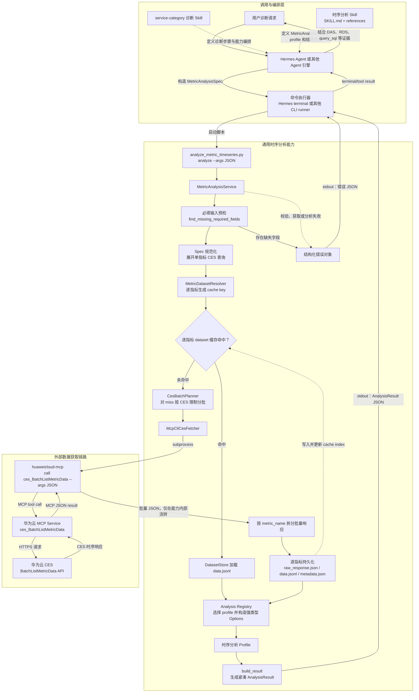

# CES 时序数据与通用分析能力设计

## 1. 文档定位

本文是通用指标时序分析能力的唯一技术设计，定义：

- `MetricAnalysisSpec -> AnalysisResult` 对外合约。
- CES 查询、MCP CLI Adapter、DatasetStore 和缓存的内部流程。
- 分析 profile、错误处理、CLI 和代码扩展方式。
- 当前已实现内容与尚未完成的适配项。

MySQL 故障诊断为什么使用该能力、如何编排 DAS/RDS/MCP/`query_sql`，见
[MySQL 故障诊断 Skill 编排与分析能力迁移设计](./mysql-metric-analysis-tool-design-zh.md)。

## 2. 需求背景

原 MySQL 故障诊断 Python 代码包含多种可复用的时序分析算法。迁移到 Hermes 后，这些算法不应继续绑定 MySQL，而应作为数据库和云服务都可以使用的通用能力。

时序分析存在两个关键约束：

1. CES 一次查询可能返回大量 datapoints，不适合进入 LLM 上下文。
2. LLM 不适合在“获取数据”和“分析数据”两个 tool 之间复制时序数组。

因此，对 LLM 和 service-category Skill 只提供高层分析入口。该入口内部完成：

```text
检查全部必填输入，缺失时一次返回结构化错误
-> 规范化请求
-> 将指标名数组展开为单指标 CES 查询
-> 逐指标查询时序数据缓存
-> 对缓存未命中的指标按 CES 限制分批调用 MCP CLI
-> 将批量响应拆分并按单指标保存原始响应和规范化数据
-> 执行指定分析 profile
-> 返回紧凑 AnalysisResult 或结构化错误对象
```

当前 CES MCP CLI 的实际入口为：

```text
huaweicloud-mcp
```

分析能力通过 `call ces_BatchListMetricData --args <JSON>` 调用 CES 批量指标
查询 tool。CLI 参数由 `MetricAnalysisSpec` 动态生成，不在 Skill 中写死具体
区域、项目、实例、指标或时间范围。

## 3. 目标与边界

### 3.1 目标

- 将六类时序分析算法迁移为跨数据库服务复用的能力，包括双指标关联异常分析。
- 对外只暴露小体积 `MetricAnalysisSpec` 和 `AnalysisResult`。
- 将 CES 数据获取封装在分析能力内部。
- 将原始响应和规范化时序数据保存到 DatasetStore。
- 缓存 CES 时序 dataset，避免同一查询重复拉数。
- 利用 CES 批量查询能力合并多指标 cache miss，同时保持一个指标一个 cache entry 和 dataset。
- 允许相同 dataset 被不同 profile 重复分析。
- 保留 MCP CLI 作为当前获取后端，并允许未来替换为 CES SDK/API。
- 通过 profile registry 扩展算法，不修改主编排流程。

### 3.2 非目标

- 不暴露 raw CES query 或 raw datapoints 给 LLM。
- 不提供独立的 `get_ces_timeseries_raw` LLM-facing tool。
- 不要求 service-category Skill 编排 CES、DatasetStore 或缓存。
- 不缓存 `AnalysisResult`、根因判断或 LLM 最终回答。
- 不修改 Hermes `terminal` tool。
- 不在本文定义完整 MySQL 故障诊断流程。
- 不允许 Skill 绕过分析入口直接拼接 CES MCP CLI 命令。

## 4. 功能方案

### 4.1 整体方案设计

对外边界只有：

```text
MetricAnalysisSpec -> AnalysisResult
```

#### 4.1.1 调用架构图



图中的实线表示运行时调用或数据流，虚线表示 Skill 指导关系或缓存索引更新。
原单指标 cache 子流程可简写为 `CLI --> Service --> Preflight --> Normalize --> Key --> Cache`；
当前实现由 `MetricDatasetResolver` 对指标数组中的每个元素执行该子流程。
`service-category` Skill 不直接调用 CES，也不在多个 tool 之间传递 datapoints；它只让
Agent 按时序分析 Skill 的契约构造 `MetricAnalysisSpec`。CES 原始响应、规范化时序、
dataset 路径和缓存元数据均停留在通用时序分析能力内部，跨边界返回的只有紧凑
`AnalysisResult` 或结构化错误对象。

### 4.2 能力边界

调用方可见：

- 指标、维度、时间窗口和 period。
- 显式选择的 `analysis.profile` 及其参数。
- 脚本返回的紧凑分析结论、结构化 findings，以及可选统计值或预测。

调用方不可见：

- CES tool 名称和 MCP Gateway 地址。
- CES 原始响应和完整 datapoints。
- DatasetStore 文件路径的内部传递过程。
- cache index、TTL 判断和淘汰过程。
- dataset 标识、cache hit、文件 hash/bytes 和其他运维属性。
- MCP CLI stdout 和 Hermes terminal 截断处理。

### 4.3 端到端数据流

```text
1. CLI 从 `--args` 解析 MetricAnalysisSpec JSON 对象字符串。
2. MetricAnalysisService 调用 find_missing_required_fields 聚合全部缺失字段。
3. 存在缺失字段时立即返回 missing_required_input，不执行 CES 查询。
4. normalize_metric_analysis_spec 校验已提供字段，将 metric_name 数组展开为内部 ces_queries。
5. MetricDatasetResolver 为每个单指标 ces_query 计算 cache key，CesBatchPlanner 在不改变 from/to 的前提下按 500 指标、3000 数据点和 512KB 限制形成锁与查询批次。
6. 每个批次按 cache key 稳定顺序获取该批涉及的文件系统锁，再由 cache_get 分别校验 index、TTL、dataset 文件和 sha256。
7. 缓存命中时从对应 DatasetStore 加载规范化数据，只保留该批缺失指标进入拉数流程。
8. 对该批缺失指标重新规划合法 CES 请求；全命中时不调用 CES。
9. CesFetcher 对每个仍有 miss 的批次调用 MCP CLI，并解析 CES 返回。
10. response_splitter 按 metric_name 将批量响应拆成单指标响应。
11. persist_dataset 为每个指标分别保存 raw_response.json、data.jsonl 和 metadata.json。
12. cache_put 分别写入单指标 cache index，并在超限时执行容量淘汰。
13. 当前批次持久化完成后立即释放该批 cache key 锁，继续下一批，最后合并为 series_by_metric。
14. service 根据 period 构造 AnalysisContext。
15. registry 根据 analysis.profile 将 JSON 参数转换为对应的不可变 Options。
16. profile 只接收 series_by_metric、AnalysisContext 和专属 Options 执行算法。
17. build_result 生成紧凑 AnalysisResult。
18. CLI 向 stdout 打印一个紧凑 JSON：AnalysisResult 或结构化错误对象。
```

### 4.4 当前实现状态

| 能力 | 状态 | 说明 |
| --- | --- | --- |
| 必填输入聚合预检 | 已实现 | `find_missing_required_fields` 一次返回公共字段、嵌套 metric/time_window 字段及所选 profile 必填参数；缺失时不调用 CES |
| `MetricAnalysisSpec` 规范化 | 已实现 | 按 CES schema 校验必填项、格式、长度、维度数量和时间戳范围；profile 参数严格校验并固定使用 `average` |
| 六个分析 profile | 已实现 | 五个单指标 profile 和一个双指标关联 profile 已拆分为独立模块并通过 registry 分发 |
| Profile 强类型参数边界 | 已实现 | 外部保留 `analysis` JSON；内部转换为 `AnalysisContext` 和各 profile 的不可变 Options，算法不接收完整 spec |
| DatasetStore | 已实现 | 保存 raw JSON、规范化 JSONL 和 metadata |
| 文件型 CES 缓存 | 已实现 | 支持 TTL 惰性淘汰和写入后容量淘汰 |
| Profile CLI 帮助 | 已实现 | 支持 `profiles` 和 `profile <name>` |
| 高层 `analyze --args '<JSON>'` | 已实现 | 直接接收 JSON 对象字符串并返回紧凑 JSON，不读写临时 spec 文件 |
| LLM 可见 `AnalysisResult` | 已实现 | 使用字段白名单，只返回诊断结论和证据，不返回 dataset、cache 或 trace 元数据 |
| MCP CLI 抽象接口 | 已实现 | `McpCliCesFetcher` 使用可注入的 CLI executable，并固定按 `call <tool> --args <JSON>` 构造 argv |
| 真实华为云 MCP CLI 命令形态 | 已实现 | 使用 `huaweicloud-mcp call ces_BatchListMetricData --args '<JSON>'` |
| CES API 请求/响应 schema | 已确定 | 以官方 `BatchListMetricData` 文档为准 |
| CES tool 名称和 MCP 参数包装 | 已确定 | tool 为 `ces_BatchListMetricData`；参数为扁平的 `region`、`project_id`、`metrics`、`period`、`filter`、`from`、`to` |
| MCP CLI 成功返回 schema | 已确定 | 外层包含 `tool`、`arguments`、`content`、`result`、`content_count`；CES 业务响应位于唯一的 `result` |
| 并发 single-flight | 已实现 | 同一 cache key 使用跨进程文件系统锁合并并发 miss |
| 多指标 CES 批量获取 | 已实现 | 只合并 cache miss；超限时按指标拆批，不缩短单指标时间范围 |
| 单指标缓存拆分 | 已实现 | CES 批量响应在落盘前按 metric_name 拆分，每个指标独立 cache key 和 dataset |
| 数据库 CES 参数 reference | 已实现 | 通用分析 Skill 在填写数据库指标 namespace、指标 ID 和 dimensions 前强制查阅独立 reference |

## 5. 详细功能设计

### 5.1 MetricAnalysisSpec

必填字段：

```text
region
project_id
metric.namespace
metric.metric_name
metric.dimensions
time_window.from
time_window.to
period
analysis.profile
```

可选字段：

```text
analysis profile options
```

示例：

```json
{
  "region": "cn-north-4",
  "project_id": "project-xxx",
  "metric": {
    "namespace": "SYS.RDS",
    "metric_name": ["rds001_cpu_util"],
    "dimensions": [
      {
        "name": "rds_cluster_id",
        "value": "32804075f7f14481a8fe9cd4b0e5c883in01"
      }
    ]
  },
  "time_window": {
    "from": 1784160000000,
    "to": 1784764800000
  },
  "period": 3600,
  "analysis": {
    "profile": "trend_prediction"
  }
}
```

字段说明：

| 字段 | 中文含义 | 类型 | 必填 | 来源 | 作用 |
| --- | --- | --- | --- | --- | --- |
| `region` | 云区域 | String | 是 | 分析能力自定义路由字段 | 指定 MCP CLI 调用的华为云区域，例如 `cn-north-4` |
| `project_id` | 项目 ID | String | 是 | CES | 定义见 CES 接口文档 |
| `metric` | 指标信息 | Object | 是 | 对共享 CES 指标字段的封装 | 描述本次需要查询和分析的一组同 namespace、同 dimensions 指标 |
| `metric.namespace` | 指标命名空间 | String | 是 | CES | 定义见 CES 接口文档 |
| `metric.metric_name` | 指标名称列表 | Array<String> | 是 | CES | 非空且不重复；数组元素定义见 CES 接口文档 |
| `metric.dimensions` | 指标维度 | Array<Object> | 是 | CES | 定义见 CES 接口文档；维度名由目标指标文档决定 |
| `metric.dimensions[].name` | 维度名称 | String | 是 | CES | 定义见 CES 接口文档 |
| `metric.dimensions[].value` | 维度值 | String | 是 | CES | 定义见 CES 接口文档 |
| `time_window` | 查询时间窗口 | Object | 是 | 对 CES `from/to` 的分组封装 | 组织本次查询的开始和结束时间 |
| `time_window.from` | 开始时间 | Integer | 是 | CES | 定义见 CES 接口文档 |
| `time_window.to` | 结束时间 | Integer | 是 | CES | 定义见 CES 接口文档 |
| `period` | 聚合周期 | Integer | 是 | CES | 定义见 CES 接口文档；adapter 调用 CES 时转成字符串 |
| `analysis` | 分析配置 | Object | 是 | 分析能力自定义 | 指定分析算法及其参数 |
| `analysis.profile` | 分析配置标识 | String | 是 | 分析能力自定义 | 选择 `analysis/registry.py` 中注册的分析实现 |

`analysis` 可选参数：

| 字段 | 中文含义 | 类型 | 适用 profile | 默认值 | 作用 |
| --- | --- | --- | --- | --- | --- |
| `threshold` | 阈值 | Number | `sliding_window_threshold_frequency_detection` | 无，必填 | 每个数据点与该值比较 |
| `direction` | 阈值比较方向 | String | `sliding_window_threshold_frequency_detection` | `above` | `above` 表示大于等于阈值，`below` 表示小于等于阈值 |
| `window_points` | 滑动窗口点数 | Integer | `sliding_window_threshold_frequency_detection` | `3` | 每个滑动窗口包含的数据点数量 |
| `min_frequency` | 最小命中次数 | Integer | `sliding_window_threshold_frequency_detection` | `ceil(window_points / 2)` | 一个窗口至少命中阈值多少次才生成 finding，且不能大于 `window_points` |
| `box_scale` | 箱线图范围倍数 | Number | `spike_drop_detection`、`coincident_anomaly_detection` | `3` | 使用 `Q1 - box_scale × IQR` 和 `Q3 + box_scale × IQR` 计算异常上下界 |
| `direction` | 突变检测方向 | String | `spike_drop_detection`、`coincident_anomaly_detection` | `up` | `up` 检测突增，`down` 检测突降，`all` 检测两个方向 |
| `window_size` | 突变检测平滑时长 | Integer | `spike_drop_detection`、`coincident_anomaly_detection` | `3600` | 均值和中值平滑的时间窗口，单位秒；内部结合有效时间粒度换算为奇数点窗 |
| `residual_sen` | 残差灵敏度 | Number | `spike_drop_detection`、`coincident_anomaly_detection` | `10` | 均值平滑残差的极差小于该值时直接判定无异常 |
| `nonzero` | 非零边界估计 | Boolean | `spike_drop_detection`、`coincident_anomaly_detection` | `false` | 为 `true` 时，计算箱线图上下界前排除零值 |
| `smoothing_time` | 平滑时间 | Integer | `median_p75_statistics` | `900` | 上层可传入的平滑时长，单位秒；省略时默认 15 分钟 |
| `time_point` | 故障时间点 | Integer | `coincident_anomaly_detection` | 无，必填 | 毫秒时间戳；关联判断窗口的结束时间 |
| `lookback_seconds` | 故障前回看时长 | Integer | `coincident_anomaly_detection` | `1800` | 检查 `[time_point-lookback_seconds, time_point]` 内两个指标是否都出现异常 |

`rising_trend_detection` 和 `trend_prediction` 没有额外分析参数。

字段规则：

- `project_id` 是 CES API 路径参数，必填，长度为 1 到 64。
- 用户提供自然语言时间范围；调用 Skill 结合当前时间和时区解析后，写入毫秒时间戳格式的 `time_window.from/to`，不要求用户直接提供时间戳。
- `metric.dimensions` 遵循 CES `MetricInfo.dimensions`，每项为 `{name, value}`。
- `metric.metric_name` 必须是非空、不重复的字符串数组；五个单指标 profile 要求恰好一个元素，`coincident_anomaly_detection` 要求恰好两个元素。
- 指标数组中的所有指标共享 namespace、dimensions、region、project_id、time_window 和 period；需要不同维度的指标必须拆成不同分析请求。
- `dimensions[].name` 必须使用目标指标文档定义的维度名；`instance_id` 只是示例。
- 数据库指标的 namespace、准确指标 ID 和维度 key 必须先查阅通用分析 Skill 的
  `references/ces-database-metric-parameters.zh-CN.md`，不得跨产品类推。
- dimensions 必须有 1 到 4 项，name 不能重复，name/value 按 CES 长度和格式校验，规范化后按 name 排序。
- 调用方不传 `filter`；内部 CES 请求固定使用 `average`。
- `analysis.profile` 必须显式填写，不根据自然语言自动猜测。
- `coincident_anomaly_detection.time_point` 必须位于 `time_window` 内，且 `time_window.from` 必须覆盖完整回看窗口。
- profile 只接受目录中声明的参数；类型、枚举、最小值和参数间约束在运行时统一校验。
- 缓存 TTL 和容量属于服务级策略，不允许通过 `MetricAnalysisSpec` 覆盖。

CES 批量查询指标数据接口参考：

```text
https://support.huaweicloud.com/api-ces/ces_03_0034.html
```

数据库服务目录及其监控指标文档入口参考：

```text
https://support.huaweicloud.com/api-ces/ces_03_0059.html
```

### 5.2 AnalysisResult

成功结果的稳定结构：

```json
{
  "success": true,
  "metric_name": ["cpu_util"],
  "profile": "trend_prediction",
  "summary": "Forecasted the next seven days with Prophet.",
  "findings": []
}
```

顶层字段：

| 字段 | 中文含义 | 类型 | 必填 | 作用 |
| --- | --- | --- | --- | --- |
| `success` | 执行是否成功 | Boolean | 是 | 成功结果固定为 `true`；调用方据此区分成功和错误结构 |
| `metric_name` | 指标名称列表 | Array<String> | 是 | 标识本次结论对应的一个或两个指标；元素定义见 CES 接口文档 |
| `profile` | 实际执行的分析配置 | String | 是 | 告诉 LLM 本次结果由哪一种分析算法产生 |
| `summary` | 分析摘要 | String | 是 | 提供可直接用于诊断编排的简短自然语言结论 |
| `findings` | 结构化发现 | Array<Object> | 是 | 返回算法识别出的事件、趋势或统计证据；没有匹配事件时为空数组 |
| `statistics` | 统计结果 | Object | 否 | 仅 `median_p75_statistics` 返回当前指标的分布统计 |
| `forecast` | 预测结果 | Object | 否 | 仅 `trend_prediction` 返回当前指标的预测详情 |

`findings` 始终是数组。事件检测类 profile 检测到事件时返回结构化记录，未检测到时返回空数组；统计和趋势类 profile 返回对应的结构化摘要记录。

`sliding_window_threshold_frequency_detection` 和 `spike_drop_detection` 最多返回前 20 条 findings，防止事件密集时结果膨胀进入 LLM 上下文。

`findings[]` 通用字段：

| 字段 | 中文含义 | 类型 | 必填 | 作用 |
| --- | --- | --- | --- | --- |
| `kind` | 发现类型 | String | 是 | 机器可读的结论类型，例如 `spike`、`drop`、`rising_trend`、`upward_trend` 或 `coincident_anomaly` |
| `severity` | 严重级别 | String | 是 | 当前实现使用 `info` 或 `warning`，供诊断流程区分普通信息和风险信号 |
| `metric_name` | 指标名称 | String 或 Array<String> | 是 | 单指标 finding 为字符串；`coincident_anomaly` 为两个指标名数组 |
| `confidence` | 置信度 | Number | 是 | 范围 `[0,1]`，表示算法对该 finding 的数值化可信程度，不等同于故障根因概率 |
| `time_window` | 事件时间窗口 | Object | 否 | 事件检测类 finding 的开始和结束毫秒时间戳 |
| `time_window.start` | 事件开始时间 | Integer | 条件必填 | 阈值窗口起始时间，或突变异常点时间 |
| `time_window.end` | 事件结束时间 | Integer | 条件必填 | 阈值窗口结束时间，或突变异常点时间 |
| `evidence` | 结构化证据 | Object | 是 | 保存支撑 finding 的紧凑数值；具体字段由 profile 决定 |

`kind` 与 profile 的对应关系：

| Profile | `kind` 值 | 中文含义 |
| --- | --- | --- |
| `sliding_window_threshold_frequency_detection` | `threshold_frequency` | 窗口内阈值命中次数达到要求 |
| `spike_drop_detection` | `spike` / `drop` | 残差或平滑趋势差分发生突增/突降异常 |
| `median_p75_statistics` | `distribution_summary` | 分布统计摘要 |
| `rising_trend_detection` | `rising_trend` / `falling_trend` / `no_clear_trend` | 相邻点变化次数显示上升、下降或无明显方向 |
| `trend_prediction` | `upward_trend` / `downward_trend` / `flat_trend` | 整体趋势为上升/下降/平稳 |
| `coincident_anomaly_detection` | `coincident_anomaly` | 两个指标在故障前同一回看窗口内均出现指定方向的异常 |

阈值频次 finding 的 `evidence`：

| 字段 | 中文含义 | 类型 | 作用 |
| --- | --- | --- | --- |
| `threshold` | 阈值 | Number | 本次比较使用的阈值 |
| `direction` | 比较方向 | String | `above` 或 `below` |
| `window_points` | 窗口点数 | Integer | 当前窗口包含的数据点数量 |
| `hit_count` | 命中次数 | Integer | 当前窗口中越过阈值的数据点数量 |
| `min_frequency` | 最小命中次数 | Integer | 生成 finding 所需的最少命中数 |

突增/突降 finding 的 `evidence`：

| 字段 | 中文含义 | 类型 | 作用 |
| --- | --- | --- | --- |
| `value` | 异常点值 | Number | 当前异常索引对应的原始指标值 |
| `residual` | 中值平滑残差 | Number | 原始指标值减去中值平滑值 |
| `residual_bounds.low` | 残差异常下界 | Number | 残差箱线图下界 |
| `residual_bounds.high` | 残差异常上界 | Number | 残差箱线图上界 |
| `trend_delta` | 平滑趋势变化量 | Number | 中值平滑序列在当前索引的一阶差分 |
| `trend_bounds.low` | 趋势差分异常下界 | Number | 趋势差分箱线图下界 |
| `trend_bounds.high` | 趋势差分异常上界 | Number | 趋势差分箱线图上界 |
| `triggers` | 异常触发来源 | Array<String> | 包含 `residual`、`trend` 或两者 |
| `window_size` | 平滑时长 | Integer | 本次检测使用的时间窗口，单位秒 |
| `window_points` | 平滑窗口点数 | Integer | 根据平滑时长和有效时间粒度换算得到的奇数点窗 |

上升趋势方向计数 finding 的 `evidence`：

| 字段 | 中文含义 | 类型 | 作用 |
| --- | --- | --- | --- |
| `judge` | 是否判定为上升趋势 | Boolean | 仅上升次数多于下降次数时为 `true` |
| `trend` | 趋势方向 | String | `upward`、`downward` 或 `no_clear_change` |
| `increasing_count` | 上升次数 | Integer | 相邻点差值大于 0 的数量 |
| `decreasing_count` | 下降次数 | Integer | 相邻点差值小于 0 的数量 |
| `unchanged_count` | 不变次数 | Integer | 相邻点差值等于 0 的数量，不参与方向大小比较 |
| `comparison_count` | 相邻比较次数 | Integer | 数据点数量减 1 |

`statistics` 以及分布统计 finding 的 `evidence`：

| 字段 | 中文含义 | 类型 | 作用 |
| --- | --- | --- | --- |
| `count` | 数据点数量 | Integer | 参与统计的数据点总数 |
| `min` | 最小值 | Number | 指标序列最小值 |
| `max` | 最大值 | Number | 指标序列最大值 |
| `median` | 中位数 | Number | 两端补零、中值平滑后的指标序列 p50 |
| `p75` | 75 分位数 | Number | 两端补零、中值平滑后的指标序列 p75 |

`forecast` 以及趋势类 finding 的 `evidence`：

| 字段 | 中文含义 | 类型 | 作用 |
| --- | --- | --- | --- |
| `forecast_hours` | 预测小时数 | Integer | 固定为 `168` |
| `start_time` | 预测开始时间 | Integer | 第一个预测点的 UTC 毫秒时间戳 |
| `end_time` | 预测结束时间 | Integer | 最后一个预测点的 UTC 毫秒时间戳 |
| `first_predicted_value` | 首个预测值 | Number | 第一个小时预测点的 Prophet `yhat` |
| `last_predicted_value` | 末个预测值 | Number | 最后一个小时预测点的 Prophet `yhat` |
| `min_predicted_value` | 最小预测值 | Number | 未来 168 小时 `yhat` 的最小值 |
| `max_predicted_value` | 最大预测值 | Number | 未来 168 小时 `yhat` 的最大值 |
| `mean_predicted_value` | 平均预测值 | Number | 未来 168 小时 `yhat` 的算术平均值 |
| `change` | 总变化量 | Number | 末个预测值减去首个预测值 |
| `change_ratio` | 总变化比例 | Number 或 Null | `change / abs(first_predicted_value)`；首个预测值为零时返回 `null` |
| `direction` | 趋势方向 | String | 根据首末预测值判断为 `upward`、`downward` 或 `flat` |

这些字段直接打印到 stdout，并通过 Hermes terminal tool result 进入 LLM 上下文，因此采用显式白名单。`AnalysisResult` 不包含：

```text
原始 datapoints
analysis_id / trace id
dataset_ref / dataset_id
cache_hit 或其他缓存状态
dataset 文件路径、sha256、bytes
内部 statistics_by_metric / forecast_by_metric
```

运维和缓存属性只保留在内部日志、DatasetStore 和 cache index。`AnalysisResult` 不承担缓存观测、文件定位或数据集重新加载职责。

### 5.3 分析 Profile

| Profile | 用途 | 参数 |
| --- | --- | --- |
| `sliding_window_threshold_frequency_detection` | 统计滚动窗口内越过阈值的频次 | `threshold` 必填；`direction` 默认 `above`；`window_points` 默认 3；`min_frequency` 默认 `ceil(window_points/2)` |
| `spike_drop_detection` | 过滤正常波动后检测残差或平滑趋势的突增、突降异常 | `box_scale` 默认 3；`direction` 默认 `up`；`window_size` 默认 3600 秒；`residual_sen` 默认 10；`nonzero` 默认 `false` |
| `median_p75_statistics` | 先进行中值平滑，再计算中位数和 p75 | `smoothing_time` 默认 900 秒，可由上层覆盖 |
| `rising_trend_detection` | 比较相邻点上升和下降次数，判断上升、下降或无明显方向 | 无额外参数；少于 2 个数据点时返回数据不足 |
| `trend_prediction` | 使用 Prophet 预测未来七天的小时级指标趋势 | 无额外参数；历史数据跨度至少为 7 天；固定预测未来 168 小时 |
| `coincident_anomaly_detection` | 判断两个指标是否都在故障前同一时间窗口发生突增或突降 | 恰好两个指标；`time_point` 必填；`lookback_seconds` 默认 1800 秒；其余参数与突增突降检测一致 |

参数定义的代码事实来源是 `analysis/profile_catalog.py`。调用方通过 CLI 查询，避免文档与实现漂移：

```bash
python skills/metric-timeseries-analysis/analyze-metric-timeseries/scripts/analyze_metric_timeseries.py profiles
python skills/metric-timeseries-analysis/analyze-metric-timeseries/scripts/analyze_metric_timeseries.py profile trend_prediction
python skills/metric-timeseries-analysis/analyze-metric-timeseries/scripts/analyze_metric_timeseries.py profile sliding_window_threshold_frequency_detection --help
```

`profiles` 命令结果：

| 字段 | 中文含义 | 类型 | 作用 |
| --- | --- | --- | --- |
| `profiles` | 支持的分析配置列表 | Array<String> | 返回所有已注册 profile 名称，供 LLM 选择后继续查询参数 |

`profile <profile-name>` 命令结果：

| 字段 | 中文含义 | 类型 | 作用 |
| --- | --- | --- | --- |
| `name` | 分析配置标识 | String | 可填写到 `analysis.profile` 的值 |
| `summary` | 能力摘要 | String | 简述该 profile 做什么 |
| `use_for` | 适用场景 | String | 告诉 LLM 什么时候应选择该 profile |
| `min_metric_count` | 最少指标数 | Integer | 该 profile 接受的 metric_name 数组最小长度 |
| `max_metric_count` | 最多指标数 | Integer | 该 profile 接受的 metric_name 数组最大长度 |
| `options` | 参数定义列表 | Array<Object> | 描述该 profile 接受的全部参数 |
| `example_analysis` | 分析配置示例 | Object | 可直接作为 `MetricAnalysisSpec.analysis` 的结构参考 |

`options[]` 字段：

| 字段 | 中文含义 | 类型 | 作用 |
| --- | --- | --- | --- |
| `name` | 参数名称 | String | 参数在 `analysis` 对象中的 JSON key |
| `type` | 参数类型 | String | `string`、`integer` 或 `number` |
| `required` | 是否必填 | Boolean | 指示调用方是否必须提供该参数 |
| `default` | 默认值 | 任意 JSON 值或 Null | 未传参数时的规范化值；无默认值时为 `null` |
| `choices` | 可选值 | Array<String> | 枚举参数允许的值；非枚举参数为空数组 |
| `description` | 参数说明 | String | 参数语义和计算方式的简短说明 |
| `example` | 示例值 | 任意 JSON 值或 Null | 构造 `analysis` 时可参考的合法值 |

新增 profile 时：

1. 新增 `analysis/profiles/<profile>.py`。
2. 在 `analysis/registry.py` 注册。
3. 在 `analysis/profile_catalog.py` 定义参数和 CLI 帮助。
4. 增加算法边界测试。

不得为新增 profile 修改 `MetricAnalysisService` 主流程。

### 5.4 CES 查询与限制

#### 5.4.1 官方 API Schema

CES 原生字段不在本文重新定义，权威定义以华为云接口文档为准：

```text
https://support.huaweicloud.com/api-ces/ces_03_0034.html

BatchListMetricData
POST /V1.0/{project_id}/batch-query-metric-data

https://support.huaweicloud.com/api-ces/ces_03_0059.html

支持监控的服务列表（数据库分类及各产品监控指标文档入口）
```

本文只保留直接影响内部实现的接口限制：

- 单次请求最多 500 个指标。
- 所有指标合计最多返回 3000 个 datapoints。
- 请求消息体不能超过 512KB。
- 单个 API 的调用限制为 500 次/分钟。
- 内部固定查询并读取 `average`，调用方不传 CES `filter`。

路径参数、请求 Body、`MetricInfo`、`MetricsDimension`、`BatchMetricData` 和 datapoint 字段的类型、含义及约束均直接遵循上述 CES 文档。

#### 5.4.2 内部查询和校验

规范化后先生成 `ces_queries`，数组中的每一项都是单指标内部查询，包含：

```text
project_id
region
request_body.metrics
request_body.from
request_body.to
request_body.period
request_body.filter
normalization_version
backend_version
```

内部单指标 `ces_query` 字段：

| 字段 | 中文含义 | 类型 | 来源/作用 |
| --- | --- | --- | --- |
| `project_id` | 项目 ID | String | 来自 CES，定义见 CES 接口文档 |
| `region` | 云区域 | String | 供 MCP CLI 选择华为云区域 |
| `request_body` | CES 请求体 | Object | 对应 CES `BatchListMetricData` 请求 Body |
| `request_body.metrics` | 指标列表 | Array<Object> | 单指标查询中固定包含一个 CES MetricInfo；批量规划时再合并多个查询 |
| `request_body.from` | 开始时间 | Integer | 来自 CES，定义见 CES 接口文档 |
| `request_body.to` | 结束时间 | Integer | 来自 CES，定义见 CES 接口文档 |
| `request_body.period` | 聚合周期 | Integer | 来自 CES；adapter 调用时转换为接口要求的字符串 |
| `request_body.filter` | 聚合方式 | String | 来自 CES；内部固定为 `average`，不允许调用方指定 |
| `normalization_version` | 规范化版本 | String | 参与 cache key，防止不同规范化规则错误复用同一 dataset |
| `backend_version` | 获取后端版本 | String | 参与 cache key，区分不同 CES backend 或参数映射版本 |

公开规格规范化和单批 CES 规划执行以下校验：

```text
project_id 长度 1 到 64
namespace、metric_name 和 dimensions 的格式与长度
dimensions 数量 1 到 4，且 name 不重复
from/to 位于 CES 毫秒时间戳范围
metrics_count <= 500
metrics_count * (to - from) / effective_period <= 3000
序列化后的请求体 <= 512KB
time_window.to > time_window.from
period in {1, 60, 300, 1200, 3600, 14400, 86400}
```

当 `period = 1` 时，数据点上限计算使用 60 秒作为 effective period。

官方接口在查询区间超限时可能自动调整 `from`。本设计不静默改变调用方请求的时间窗口：

1. 先逐指标查询缓存，只将 miss 指标交给批量规划器。
2. 按输入顺序贪心合并指标；加入下一指标会超过 500 指标、3000 数据点或 512KB 时开始新批次。
3. 每个指标在不同批次中仍使用相同的 from/to/period，确保单指标分析数据长度不被缩短。
4. 若一个指标单独请求仍超过限制，返回 `query_too_large`，由调用方调整 period 或时间范围。

当前 CES 接入仍有以下待完成项：

- 500 次/分钟限流由后端返回，调用侧尚未实现专门的退避策略。

### 5.5 MCP CLI Adapter

#### 5.5.1 真实 CLI 能力

`huaweicloud-cli` 当前提供的真实调用形式：

```bash
huaweicloud-mcp call ces_BatchListMetricData --args '<JSON>'
```

其中：

- `huaweicloud-mcp` 是部署环境提供的真实 MCP CLI 命令。
- `ces_BatchListMetricData` 是已确定的 CES 批量指标查询 tool。
- `--args` 接收扁平 JSON 对象，包含 `region`、`project_id`、`metrics`、`period`、
  `filter`、`from` 和 `to`。
- 凭证和 MCP Server 连接由 `huaweicloud-mcp` 运行环境管理，不进入
  `MetricAnalysisSpec`。
- Adapter 要求该命令的 stdout 返回可解析的 CLI JSON envelope。

真实命令示例：

```bash
huaweicloud-mcp call ces_BatchListMetricData \
  --args '{"region":"cn-north-7","project_id":"06ce852b5d00d27f2f4bc009e650e95e","metrics":[{"namespace":"SYS.RDS","metric_name":"rds001_cpu_util","dimensions":[{"name":"rds_cluster_id","value":"32804075f7f14481a8fe9cd4b0e5c883in01"}]}],"period":"300","filter":"average","from":1784706014452,"to":1784706064452}'
```

示例中的区域、项目、指标、维度值、时间范围和 period 仅展示命令结构。生产调用时
全部由当前 `MetricAnalysisSpec` 生成，只有 `filter` 由分析能力固定为 `average`。

#### 5.5.2 Adapter 映射

`McpCliCesFetcher` 负责：

```text
一个批次的 CES query
-> 映射为 CES tool 的 MCP inputSchema
-> 构造 huaweicloud-mcp argv
-> subprocess 捕获完整 stdout
-> 校验 CLI envelope
-> 从唯一的 result 提取 CES response
-> 按请求 metric_name 拆成单指标 response
-> 分别交给 DatasetStore
```

真实命令必须以 argv 数组执行，不使用 shell 字符串拼接。紧凑 JSON 作为 `--args` 的单个参数传入。

当前 adapter 已按真实 CLI 命令形态构造 argv：

```text
[
  "huaweicloud-mcp",
  "call",
  "ces_BatchListMetricData",
  "--args",
  "<compact-json>"
]
```

批次 query 按真实命令要求映射为 `region`、`project_id`、`metrics`、`period`、
`filter`、`from` 和 `to`。其中 `period` 转成字符串；其他值保持
`MetricAnalysisSpec` 规范化后的类型和内容。

`metrics` 可包含同一公开请求中的一个或多个 cache miss 指标。批量规划只合并共享
region、project_id、namespace、dimensions、from、to、period 和 filter 的指标。

#### 5.5.3 大结果处理

CLI 没有 `--output` 不代表必须让数据经过 Hermes terminal：

- 分析脚本内部使用 `subprocess.run(..., capture_output=True)` 调用 CLI。
- stdout 先被 Python adapter 完整捕获，不作为 terminal tool result 返回给 LLM。
- adapter 解析成功后立即写入 DatasetStore。
- 最外层 CLI 只打印紧凑 `AnalysisResult`。

因此，Hermes terminal 默认 `50,000` 字符的展示截断不会截断内部 subprocess
已捕获的数据。该默认值可由 Hermes 的 `tool_output.max_bytes` 配置调整，但不会
改变这里的内部捕获边界。禁止由 Skill 直接执行 CES CLI 并把完整 stdout 暴露给
Agent。

#### 5.5.4 CLI 返回结构

真实 `huaweicloud-mcp` 成功返回是一个 CLI envelope：

```json
{
  "tool": "ces_BatchListMetricData",
  "arguments": {
    "region": "cn-north-7",
    "project_id": "06ce852b5d00d27f2f4bc009e650e95e",
    "metrics": [
      {
        "namespace": "SYS.RDS",
        "metric_name": "rds001_cpu_util",
        "dimensions": [
          {
            "name": "rds_cluster_id",
            "value": "32804075f7f14481a8fe9cd4b0e5c883in01"
          }
        ]
      }
    ],
    "from": 1784706014452,
    "to": 1784706064452,
    "period": "300",
    "filter": "average"
  },
  "content": [
    {
      "metrics": [
        {
          "namespace": "SYS.RDS",
          "metric_name": "rds001_cpu_util",
          "dimensions": [
            {
              "name": "rds_cluster_id",
              "value": "32804075f7f14481a8fe9cd4b0e5c883in01"
            }
          ],
          "datapoints": [
            {
              "average": 97.41,
              "timestamp": 1784706000000
            }
          ],
          "unit": "%"
        }
      ],
      "trace_id": "f67505ee57114e4aaa2405db0750736f"
    }
  ],
  "result": {
    "metrics": [
      {
        "namespace": "SYS.RDS",
        "metric_name": "rds001_cpu_util",
        "dimensions": [
          {
            "name": "rds_cluster_id",
            "value": "32804075f7f14481a8fe9cd4b0e5c883in01"
          }
        ],
        "datapoints": [
          {
            "average": 97.41,
            "timestamp": 1784706000000
          }
        ],
        "unit": "%"
      }
    ],
    "trace_id": "f67505ee57114e4aaa2405db0750736f"
  },
  "content_count": 1
}
```

字段和处理规则：

| 字段 | 含义 | Adapter 行为 |
| --- | --- | --- |
| `tool` | 实际调用的 MCP tool 名称 | 必须等于 `ces_BatchListMetricData` |
| `arguments` | MCP CLI 实际接收的参数 | 必须是 JSON 对象 |
| `content` | MCP content 项数组 | 必须只有一项 |
| `result` | `content` 只有一项时生成的便捷结果 | 必须是对象且等于 `content[0]` |
| `content_count` | `content` 项数量 | 必须等于 `content` 长度且为 `1` |
| `result.metrics` | CES 指标数据 | 必须是数组，交给 DatasetStore 规范化 |
| `result.trace_id` | CES 请求追踪 ID | 保留在 CES 原始业务响应中，不进入 `AnalysisResult` |

Adapter 只返回 `result`，不返回整个 CLI envelope。`MetricDatasetResolver` 随后校验
每个请求指标在响应中恰好出现一次，并按 `metric_name` 拆分。每个
`raw_response.json` 只保存该指标的 CES 业务响应及批次 `trace_id`；`tool`、
`arguments`、`content` 和 `content_count` 不进入 dataset 和分析算法。

CLI 失败时的 stdout/stderr 和退出码结构仍需在真实环境补充验证。当前 adapter
按以下顺序构造 `data_fetch_failed.message`：

```text
CLI 非零退出
-> stdout 是 JSON 且包含字符串 error：使用 error 的前 1000 字符
-> 否则 stderr 非空：使用 stderr 的前 1000 字符
-> 否则使用固定文本 no error detail returned
```

启动失败时，message 包含 Python `OSError` 文本；超时、空 stdout 和非 JSON
stdout 分别使用对应的确定性错误说明。当前实现没有对这些
`data_fetch_failed.message` 再做统一敏感信息过滤，因此依赖 MCP CLI 不在错误
输出中打印 AK/SK 等凭证。

### 5.6 DatasetStore

默认根目录：

```text
<HERMES_HOME>/datasets/metric-analysis/
```

每个单指标缓存 miss 成功拉数后创建：

```text
ces_<microsecond-timestamp>_<cache-key-suffix>_<random-suffix>/
  raw_response.json
  data.jsonl
  metadata.json
```

文件职责：

| 文件 | 内容 |
| --- | --- |
| `raw_response.json` | 从 CLI envelope 的 CES `result` 拆出的单指标响应，包括一个 metrics 元素和 `trace_id`，供排障和重新解析 |
| `data.jsonl` | 规范化后的 `{metric_name,timestamp,value}` |
| `metadata.json` | dataset_id、来源、点数、指标数、sha256 和版本 |

`data.jsonl` 每行字段：

| 字段 | 中文含义 | 类型 | 来源/作用 |
| --- | --- | --- | --- |
| `metric_name` | 指标名称 | String | 来自 CES，定义见 CES 接口文档 |
| `timestamp` | 数据点时间 | Integer | 来自 CES，定义见 CES 接口文档 |
| `value` | 规范化指标值 | Number | 从 CES datapoint 的 `average` 字段提取，供算法统一读取 |

`metadata.json` 字段：

| 字段 | 中文含义 | 类型 | 作用 |
| --- | --- | --- | --- |
| `dataset_id` | 数据集标识 | String | 在 DatasetStore 内唯一标识一次成功持久化的数据集 |
| `source` | 数据来源 | String | 当前固定为 `huaweicloud_ces` |
| `cache_key` | 缓存键 | String | 关联产生该 dataset 的规范化 CES 查询 |
| `created_at` | 创建时间 | String | dataset 写入完成时的 UTC ISO 8601 时间 |
| `point_count` | 数据点数量 | Integer | 当前单指标序列的数据点总数 |
| `metric_count` | 指标数量 | Integer | 当前固定为 `1` |
| `sha256` | 数据摘要 | String | `data.jsonl` 的 SHA-256，用于完整性校验 |
| `normalization_version` | 规范化版本 | String | 标识生成 `data.jsonl` 所使用的数据格式版本 |

内部 `DatasetRef` 字段：

| 字段 | 中文含义 | 类型 | 作用 |
| --- | --- | --- | --- |
| `dataset_id` | 数据集标识 | String | 关联 dataset 目录和 metadata |
| `dataset_path` | 规范化数据路径 | String | 指向 `data.jsonl`，供 `load_dataset` 重新加载 |
| `raw_path` | 原始响应路径 | String | 指向 `raw_response.json`，供内部排障和重新解析 |
| `metadata_path` | 元数据路径 | String | 指向 `metadata.json` |
| `point_count` | 数据点数量 | Integer | dataset 中数据点总数 |
| `metric_count` | 指标数量 | Integer | dataset 中指标序列数量 |
| `bytes` | 数据集字节数 | Integer | 三个持久化文件的实际总字节数，供容量淘汰使用 |
| `sha256` | 数据摘要 | String | `data.jsonl` 的 SHA-256，供缓存命中时校验 |
| `time_window` | 查询时间窗口 | Object | 保存原请求的 `from/to`，字段定义见 CES 接口文档 |

DatasetStore 运行时返回结构：

| 字段 | 中文含义 | 类型 | 作用 |
| --- | --- | --- | --- |
| `dataset_ref` | 数据集引用 | Object | 上述内部 `DatasetRef` |
| `series_by_metric` | 按指标分组的时序数据 | Object | 供 profile 算法读取，不进入 LLM 上下文 |
| `dataset_dir` | 数据集目录 | String | 三个 dataset 文件所在的受管目录，供内部清理使用 |

`load_dataset` 只读取 `data.jsonl`，按 metric_name 分组并按 timestamp 排序。算法不直接依赖 CES 原始响应结构。

### 5.7 CES 时序数据缓存

#### 5.7.1 缓存对象和形式

缓存对象是单指标 CES 时序 dataset，不是 `AnalysisResult`。一次 CES 调用可获取多个指标，
但响应必须在缓存写入前拆分，因此 cache key、cache index 和 dataset 始终一一对应一个指标。

物理形式：

```text
<HERMES_HOME>/datasets/metric-analysis/
  cache/ces-timeseries/<cache-key-digest>.json
  ces_<timestamp>_<suffix>/
    raw_response.json
    data.jsonl
    metadata.json
```

cache index 是小体积 JSON，只记录查询摘要、`DatasetRef`、数据摘要和生命周期，不保存 datapoints。

cache index 顶层字段：

| 字段 | 中文含义 | 类型 | 作用 |
| --- | --- | --- | --- |
| `schema_version` | 索引结构版本 | Integer | 当前固定为 `1`，用于识别不兼容的 index |
| `cache_key` | 缓存键 | String | 当前 index 对应的完整查询 hash |
| `query_summary` | 查询摘要 | Object | 保存可审计的规范化查询字段，不保存 datapoints |
| `dataset_ref` | 数据集引用 | Object | 内部 `DatasetRef`，用于加载、校验和删除 dataset |
| `data_summary` | 数据摘要 | Object | 保存容量和完整性校验所需的小体积数据 |
| `lifecycle` | 生命周期 | Object | 保存状态、创建时间、最后访问时间和过期时间 |

`query_summary` 字段：

| 字段 | 中文含义 | 类型 | 来源/作用 |
| --- | --- | --- | --- |
| `region` | 云区域 | String | MCP 调用路由字段 |
| `project_id` | 项目 ID | String | 来自 CES，定义见 CES 接口文档 |
| `namespace` | 指标命名空间 | String | 来自 CES，定义见 CES 接口文档 |
| `metric_name` | 指标名称 | String | 来自 CES，定义见 CES 接口文档 |
| `dimensions` | 指标维度 | Array<Object> | 来自 CES，定义见 CES 接口文档 |
| `from` | 开始时间 | Integer | 来自 CES，定义见 CES 接口文档 |
| `to` | 结束时间 | Integer | 来自 CES，定义见 CES 接口文档 |
| `period` | 聚合周期 | Integer | 来自 CES，定义见 CES 接口文档 |
| `statistics` | 聚合方式列表 | Array<String> | 当前只包含内部固定值 `average`；字段名沿用 cache index 结构 |

`data_summary` 字段：

| 字段 | 中文含义 | 类型 | 作用 |
| --- | --- | --- | --- |
| `point_count` | 数据点数量 | Integer | dataset 中数据点总数 |
| `bytes` | 数据集字节数 | Integer | 容量淘汰使用的实际持久化总字节数 |
| `sha256` | 数据摘要 | String | cache get 时校验 `data.jsonl` 完整性 |
| `time_window` | 查询时间窗口 | Object | 原查询的 CES `from/to` |

`lifecycle` 字段：

| 字段 | 中文含义 | 类型 | 作用 |
| --- | --- | --- | --- |
| `state` | 缓存状态 | String | 当前可用值为 `ready`；其他值不作为有效命中 |
| `created_at` | 创建时间 | String | index 写入时的 UTC ISO 8601 时间 |
| `last_accessed_at` | 最后访问时间 | String | cache hit 时更新，作为 LRU 排序依据 |
| `expires_at` | 过期时间 | String | 超过该 UTC 时间后在读取或容量淘汰时删除 |

#### 5.7.2 Cache key

当前实现：

```text
cache_key = "sha256:" + sha256(canonical_ces_query).hexdigest()
```

`canonical_ces_query` 使用：

```python
json.dumps(query, sort_keys=True, separators=(",", ":"), ensure_ascii=False)
```

纳入 key：

```text
project_id
region
namespace
metric name
dimensions
from/to
period
filter
normalization version
backend version
```

不纳入 key：

```text
analysis profile
analysis options
用户自然语言
skill 名称
dataset path
trace id
```

这样同一个指标的 CES 数据可以被多个 profile 复用，也能在双指标请求部分命中时只拉取缺失指标。

`sha256` 是当前已经实现的算法，但最终选择仍未定。后续可基于跨语言一致性、吞吐量、依赖、碰撞风险和运维便利性评估 `blake2` 或 `xxHash128`。在决定替换前，文档和代码均以当前 `sha256` 行为为准。

#### 5.7.3 TTL 和容量

默认配置：

| 字段 | 中文含义 | 类型 | 默认值 | 作用 |
| --- | --- | --- | --- | --- |
| `recent_ttl_seconds` | 最近窗口缓存时长 | Integer | `300` 秒 | 查询结束时间距当前时间不超过 15 分钟时使用 |
| `historical_ttl_seconds` | 历史窗口缓存时长 | Integer | `86400` 秒 | 查询结束时间早于当前时间 15 分钟时使用 |
| `max_bytes` | 最大缓存字节数 | Integer | `536870912`（512 MiB） | 触发容量淘汰的 dataset 总字节上限 |
| `max_entries` | 最大缓存条目数 | Integer | `1024` | 触发容量淘汰的 cache index 数量上限 |

当查询结束时间位于当前时间前 15 分钟以内时使用最近窗口 TTL，否则使用历史窗口 TTL。

上述 TTL 和容量是服务级常量，调用方不能通过 `MetricAnalysisSpec` 修改，避免单次分析改变共享缓存的淘汰行为。

`bytes` 统计 `raw_response.json`、`data.jsonl` 和 `metadata.json` 的实际总字节数，容量淘汰据此计算。

#### 5.7.4 淘汰策略

只保留两种触发，不设置后台定时任务。

读取时惰性淘汰：

```text
cache_get
-> 校验 schema_version 和 state
-> 校验 expires_at
-> 校验 dataset 文件存在
-> 校验 data.jsonl sha256
-> JSON 无法解析时将 index 隔离为 .bad
-> 已过期或 dataset 校验失败时删除受管 dataset 和 index，返回 cache miss
```

写入后容量淘汰：

```text
cache_put
-> 写入新 index
-> 检查 max_bytes / max_entries
-> 先删除过期 entry
-> 再按 last_accessed_at 删除 LRU entry
-> 跳过本次刚写入的 protected entry 和非 ready entry
```

缓存读取异常不阻断当前分析流程，按 miss 处理。index 写入失败时删除本次新建但未纳入缓存管理的 dataset，分析继续使用内存中的规范化数据完成。

#### 5.7.5 并发

同一个 cache key 的 `cache_get -> fetch -> persist -> cache_put` 由文件系统锁保护。每个 CES 规划批次只获取该批涉及的锁，并按 cache key 排序，避免两个请求以不同顺序等待形成死锁。当前批次写入完成后立即释放锁，再处理下一批，因此多批串行拉数不会让前一批指标持续持锁。锁目录通过原子创建获取，可跨进程工作；并发调用拿到锁后重新读取 cache，因此同一单指标 miss 只拉取一次 CES。

锁等待上限为单次 CES fetch 超时加 30 秒；锁设置 stale 清理。创建锁目录后若 owner 元数据写入失败，会立即清理锁目录并返回内部错误。dataset 目录名同时包含微秒时间、cache key 后缀和随机后缀，原子 JSON 写入使用同目录唯一临时文件，避免不同查询或进程互相覆盖。

### 5.8 分析执行

`MetricAnalysisService` 只负责编排，不实现算法：

```text
find_missing_required_fields
-> normalize
-> MetricDatasetResolver
-> per-metric cache get
-> batch missing metrics under CES limits
-> fetch/split/per-metric persist/cache put
-> AnalysisContext.from_period
-> registry.run_analysis
-> ProfileBinding.options_factory
-> profile.run(series_by_metric, context, typed_options)
-> build_result
```

外部 CLI 的 `analysis` 字段仍是 JSON Object，便于 Agent 和其他 Skill 直接通过
`--args` 传参。`normalize_metric_analysis_spec` 负责校验字段并补齐默认值，
Registry 再根据 `analysis.profile` 将该对象转换为对应的不可变强类型 Options。

算法模块不接收完整 `MetricAnalysisSpec`，也不读取 CES 查询、缓存或服务信息，只接收：

| 入参 | 类型 | 作用 |
| --- | --- | --- |
| `series_by_metric` | `MetricSeriesMap` | 已规范化的指标时序数据 |
| `context` | `AnalysisContext` | 所有算法共享的执行上下文；当前包含有效时间粒度 `granularity_seconds` |
| `options` | profile 专属 dataclass | 当前算法所需的已校验参数，不允许算法从通用字典中自行取值 |

`AnalysisContext.from_period` 将 CES `period` 转换为算法使用的有效时间粒度：
`period = 1` 时为 60 秒，其他合法值保持不变。

各 profile 的内部 Options：

| profile | Options 类型 | 字段 |
| --- | --- | --- |
| `sliding_window_threshold_frequency_detection` | `SlidingWindowThresholdOptions` | `threshold`、`direction`、`window_points`、`min_frequency` |
| `spike_drop_detection` | `SpikeDropOptions` | `box_scale`、`direction`、`window_size`、`residual_sen`、`nonzero` |
| `median_p75_statistics` | `MedianP75Options` | `smoothing_time` |
| `rising_trend_detection` | `RisingTrendOptions` | 无字段 |
| `trend_prediction` | `TrendPredictionOptions` | 无字段 |
| `coincident_anomaly_detection` | `CoincidentAnomalyOptions` | `time_point`、`lookback_seconds`、`box_scale`、`direction`、`window_size`、`residual_sen`、`nonzero` |

外部 `analysis` JSON 是调用契约，内部 Options 是实现契约。Options 不属于 CLI
输入输出，也不会出现在 `AnalysisResult` 中。新增 profile 时，需要同时增加外部参数定义、
Options 工厂、算法实现和 Registry 绑定。

Profile 模块返回：

```text
summary
findings
statistics_by_metric（可选）
forecast_by_metric（可选）
```

运行时 `series_by_metric` 字段：

| 字段 | 中文含义 | 类型 | 作用 |
| --- | --- | --- | --- |
| `<metric_name>` | 指标名称键 | String key | 将每个指标名称映射到对应的时间序列；指标名称定义见 CES 接口文档 |
| `[].timestamp` | 数据点时间 | Integer | 来自 CES，定义见 CES 接口文档 |
| `[].value` | 规范化指标值 | Number | 从固定的 CES `average` 字段提取，供 profile 算法读取 |

Profile 内部结果字段：

| 字段 | 中文含义 | 类型 | 作用 |
| --- | --- | --- | --- |
| `summary` | 分析摘要 | String | 传递给公共 `AnalysisResult.summary` |
| `findings` | 结构化发现 | Array<Object> | 传递给公共 `AnalysisResult.findings` |
| `statistics_by_metric` | 按指标统计结果 | Object | 统计 profile 的内部 map，由 `build_result` 只提取当前指标 |
| `forecast_by_metric` | 按指标预测结果 | Object | 预测 profile 的内部 map，由 `build_result` 只提取当前指标 |

`build_result` 再生成当前请求指标的 `statistics` 或 `forecast` 快捷字段。分析结果仅由 CLI 返回，不额外写入文件。

`statistics_by_metric` 和 `forecast_by_metric` 仅作为 profile 到结果构造器之间的内部结构。只有单指标 profile 会产生这两个字段，因此 `build_result` 只提取 `metric_name` 数组首个指标对应的 `statistics` 或 `forecast`，不向 LLM 返回整个 map。双指标关联 profile 只返回紧凑 findings。

#### 5.8.1 滑动窗口阈值频次检测

`sliding_window_threshold_frequency_detection` 使用 NumPy 完成窗口命中次数计算：

```text
指标值 -> 阈值布尔掩码 -> np.convolve(valid) 滑动求和
       -> np.flatnonzero 筛选满足 min_frequency 的窗口
       -> Python 组装结构化 findings
```

`above` 使用大于等于比较，`below` 使用小于等于比较。卷积核为长度
`window_points` 的全 1 整数数组，因此卷积结果中的每个值就是对应完整窗口的
阈值命中次数。NumPy 只负责数值计算，finding 的时间范围、置信度和 evidence
仍由 profile 按原始序列顺序生成。

#### 5.8.2 指标突增或突降检测

`spike_drop_detection` 迁移原 MySQL 故障诊断服务的两路异常检测逻辑。
该 profile 的规格校验已经限定单指标和 CES 查询时间窗口，因此不再保留原函数的
`DataFrame`、`col_name`、`time_start` 和 `time_end` 参数。

计算过程：

```text
window_points = 向上取整(window_size / granularity_seconds) 后转换为奇数

原序列
-> 复制边界的均值平滑
-> noise = 原序列 - 均值平滑序列
-> max(noise) - min(noise) < residual_sen 时返回无异常

原序列
-> 复制边界的中值平滑
-> residuals = 原序列 - 中值平滑序列
-> 对 residuals 计算箱线图异常上下界

中值平滑序列
-> np.diff 一阶差分，并在首位补 0
-> 对差分序列计算箱线图异常上下界
```

箱线图边界为：

```text
low  = Q1 - box_scale * IQR
high = Q3 + box_scale * IQR
IQR  = Q3 - Q1
```

`nonzero=true` 时，仅使用非零值估计 `Q1/Q3`；如果序列不存在非零值，则退回
完整序列，避免空数组分位数。方向判断保持原算法的或关系：

```text
up   = residuals > residual_high 或 trend_diff > trend_high
down = residuals < residual_low  或 trend_diff < trend_low
all  = up 或 down
```

每个异常索引生成一条 finding，`kind` 为 `spike` 或 `drop`，异常点时间同时作为
`time_window.start/end`。`evidence` 返回异常点值、残差、趋势差分、两组上下界、
触发来源以及平滑时间/点窗，不返回原始时序数组。

#### 5.8.3 双指标关联异常检测

`coincident_anomaly_detection` 适配原 MySQL 故障诊断中“故障发生前 30 分钟内，
目标指标和 QPS 均发生突增”的判断方式，但不硬编码 CPU、QPS 或具体文案。该 profile
要求 `metric.metric_name` 恰好包含两个指标，并复用 `SpikeDropDetector` 对两个完整
序列分别执行与 `spike_drop_detection` 相同的异常检测。

计算过程：

```text
两个单指标 dataset -> 合并为 series_by_metric
-> SpikeDropDetector 对每个指标产生完整异常事件列表
-> window_start = time_point - lookback_seconds * 1000
-> 分别保留 [window_start, time_point] 内的异常事件
-> 两个指标的过滤结果都非空时，生成 coincident_anomaly finding
-> 任一指标为空时，findings = []
```

默认 `lookback_seconds=1800`，即故障发生前 30 分钟。与原实现使用绝对时间差不同，
当前实现严格按“故障前”语义排除 `time_point` 之后的异常。`direction` 默认 `up`，
因此默认判断两个指标是否都突增；可显式使用 `down` 或 `all`。

关联成立时只返回一条 finding。顶层 `metric_name` 和 finding 的 `metric_name` 都是
两个指标名的数组；`time_window` 是完整回看窗口。`evidence.metrics` 为每个指标返回：

```text
metric_name
abnormal
kinds
anomaly_count
nearest_anomaly_time
time_diff_ms
min_value
abnormal_value
```

其中 `nearest_anomaly_time` 是距离故障时间最近的异常点，`time_diff_ms` 是该点距
故障时间的毫秒数。`min_value` 是回看窗口内该指标最小值；`abnormal_value` 在纯
突降时取异常值最小值，否则取异常值最大值。该算法要求两个指标位于同一个故障前
窗口，但不额外要求两个异常点彼此相差小于某个阈值。

#### 5.8.4 上升趋势方向计数

`rising_trend_detection` 迁移原服务的相邻点方向计数算法。当前框架已经提供
按时间戳排序且去除无效值的单指标序列，因此不再保留原函数的 `DataFrame` 和
`column_name` 参数。

计算过程：

```text
differences = np.diff(values)
increasing_count = count(differences > 0)
decreasing_count = count(differences < 0)
unchanged_count = count(differences == 0)
```

判断规则保持原算法：

```text
increasing_count > decreasing_count
-> judge = true
-> trend = upward
-> kind = rising_trend

decreasing_count > increasing_count
-> judge = false
-> trend = downward
-> kind = falling_trend

increasing_count == decreasing_count
-> judge = false
-> trend = no_clear_change
-> kind = no_clear_trend
```

相等点只计入 `unchanged_count`，不参与上升和下降次数比较。该算法不要求上涨连续，
不使用线性回归，也不预测未来值。有效数据少于两个点时返回数据不足摘要和空
`findings`，不返回 `invalid_request`。

#### 5.8.5 Prophet 趋势预测

`trend_prediction` 迁移原服务的 Prophet 预测算法。当前框架已经提供按时间戳排序、
去除无效值的单指标序列，因此不再保留原函数的 `DataFrame` 和 `col_name` 参数。
该 profile 没有额外分析参数，预测范围固定为未来 168 小时。

历史数据校验和预处理流程：

```text
有效序列的最大时间戳 - 最小时间戳 < 7 天
-> 返回 invalid_request

毫秒时间戳
-> 转换为 UTC datetime
-> 向下取整到小时
-> 同一小时内的指标值求平均
-> 按小时升序排列
-> 去除时区
-> 生成 Prophet 的 ds/y DataFrame
```

模型配置保持原算法：

```python
model = Prophet(growth="linear", changepoint_range=0.9)
model.fit(history)
future = model.make_future_dataframe(
    periods=168,
    freq="H",
    include_history=False,
)
forecast = model.predict(future)
```

`analysis/forecasting/prophet_forecaster.py` 封装 Prophet 依赖和模型调用，
`analysis/profiles/trend_prediction.py` 只负责数据准备、业务约束和结果摘要。
Prophet 使用延迟导入，使 CLI 的能力发现和其他 profile 不依赖 Prophet 初始化；
实际执行 `trend_prediction` 时缺少依赖则返回脱敏后的 `internal_error`。

Prophet、Matplotlib 和 CmdStan 可能在导入、模型构造或拟合期间输出 stdout、
stderr、warning 或 logging 信息。适配器在依赖导入、模型构造、拟合和预测期间
临时隔离这四类输出，并在调用结束后恢复 logging 状态，确保 terminal 结果中的
业务输出始终只有一个 `AnalysisResult` JSON。

模型产生的 168 个 `ds/yhat` 预测点只在进程内使用，不进入 LLM 上下文，也不写入
dataset 缓存。Profile 根据这些预测点构造紧凑 `forecast`：

```text
forecast_hours
start_time / end_time
first_predicted_value / last_predicted_value
min_predicted_value / max_predicted_value / mean_predicted_value
change / change_ratio
direction
```

`direction` 根据首末预测值的变化量判断；变化量大于零为 `upward`，小于零为
`downward`，绝对值不超过 `1e-9` 为 `flat`。`change_ratio` 使用
`change / abs(first_predicted_value)`，首个预测值接近零时返回 `null`。

#### 5.8.6 通用时序平滑

`series/smoothing.py` 提供可复用的 NumPy/Pandas 平滑能力，供当前和后续 profile 使用。依赖由 Skill 根目录的 `requirements.txt` 声明，不加入 Hermes core 依赖。

支持的平滑方法：

| 方法 | 作用 |
| --- | --- |
| `median` | 对每个滑动窗口取中值 |
| `mean` | 对每个滑动窗口取算术平均值 |

支持的边界策略：

| 策略 | 首尾处理 | 输出长度 |
| --- | --- | --- |
| `zero` | 两端补零 | 与输入相同 |
| `edge` | 复制首尾值 | 与输入相同 |
| `reflect` | 镜像填充；单点序列退化为复制边界 | 与输入相同 |
| `shrink` | 边界位置缩小实际窗口 | 与输入相同 |
| `drop` | 丢弃无法形成完整窗口的位置 | `n - window_size + 1` |

NumPy 负责数值数组、补边、滑动窗口和窗口聚合；Pandas 负责缩小窗口模式和线性插值分位数。输入必须是一维、非空且全部为有限数值，窗口必须是正奇数；`drop` 模式要求数据点数不少于窗口大小。

#### 5.8.7 中位数和 P75

`median_p75_statistics` 接收上层可选参数 `analysis.smoothing_time`，单位秒，默认值为 `900`，即 15 分钟。

时间粒度使用 CES `period`。特殊值 `period = 1` 表示实时数据，平滑窗口计算时按 60 秒处理：

```python
effective_period = 60 if period == 1 else period
points = ceil(smoothing_time / effective_period)
window_size = points // 2 * 2 + 1
```

该公式保证窗口大小为不小于 `points` 的奇数。例如：

| 平滑时间 | 时间粒度 | 窗口大小 |
| ---: | ---: | ---: |
| 300 秒 | 60 秒 | 5 |
| 360 秒 | 60 秒 | 7 |
| 600 秒 | 300 秒 | 3 |
| 900 秒 | 300 秒 | 3 |
| 900 秒 | `period = 1` | 15 |

计算过程固定为：

```text
从 CES datapoints 提取 average 序列
-> 按上述公式计算 window_size
-> smooth(values, method="median", boundary="zero")
-> 对平滑结果计算线性插值 p50 和 p75
```

公共 `statistics.count/min/max` 延续现有含义，描述参与分析的有效输入序列；`statistics.median/p75` 描述补零中值平滑后的序列。平滑后的完整数组仅在进程内使用，不写入 `AnalysisResult`。

### 5.9 错误处理

| 错误码 | 当前代码中的场景 | 当前输出行为 |
| --- | --- | --- |
| `missing_required_input` | 一个或多个必填字段未提供；包括所选 profile 声明的必填参数 | 一次返回完整 `missing_fields`，CES 查询不会执行；全部缺失字段补齐前不得再次调用 |
| `invalid_request` | 已提供字段的值类型错误、单指标请求体超过 512KB、period 或时间范围非法、指标数量与 profile 不匹配、无可用 datapoints、profile 不支持，或趋势预测历史跨度不足 7 天 | 返回具体校验消息；请求体超限时附带大小字段 |
| `query_too_large` | 单个指标在完整请求时间范围内估算数据点超过 3000 | 返回超限消息；附带估算值、上限和调整建议；多指标合计超限已由批量规划器自动拆批 |
| `data_fetch_failed` | MCP CLI 配置、启动、超时、退出码、空输出、JSON/envelope 解析失败，或 datapoint 缺少 `average` | 返回 adapter 构造的失败消息；其中部分分支包含最多 1000 字符的 CLI/OSError 诊断文本 |
| `internal_error` | 缓存锁超时、Prophet 依赖/执行失败，或其他未归类异常 | 统一返回固定消息 `Metric analysis failed unexpectedly`，不暴露原异常 |

错误结果字段：

| 字段 | 中文含义 | 类型 | 必填 | 作用 |
| --- | --- | --- | --- | --- |
| `success` | 执行是否成功 | Boolean | 是 | 错误结果固定为 `false` |
| `error` | 错误码 | String | 是 | 供 LLM 或上层 Skill 选择修正、拆分或停止等处理分支 |
| `message` | 错误说明 | String | 是 | 校验错误使用确定性文本；`internal_error` 使用固定脱敏文本；`data_fetch_failed` 可能包含受长度限制的后端诊断文本 |
| `missing_fields` | 完整缺失字段列表 | Array<String> | 否 | 仅 `missing_required_input` 返回；调用方先从可信上下文补充，再一次性询问用户所有仍无法确定的值 |
| `request_bytes` | 请求体字节数 | Integer | 否 | 仅请求超过 512KB 时返回，表示实际序列化大小 |
| `limit_bytes` | 请求体字节上限 | Integer | 否 | 仅请求超过 512KB 时返回，当前为 `524288` |
| `estimated_datapoints` | 估算数据点数 | Integer | 否 | 仅超过 CES 数据点限制时返回 |
| `limit` | 数据点上限 | Integer | 否 | 与 `estimated_datapoints` 配套，当前为 `3000` |
| `suggestion` | 调整建议 | Object | 否 | 仅查询过大时返回机器可读的拆分建议 |
| `suggestion.increase_period` | 是否建议增大周期 | Boolean | 条件必填 | 为 `true` 时可通过增大 `period` 降低数据点数 |
| `suggestion.split_by_metric` | 是否建议按指标拆分 | Boolean | 条件必填 | 多指标内部查询时指示是否可按指标拆分 |
| `suggestion.split_by_time` | 是否建议按时间拆分 | Boolean | 条件必填 | 为 `true` 时可缩短或分段查询时间窗口 |

当前错误结果没有 `action` 或统一的 `details` 字段。除
`success/error/message` 外，只有上表所列的缺失输入和 CES 限制字段可能出现在顶层。
`MetricAnalysisError.extra` 也会原样合并到错误结果。

最小错误结构：

```json
{
  "success": false,
  "error": "query_too_large",
  "message": "metrics_count * (to - from) / period exceeds 3000"
}
```

`analyze` 子命令在 `success=true` 时退出码为 `0`，在任何结构化错误结果下退出码
为 `1`。调用方应先解析 stdout JSON，再根据 `success` 和 `error` 判断结果。

当前实现不会返回完整 CLI stdout 或完整请求签名。`internal_error` 不包含未处理
异常详情；`data_fetch_failed` 可能包含截断后的 CLI `error`、stderr 或
`OSError` 文本，尚未执行独立的 AK/SK 脱敏过滤。

## 6. 具体实现细节

### 6.1 代码目录

```text
skills/metric-timeseries-analysis/
  DESCRIPTION.md
  DESCRIPTION.zh-CN.md
  analyze-metric-timeseries/
    requirements.txt
    SKILL.md
    SKILL.zh-CN.md
    references/
      analysis-contract.md
      analysis-contract.zh-CN.md
      ces-database-metric-parameters.md
      ces-database-metric-parameters.zh-CN.md
    scripts/
      analyze_metric_timeseries.py
      metric_timeseries_analysis/
        constants.py
        errors.py
        service/
          analysis_service.py
          dataset_resolver.py
        contracts/
          spec.py
          result.py
        ces/
          batch_planner.py
          fetcher.py
          mcp_cli_fetcher.py
          query_builder.py
          response_parser.py
          response_splitter.py
          limits.py
        cache/
          config.py
          key.py
          index_store.py
          dataset_store.py
          locking.py
        analysis/
          context.py
          options.py
          profile.py
          profile_catalog.py
          registry.py
          detectors/
            __init__.py
            spike_drop_detector.py
          forecasting/
            __init__.py
            prophet_forecaster.py
          profiles/
            sliding_window_threshold_frequency.py
            spike_drop.py
            coincident_anomaly.py
            median_p75.py
            rising_trend.py
            trend_prediction.py
        series/
          model.py
          smoothing.py
          statistics.py
        io/
          json_files.py
          paths.py
```

模块边界：

- `contracts` 只负责公共输入输出。
- `ces` 只负责查询、限制、后端适配和响应解析。
- `cache` 只负责 dataset 持久化和缓存生命周期。
- `analysis/context.py` 定义所有算法共享的强类型运行上下文。
- `analysis/options.py` 定义各 profile 的不可变 Options 及 JSON 到 Options 的转换。
- `analysis/profile_catalog.py` 负责外部 `analysis` JSON 的字段校验、默认值和 CLI 帮助。
- `analysis/registry.py` 负责将 profile、Options 工厂和算法实现绑定并执行。
- `analysis/detectors` 保存可被多个 profile 组合使用的完整事件检测器；profile 决定结果摘要和 LLM 输出裁剪。
- `analysis/forecasting` 封装 Prophet 等预测引擎，不承载业务规则或公共结果组装。
- `analysis/profiles` 只负责算法，不依赖完整 spec、CES、缓存或 service。
- `service` 只负责串联流程；`dataset_resolver.py` 负责逐指标缓存解析和多指标拉数编排。
- `io` 和 `series` 提供低层通用结构，不依赖 service。

Skill 私有依赖由 `requirements.txt` 声明，当前包括 NumPy、Pandas 和
`prophet>=1.2.1,<2`，不加入 Hermes core 依赖。Prophet 1.2.1 开始修复其精简
CmdStan 包缺少 `makefile` 的问题，因此不再允许安装 1.1.6。部署时优先安装 PyPI
提供的目标平台 wheel；如果安装器回退到 source distribution，则部署环境还必须
自行提供可用的 CmdStan 和对应 C++ 构建工具链。

### 6.2 当前 CLI

唯一分析入口：

```bash
python3 skills/metric-timeseries-analysis/analyze-metric-timeseries/scripts/analyze_metric_timeseries.py \
  analyze --args '<MetricAnalysisSpec JSON>'
```

`--args` 接收 JSON 对象字符串，不接收文件路径。service-category Skill 直接序列化 `MetricAnalysisSpec` 后传入，不创建临时文件。

能力发现入口：

```bash
python3 skills/metric-timeseries-analysis/analyze-metric-timeseries/scripts/analyze_metric_timeseries.py profiles
python3 skills/metric-timeseries-analysis/analyze-metric-timeseries/scripts/analyze_metric_timeseries.py profile <profile-name>
python3 skills/metric-timeseries-analysis/analyze-metric-timeseries/scripts/analyze_metric_timeseries.py profile <profile-name> --help
```

当前不提供以下独立命令：

```text
ces prepare
ces analyze --dataset-id
ces capabilities
ces diagnose
mysql diagnose
```

数据准备和分析在一次高层 `analyze --args '<JSON>'` 调用中完成。未来是否拆分入口必须基于明确的外部需求，不作为当前设计的一部分。

### 6.3 配置与常量

当前固定在代码中的内容：

- CES period 和数据点限制。
- 固定的 CES `filter=average`。
- normalization/backend version。
- MCP CLI 超时时间。
- 缓存 TTL、容量和条目数。
- MCP CLI executable 默认值 `huaweicloud-mcp`。

非密钥配置不通过 `.env` 传递。MCP Server 地址和认证信息由
`huaweicloud-mcp` 的部署环境管理，不进入 `MetricAnalysisSpec`。

MCP CLI 命令只集中在 adapter 内部，不进入 `MetricAnalysisSpec`。CLI executable
默认值 `huaweicloud-mcp` 和真实 tool 名称 `ces_BatchListMetricData` 保存在
adapter 常量中；`call` 和 `--args` 由 `render_command` 固定组装，调用参数统一由
`_mcp_tool_arguments` 从规范化后的 `ces_query` 生成。

### 6.4 安全与可观测性

安全要求：

- 不在参数、stdout、日志或 dataset metadata 中记录 AK/SK。
- DatasetStore 使用 Hermes profile 对应的 `HERMES_HOME`。
- 缓存淘汰只删除 DatasetStore 根目录下符合受管命名和文件结构的目录。
- `AnalysisResult` 使用 LLM 字段白名单，不返回 dataset、cache、trace 或内部文件属性。

建议记录：

```text
trace id
dataset_id
cache hit/miss/expired/corrupted
region/namespace/metric name
point_count/metric_count
profile
fetch latency/analysis latency
backend type
error code
```

日志不得记录完整 datapoints。

## 7. 测试与验收

### 7.1 单元测试

- `MetricAnalysisSpec` 必填字段、CES 格式/长度、dimensions 和 profile 参数校验。
- 缺失公共字段、嵌套 metric/time_window 字段或 profile 必填参数时，一次返回完整
  `missing_fields`，且不调用 CES。
- CES period、时间范围、512KB 请求体和 3000 数据点上限。
- canonical query 和 cache key 稳定性。
- cache hit、TTL 过期、文件缺失、sha256 错误、受管路径删除和 LRU 淘汰。
- 相同 cache key 的并发 miss 只调用一次 CES；多批请求逐批持锁；owner 元数据写入失败时不残留锁目录；dataset 和原子临时文件名不冲突。
- DatasetStore 写入、读取和指标排序。
- CLI JSON 包装与 CES response 解析，包括多指标 metrics 参数和批量响应乱序、缺失、重复校验。
- 六个 profile 的参数和算法边界，包括双指标关联的故障前窗口语义、Prophet 七天历史校验和 168 小时预测。
- metric_name 数组非空、去重和各 profile 指标数量约束。
- 两个 cache miss 合并为一次 CES 请求，部分命中时只查询缺失指标，合计超限时按指标拆成多个完整时间范围批次。
- CES 批量响应按指标拆成两个单指标 dataset 和 cache index。
- `MetricAnalysisService` 在 fake fetcher 下的缓存复用。

### 7.2 集成测试

- 使用真实成功样例验证 CLI envelope，并确认 adapter 返回完整 `result` 和
  `trace_id`。
- 验证 adapter 将 `MetricAnalysisSpec` 映射为 `ces_BatchListMetricData` 的真实参数。
- 同一 CES 查询使用不同 profile 时只复用 dataset，不复用分析结果。
- `analyze` stdout 只包含一个紧凑 JSON；成功时为 `AnalysisResult` 白名单字段，
  失败时为已定义的结构化错误字段。
- 接近 3000 datapoints 的响应完整写入 DatasetStore，不进入 LLM 上下文。
- 双指标关联分析复用突增突降检测结果，并排除故障时间之后的异常点。
- 缓存损坏后重新拉取并完成分析。

### 7.3 验收标准

- service-category Skill 不感知 CES tool、MCP CLI、DatasetStore 和 cache index。
- CES 原始响应不会成为 Hermes terminal tool result。
- `AnalysisResult` 不包含 raw datapoints、dataset/cache/trace 元数据或内部按指标 map。
- Profile 参数可通过 CLI 自发现。
- 数据库指标参数由通用分析 Skill 强制查阅专用 reference 后填写。
- 缓存只复用 dataset，切换 profile 会重新执行算法。
- 同一查询的并发 miss 被合并，缓存容量按 dataset 全部文件计算。
- 多指标查询可以合并 CES 调用，但缓存仍保持一个指标一个 cache entry 和 dataset。
- 文档中的 CLI、字段、默认值和错误码与代码一致。
- `huaweicloud-mcp` 可执行文件和 MCP Server 可用时，真实 CES 调用能够完成；其
  返回解析在真实环境测试后单独验收。

## 8. 交付步骤

1. 使用 metric_name 数组形式的 `MetricAnalysisSpec`、单指标 DatasetStore/cache 和六个 profile。
2. 在部署环境安装并配置 `huaweicloud-mcp`。
3. 确认 MCP Server 已提供 `ces_BatchListMetricData`。
4. 执行真实 CES 集成测试，验证动态参数，并补充采集失败输出样例。
5. 验证接近 3000 个 datapoints 的结果只在内部捕获和落盘，外层只返回
   `AnalysisResult` 或结构化错误对象。

## 9. 待确认事项

- 部署环境中 `huaweicloud-mcp` 的 MCP Server 地址与认证配置方式。
- `huaweicloud-mcp` 失败时的 stdout/stderr schema 和退出码。
- `sha256` 是否继续作为最终 cache key hash 算法。
