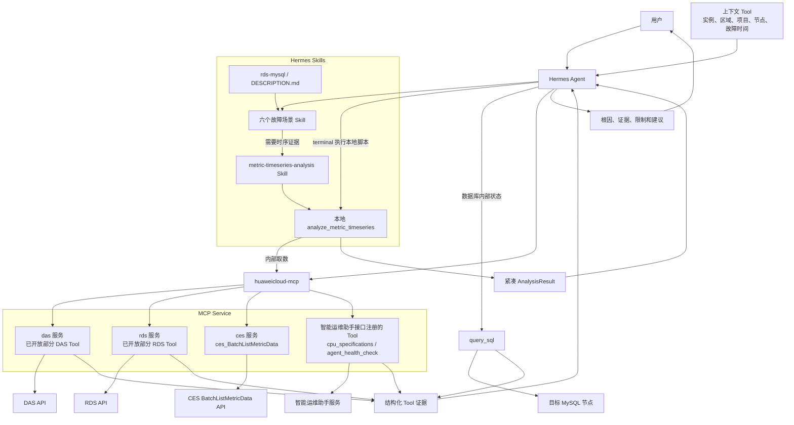
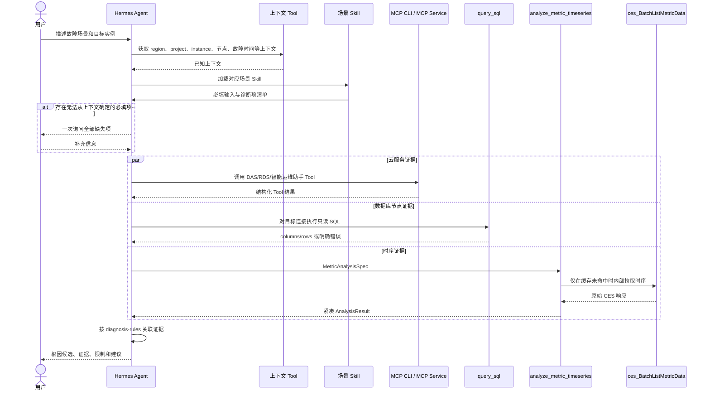
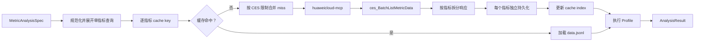
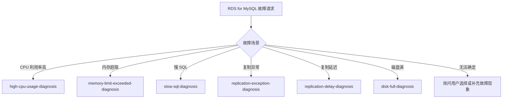
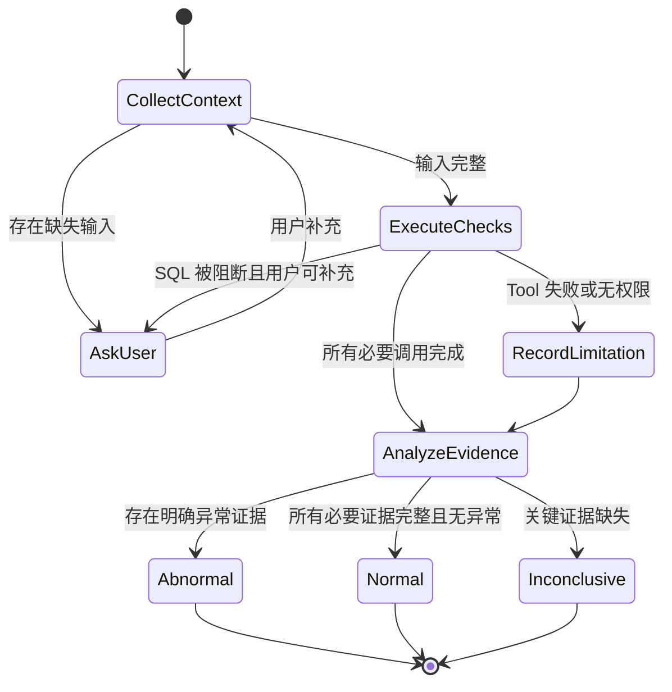

# RDS for MySQL 实时诊断 Skill 化实现设计

## 0. 文档定位

本文定义老版本实时诊断 Agent 迁移到 Hermes Agent 后的完整实现方案，作为 RDS for MySQL 实时诊断 Skill、通用时序分析 Tool 以及相关 MCP 接口的统一设计依据。

本文严格分为三部分：

1. **实时诊断 Skill 化整体设计**：说明迁移范围、系统分层、能力归属、六个故障场景和端到端流程。
2. **通用数据分析 Tool 与相关接口设计**：说明已经实现的时序分析 Tool、CES MCP 接口，以及智能运维助手服务需要新增并注册到 MCP Service 的接口边界。
3. **Hermes Agent 场景 Skill 设计**：说明 `skills/rds-mysql/` 的目录、六个场景 Skill、诊断项编排、输入收集、错误处理和结果输出。

CES 数据获取、缓存、DatasetStore 和各分析算法的代码级细节，以 [CES 时序数据与通用分析能力设计](./ces-timeseries-analysis-design-zh.md) 为准。本文只保留实时诊断编排所需的接口边界，不重复算法实现。

### 0.1 术语

| 名称 | 本文含义 |
| --- | --- |
| MCP Service | Hermes 通过 MCP CLI 访问的统一 MCP 服务端；其下按服务代码注册 `das`、`rds`、`ces` 等服务的 Tool |
| DAS/RDS 服务 | 已经挂载在 MCP Service 下的两个服务分类，目前只有部分云服务接口已注册为可调用 Tool |
| CES 服务 | 挂载在 MCP Service 下的 CES 服务分类，`ces_BatchListMetricData` 归属该服务，不归属数据分析能力 |
| 智能运维助手服务 | 老版本诊断项目所在的后端服务；负责实现 `cpu_specifications` 和 `agent_health_check` 对应的新接口，并将其注册到 MCP Service |
| 通用数据分析 Tool | 已经实现于 Hermes Skill 中的本地 `analyze_metric_timeseries`，不是独立的数据分析服务 |
| 场景 Skill | `skills/rds-mysql/` 下按故障场景拆分的 Agent 编排说明 |
| 诊断项 | 一个场景中用于验证某个根因假设的最小检查单元，例如 `CPU_USAGE`、`SLOW_SQL_INFO` |

---

# 第一部分：实时诊断 Skill 化整体设计

## 1. 需求背景

老版本实时诊断 Agent 使用 Python 代码同时完成诊断流程、云服务查询、数据库 SQL 查询、时序数据获取和数值分析。系统切换到 Hermes Agent 后，不再整体迁移旧诊断引擎，而是按职责拆分：

- 故障场景和根因检查顺序迁移为 Hermes 场景 Skill。
- 可跨数据库复用的数值分析逻辑迁移为通用数据分析 Tool。
- DAS、RDS 已经开放的能力通过 MCP CLI 直接复用。
- CES 时序数据通过 MCP Service 下的 `ces` 服务获取。
- 数据库内部状态通过 Hermes 插件已有的 `query_sql` Tool 查询。
- DAS/RDS 尚未提供的 `cpu_specifications` 和 `agent_health_check` 由智能运维助手服务新增接口，再注册到 MCP Service。

本次支持六个故障场景：

1. CPU 利用率高。
2. 内存超限。
3. 慢 SQL。
4. 复制异常。
5. 复制延迟。
6. 磁盘满。

## 2. 设计目标

- 在 Hermes 中恢复与老版本相同的六类实时故障诊断能力。
- 一个 Skill 只处理一个故障场景，避免场景规则相互干扰。
- Tool 名称、输入和输出必须能让 LLM 理解其业务含义。
- 不创建功能重叠的 Tool；已有 DAS/RDS/`query_sql` 能力必须复用。
- CES 原始 datapoints 不进入 LLM 上下文，也不在多个 Tool 之间由 LLM 搬运。
- 场景 Skill 只负责证据编排和根因判断，不实现数值算法。
- 用户输入或可信上下文不足时一次性询问全部缺失项，不允许反复试参。
- SQL 被白名单、安全规则、权限或节点可达性阻断时，不允许在证据不足的情况下给出确定性结论。
- 每个诊断结论都能追溯到 DAS、RDS、CES 分析、智能运维助手接口或 `query_sql` 的结构化证据。

## 3. 非目标

- 不迁移老版本完整的单体诊断 Agent 或 Pipeline 框架。
- 不新增一个覆盖所有场景的 `mysql_diagnose` 单体 Tool。
- 不重复实现 DAS/RDS 已经开放的接口。
- 不让场景 Skill 直接调用 `ces_BatchListMetricData`。
- 不让场景 Skill 管理时序缓存、DatasetStore、cache key 或淘汰策略。
- 不在本文设计 `cpu_specifications` 和 `agent_health_check` 的业务请求、响应字段；这两部分由其他 Agent 补充。

## 4. 总体架构

### 4.1 组件架构图



关键边界：

- MCP Service 是统一服务端，`das`、`rds` 和 `ces` 是其下的服务分类，不是三个独立 MCP Service。
- `analyze_metric_timeseries` 是 Hermes 本地 Tool，不存在独立“数据分析服务”。
- `ces_BatchListMetricData` 属于 `ces` 服务，只允许通用数据分析 Tool 在内部取数时使用。
- 场景 Skill 可以直接编排 DAS、RDS、智能运维助手和 `query_sql`，但不能读取 CES 原始 datapoints。

### 4.2 功能分层

| 层级 | 职责 | 不承担的职责 |
| --- | --- | --- |
| `rds-mysql` category | 描述 RDS for MySQL 实时诊断能力、边界和场景 Skill 列表 | 不执行具体诊断 |
| 场景 Skill | 收集输入、选择诊断项、调用能力、汇总证据和结论 | 不实现算法，不直接拉取 CES |
| 通用数据分析 Tool | 获取并缓存 CES 时序，执行 Profile，返回紧凑结果 | 不判断 MySQL 业务根因 |
| DAS/RDS Tool | 返回云服务控制面、SQL、会话、空间和实例信息 | 不实现重复的数据分析算法 |
| 智能运维助手 Tool | 补齐 DAS/RDS 当前没有的专有查询 | 不重复 DAS/RDS 已有能力 |
| `query_sql` | 连接指定数据库节点执行只读 SQL | 不代表其他未连接节点的状态 |

### 4.3 能力归属与无重叠约束

设计基线中的 MCP 服务清单：

| 服务代码 | 当前 Tool 数 | 服务边界 | 本次使用方式 |
| --- | ---: | --- | --- |
| `das` | 47 | SQL 开发运维、性能诊断、会话、慢 SQL 和空间分析 | 复用已开放的慢 SQL、会话、空间和 TOP 数据能力 |
| `rds` | 33 | RDS 实例生命周期、配置、日志、备份、规格和磁盘信息 | 复用 `ListInstances` 等已开放能力 |
| `ces` | 以实际注册为准 | 云监控指标查询 | 数据分析 Tool 内部调用 `ces_BatchListMetricData` |
| 智能运维助手服务代码 | 待接口设计 Agent 确认 | DAS/RDS 当前缺少的专有诊断查询 | 注册 `cpu_specifications`、`agent_health_check` 对应 Tool |

Tool 数量只表示当前注册规模，不作为 Skill 判断能力是否存在的依据。Skill 使用某个 Tool 前，必须以 MCP Service 返回的真实 Tool 名称和 schema 为准。

| 业务能力 | 唯一实现位置 | 调用方 |
| --- | --- | --- |
| 慢 SQL 模板 | DAS `ExportSlowSqlTemplatesDetails` | CPU、内存、慢 SQL Skill |
| 实时会话、慢会话 | DAS `ListProcesses` | CPU、内存、慢 SQL Skill |
| 只读实例规格和 CPU/内存容量 | RDS `ListInstances` | 复制延迟 Skill |
| 空间分布 | DAS `ListSpaceAnalysis` | 磁盘满 Skill |
| TOP 库表最近信息 | DAS 已有 TOP 数据 Tool，真实注册名称待环境确认 | 磁盘满 Skill |
| CPU 规格是否共享型 | 智能运维助手新增接口 | CPU、复制延迟 Skill |
| 非标参数 | 智能运维助手新增接口 | CPU、内存、慢 SQL、复制异常、复制延迟 Skill |
| 内存表、`performance_schema`、Query Cache、复制状态 | `query_sql` | 对应场景 Skill |
| 阈值频次、突增突降、分位数、趋势、预测、关联异常 | 本地 `analyze_metric_timeseries` | 对应场景 Skill |
| CES 原始时序获取 | MCP Service 下 `ces_BatchListMetricData` | 仅本地数据分析 Tool |

同一个业务问题不能再创建第二个同义 Tool。例如：

- 慢 SQL 模板必须复用 DAS，不再开放 `slow_sql_info` 后端接口。
- 主从复制状态能够通过目标节点 `query_sql` 获取时，不再开放同义复制状态接口。
- 数据分析只保留一个 `analyze_metric_timeseries` 入口，通过互斥的 Profile 表达不同算法。
- `interval_threshold_exceedance_detection` 只回答“整个区间是否至少一次越界”；现有滑动窗口 Profile 回答“滚动窗口内越界频次是否满足条件”，两者语义不得混用。

## 5. 场景与诊断项总览

| 场景 Skill | 诊断项 |
| --- | --- |
| CPU 利用率高 | `CPU_SPEC`、`CPU_USAGE`、`DISK_LATENCY`、`HIGH_CONCURRENCY_QPS`、`HIGH_CONCURRENCY_CONN`、`SLOW_SQL_INFO`、`AGENT_HEALTH_CHECK`、`SESSION_INFO` |
| 内存超限 | `MEMORY_USAGE`、`HIGH_CONCURRENCY_QPS`、`HIGH_CONCURRENCY_CONN`、`SLOW_SQL_INFO`、`AGENT_HEALTH_CHECK`、`MEMORY_TABLE_CHECK`、`PERFORMANCE_SCHEMA_CHECK`、`SESSION_INFO` |
| 慢 SQL | `SLOW_SQL_INFO`、`AGENT_HEALTH_CHECK`、`SESSION_INFO` |
| 复制异常 | `AGENT_HEALTH_CHECK`、`SHOW_SLAVE_STATUS`；按主实例和只读实例选择不同连接 |
| 复制延迟 | `CPU_SPEC`、`CPU_USAGE_TREND`、`LONG_TRANSACTION`、`AGENT_HEALTH_CHECK`、`DISK_LATENCY`、`QUERY_CACHE_CHECK`；只读实例分支额外执行 `CPU_MEM_CAPACITY` |
| 磁盘满 | `DISK_DISTRIBUTION`、`DISK_INCREASE_ABNORMAL`、`TOPDATA_RECENT` |

## 6. 标准诊断流程



执行规则：

1. 用户先描述场景和目标，Agent 使用上下文 Tool 获取可用的实例信息。
2. 上下文缺少 `region`、`project_id`、`instance_id`、目标节点、故障时间范围或 `period` 时，一次性向用户询问全部缺失项。
3. 用户使用自然语言表达时间，Skill 将其转换为毫秒时间戳；不得要求用户手工提供毫秒值。
4. `period` 是必填外部输入，优先取可信上下文，缺失时询问用户，不使用默认值。
5. 场景 Skill 默认执行该场景配置的全部诊断项；只有硬前置条件不满足时才跳过对应项，并记录限制。
6. 相互独立的诊断项可以并行执行；依赖前一步输出的诊断项必须串行。
7. Agent 只消费结构化结果，不把 CES 原始数据、全量日志或大量 SQL 文本放入上下文。

## 7. 输入、权限与证据规则

### 7.1 场景公共输入

| 输入 | 来源 | 缺失处理 |
| --- | --- | --- |
| 故障场景 | 用户描述或告警上下文 | 无法判断时询问用户选择六个场景之一 |
| `region` | 上下文 Tool，其次用户 | 一次询问 |
| `project_id` | 上下文 Tool，其次用户 | 一次询问 |
| `instance_id` | 上下文 Tool，其次用户 | 多实例时让用户选择，不猜测 |
| 目标节点/连接 | 上下文 Tool或 `list_database_info` | 主、只读节点不明确时询问 |
| 故障发生时间及分析范围 | 用户自然语言、上下文 Tool | 一次询问并转换为毫秒时间戳 |
| `period` | 上下文 Tool，其次用户 | 一次询问，不使用默认值 |

### 7.2 实例权限

智能运维助手服务新增接口必须满足：

- `project_id` 和 `instance_id` 位于 URL path。
- 接口使用调用者身份校验其是否有权访问该 `project_id` 下的 `instance_id`。
- path 中的实例与请求体、下游查询中的实例不一致时拒绝请求。
- 未授权返回明确的权限错误，不返回实例是否存在、配置值或其他敏感信息。
- MCP Tool 只转发经过校验的结果，不把认证凭据写入返回。

CES、DAS 和 RDS Tool 继续遵循对应云服务的鉴权模型。场景 Skill 不绕过服务鉴权。

### 7.3 `query_sql` 权限和阻断

`query_sql` 已经由 Hermes 插件提供，直接连接指定数据库执行只读 SQL。Skill 必须遵循：

- 先通过 `list_database_info` 或可信上下文确定 `connection_id` 及其 `readonly` 属性。
- 查询结果只代表当前连接节点，不能用主节点结果推断只读节点状态。
- SQL 被白名单、SQL 防火墙、安全 Hook 或只读策略拒绝时，不使用同义 SQL 反复尝试绕过。
- 数据库账号权限不足时，记录具体受阻诊断项，并一次性请求用户补充查询结果、选择有权限连接或处理权限。
- `SHOW SLAVE STATUS`、`SHOW REPLICA STATUS` 等命令无权限或无结果时，不得直接判定复制正常。
- Query Cache 变量不存在时，需要结合 MySQL 版本区分“不支持”与“未开启”，不能直接判定关闭。
- 关键 SQL 证据缺失时，最终状态必须是“无法确认”而不是“正常”。

现有 Tool 合约：

```text
list_database_info()
  -> instance_id、instance_name、region_id、project_id、database、readonly、connection_id

query_sql(connection_id, sql)
  -> success、columns、rows、affected_rows、duration_ms
```

各诊断项使用的 SQL 应写入对应场景的 `diagnosis-rules.md`，典型查询包括：

| 诊断项 | SQL 语义 |
| --- | --- |
| `MEMORY_TABLE_CHECK` | 从 `information_schema.TABLES` 查询 `ENGINE='MEMORY'` 的表 |
| `PERFORMANCE_SCHEMA_CHECK` | 查询 `performance_schema` 系统变量 |
| `QUERY_CACHE_CHECK` | 查询目标节点的 Query Cache 类型、大小等版本支持的变量 |
| `SHOW_SLAVE_STATUS` | 根据目标版本执行 `SHOW SLAVE STATUS` 或 `SHOW REPLICA STATUS` |

具体 SQL 必须保持只读，并以目标 MySQL 版本、账号权限和安全白名单允许范围为准。

## 8. 统一诊断结果

场景 Skill 最终面向用户输出以下语义，不要求再包装成新的单体 Tool：

```text
scenario             故障场景
target               实例和目标节点
diagnosis_status     abnormal | normal | inconclusive
summary              诊断摘要
root_causes          按证据强度排序的根因候选
evidence             每个诊断项的紧凑证据摘要及来源
recommendations      与已确认根因对应的处理建议
limitations          权限、数据缺失、节点不可达和接口失败
```

结论规则：

- `abnormal`：至少一个诊断项存在明确异常证据。
- `normal`：所有必要诊断项均成功执行且未发现异常。
- `inconclusive`：关键输入、权限或必要证据缺失，无法排除异常。
- 不把“Tool 调用失败”解释成“诊断项正常”。
- 不根据单条弱证据虚构唯一根因；多个根因同时成立时全部保留并排序。

---

# 第二部分：通用数据分析 Tool 与相关接口设计

## 9. 部署边界

本方案没有独立的数据分析服务。通用数据分析能力继续使用当前已经实现的形态：

```text
skills/metric-timeseries-analysis/analyze-metric-timeseries/
  SKILL.md
  references/
  scripts/analyze_metric_timeseries.py
  scripts/metric_timeseries_analysis/
```

Hermes Agent 根据通用分析 Skill 的说明，通过 `terminal` 调用本地脚本。脚本内部使用 `huaweicloud-mcp` 调用 MCP Service 下 `ces` 服务的 `ces_BatchListMetricData`，然后完成缓存、数据规范化和分析。

场景 Skill 不感知 CES 命令、缓存文件或原始响应，只依赖：

```text
MetricAnalysisSpec -> AnalysisResult
```

## 10. 数据分析能力迁移

### 10.1 已实现 Profile

| 当前 Profile | 老版本能力 | 唯一职责 | 状态 |
| --- | --- | --- | --- |
| `sliding_window_threshold_frequency_detection` | `SingleRowDataFrameSlidingWindowRouter` + 部分 `ParseResReadWriteLatency` | 判断滚动窗口内越过阈值的次数是否达到要求 | 已实现 |
| `spike_drop_detection` | `DetectAbnormalRange` | 对单指标执行统一的异常突增或突降检测 | 已实现 |
| `coincident_anomaly_detection` | `DetectAbnormalRange` + `ParseResHighConcurrencyQPS` 类关联判断 | 判断两个指标是否在故障前同一窗口内同时出现异常 | 已实现 |
| `median_p75_statistics` | `GetAbnormalRange` + `ParseResResourceNotEnough` | 平滑后计算中位数和 P75 | 已实现 |
| `rising_trend_detection` | `GetAbnormalTrend` + `ParseResCpuUsageTrend` | 根据相邻点上升/下降次数判断方向 | 已实现 |
| `trend_prediction` | `ProphetPredict` + `ParseResDiskUsage` | 使用 Prophet 预测未来 168 小时趋势 | 已实现 |

### 10.2 待新增 Profile

`LONG_TRANSACTION` 需要新增：

```text
interval_threshold_exceedance_detection
```

职责：判断一个指标在指定完整时间段内是否至少一次高于或低于阈值，不计算滚动窗口频次。

建议参数：

| 参数 | 必填 | 含义 |
| --- | --- | --- |
| `threshold` | 是 | 与每个数据点比较的阈值，由复制延迟 Skill 的 `diagnosis-rules.md` 提供 |
| `direction` | 否 | `above` 或 `below`，默认 `above` |

建议返回的 finding evidence：

```json
{
  "exceeded": true,
  "threshold": 10,
  "direction": "above",
  "hit_count": 3,
  "first_hit_time": 1784200000000,
  "last_hit_time": 1784200600000,
  "extreme_value": 21
}
```

该 Profile 不返回完整越界点列表。它与滑动窗口频次检测的边界如下：

| Profile | 回答的问题 |
| --- | --- |
| `interval_threshold_exceedance_detection` | 整个时间段内是否至少发生过一次越界 |
| `sliding_window_threshold_frequency_detection` | 某个滚动窗口内越界次数是否达到频次条件 |

### 10.3 已实现算法的兼容规则

- `sliding_window_threshold_frequency_detection` 使用 NumPy 生成阈值命中掩码，并通过卷积统计每个滚动窗口的命中次数；`threshold` 必填，`direction` 默认 `above`，`window_points` 默认 `3`，`min_frequency` 默认向上取整为窗口点数的一半。
- `spike_drop_detection` 沿用老版本 `DetectAbnormalRange`：先使用复制边界的均值平滑判断残差波动是否达到灵敏度，再使用中值平滑，基于残差和一阶差分的箱线图边界检测突增或突降。默认 `box_scale=3`、`direction=up`、`window_size=3600` 秒、`residual_sen=10`、`nonzero=false`。
- `coincident_anomaly_detection` 对两个指标分别复用相同突增突降检测器，只在两个指标都于闭区间 `[time_point-lookback_seconds, time_point]` 内发生异常时返回关联异常；默认回看 `1800` 秒。
- `median_p75_statistics` 使用 `ceil(smoothing_time/effective_period)` 计算基础窗口，再转换为不小于该值的奇数窗口；默认平滑时间 `900` 秒。序列两端按补零方式执行中值平滑，再对平滑序列计算中位数和 P75。
- `rising_trend_detection` 使用相邻点差值统计上升和下降次数。上升次数更多时判断为上升趋势，下降次数更多时判断为下降趋势，相同时判断为无明显趋势。
- `trend_prediction` 要求至少七天历史数据，按小时取平均后使用 `Prophet(growth="linear", changepoint_range=0.9)`，预测未来 `168` 小时且不返回完整预测点。

算法内部依赖 NumPy、Pandas 和 Prophet，调用方不传 DataFrame，也不直接调用算法类。

## 11. `analyze_metric_timeseries` 输入

公开 CLI：

```bash
python3 scripts/analyze_metric_timeseries.py \
  analyze --args '<MetricAnalysisSpec JSON>'
```

`--args` 接收 JSON 对象字符串，不是文件路径。场景 Skill 不导入内部 Python 类，也不使用 `python -c`。

### 11.1 LLM 可见字段

| 字段 | 必填 | 来源与含义 |
| --- | --- | --- |
| `region` | 是 | 上下文 Tool 或用户提供的区域 |
| `project_id` | 是 | 上下文 Tool 或用户提供的项目 ID |
| `metric.namespace` | 是 | 从通用分析 Skill 的数据库指标 reference 获取 |
| `metric.metric_name` | 是 | 指标 ID 数组；单指标 Profile 恰好一个，关联 Profile 恰好两个 |
| `metric.dimensions` | 是 | CES 定义的 `{name, value}` 数组，名称和顺序从指标 reference 获取 |
| `time_window.from` | 是 | Skill 将自然语言时间转换为毫秒时间戳 |
| `time_window.to` | 是 | Skill 将自然语言时间转换为毫秒时间戳 |
| `period` | 是 | 从可信上下文获取，缺失时询问用户；无默认值 |
| `analysis.profile` | 是 | 由场景 Skill 的诊断项规则选择 |
| `analysis.*` | 视 Profile | Profile 专属参数；可选参数使用实现默认值 |

不允许重新加入以下字段：

```text
goal
data_source
service_context
dataset_ref
```

`filter` 不由 LLM 传入，内部固定为 `average`。

`metric.metric_name` 数组中的指标共享 `region`、`project_id`、namespace、dimensions、time window、`period` 和 filter。共享条件不成立时，场景 Skill 必须拆成不同分析请求，不能把不同维度的指标强行放入一个数组。

### 11.2 指标 ID 与维度

数据库指标 ID、namespace 和 dimensions 统一维护在通用分析 Skill：

```text
references/ces-database-metric-parameters.zh-CN.md
references/rds-mysql-metric-catalog.zh-CN.md
```

场景 Skill 的 `diagnosis-rules.md` 只写诊断项要使用的指标语义和 Profile，不复制完整 CES 指标目录。Agent 在构造 `MetricAnalysisSpec` 前按通用分析 Skill 指引查阅上述 reference。

本次场景使用的主要指标包括：

| 指标语义 | reference 中的指标 ID |
| --- | --- |
| CPU 使用率 | `rds001_cpu_util` |
| 内存使用率 | `rds002_mem_util` |
| 活跃连接数 | `rds007_conn_active_count` |
| QPS | `rds008_qps` |
| 磁盘使用量 | `rds048_disk_used_size` |
| 硬盘读耗时 | `rds075_avg_disk_ms_per_read` |
| 硬盘写耗时 | `rds076_avg_disk_ms_per_write` |
| 长事务 | `rds_long_transaction` |

该表用于说明本次诊断映射，指标定义仍以通用 reference 为唯一来源。

## 12. `AnalysisResult` 输出

成功输出：

```json
{
  "success": true,
  "metric_name": ["rds001_cpu_util"],
  "profile": "median_p75_statistics",
  "summary": "Computed median and p75 statistics for the requested metric.",
  "findings": [],
  "statistics": {}
}
```

字段语义：

| 字段 | 含义 |
| --- | --- |
| `success` | 是否完成分析 |
| `metric_name` | 本次分析涉及的指标 ID，供 Agent 对应诊断项 |
| `profile` | 实际执行的分析算法 |
| `summary` | 可直接用于诊断证据摘要的自然语言结论 |
| `findings` | 结构化异常、统计或趋势证据；无发现时为空数组 |
| `statistics` | 统计类 Profile 的紧凑结果，可选 |
| `forecast` | 预测类 Profile 的紧凑结果，可选 |

LLM 不可见：

```text
原始 datapoints
CES 原始响应
dataset_ref
cache hit/miss
cache key
文件路径
hash 和字节数
trace_id
```

失败输出：

```json
{
  "success": false,
  "error": "missing_required_input",
  "message": "Missing required inputs: period. Collect all missing values before retrying.",
  "missing_fields": ["period"]
}
```

错误字段只有：

- `success`
- `error`
- `message`
- `missing_fields`，仅在缺少必填输入时存在
- 与特定错误直接相关的紧凑附加字段

不返回 `retryable`。Agent 根据错误代码执行固定动作：

| `error` | Agent 行为 |
| --- | --- |
| `missing_required_input` | 从上下文补充后，一次询问全部剩余缺失项；补齐前停止 |
| `invalid_request` | 报告具体非法字段；只按契约修正，不试探其他命令或类名 |
| `query_too_large` | 缩短时间范围或询问用户选择更大 `period` |
| `data_fetch_failed` | 停止该时序诊断项，保留其他证据并说明 CES 不可用 |
| `internal_error` | 返回统一消息 `Metric analysis failed unexpectedly`，真实异常仅写内部日志 |

## 13. CES MCP 接口

### 13.1 服务归属

`ces_BatchListMetricData` 注册在 MCP Service 的 `ces` 服务下：

```text
MCP Service
  └── ces
      └── ces_BatchListMetricData
```

它不挂在通用数据分析 Tool 或智能运维助手服务下。

### 13.2 调用格式

```bash
huaweicloud-mcp call ces_BatchListMetricData \
  --args '{
    "region": "cn-north-7",
    "project_id": "project-id",
    "metrics": [
      {
        "namespace": "SYS.RDS",
        "metric_name": "rds001_cpu_util",
        "dimensions": [
          {"name": "rds_cluster_id", "value": "instance-id"}
        ]
      }
    ],
    "from": 1784706014452,
    "to": 1784706064452,
    "period": "300",
    "filter": "average"
  }'
```

数据分析 Tool 根据 `MetricAnalysisSpec` 生成该参数，不允许场景 Skill 手工拼接。

### 13.3 CLI 返回结构

MCP CLI 的真实成功结果外层包含：

```text
tool
arguments
content
result
content_count
```

CES 业务数据从唯一的 `result.metrics[].datapoints[]` 解析。每个 datapoint 的数值字段取决于 `filter`；当前固定读取 `average`，时间字段为 `timestamp`。

### 13.4 CES 查询、存储与缓存



每个指标独立保存：

```text
raw_response.json
data.jsonl
metadata.json
```

即使一次 CES 请求获取多个指标，也必须在落盘前按指标拆分，每个指标使用独立 cache key 和 dataset。缓存只保存 CES dataset，不缓存分析结论。

每个实际 CES 请求必须满足：

```text
metrics_count <= 500
metrics_count * (to - from) / effective_period <= 3000
serialized_request_body <= 512KB
```

当 `period=1` 时，限制计算使用 60 秒的有效粒度。多指标合计超限时只拆分指标批次，不缩短单指标时间范围；单个指标仍超限时返回 `query_too_large`，由 Agent 请求缩短范围或选择更大的 `period`。

cache key 当前为：

```text
sha256(canonical normalized single-metric CES query)
```

纳入 project、region、namespace、metric name、dimensions、from/to、period、固定 filter 和版本字段。淘汰只在两种时机触发：

1. `cache get` 时进行 TTL 和完整性惰性淘汰。
2. `cache put` 后超出容量时先淘汰过期项，再按 LRU 淘汰。

不使用后台定时淘汰任务。

## 14. 智能运维助手服务新增接口

两个接口由其他 Agent 完成详细设计和实现。本文只保留与实时诊断编排相关的共同约束。

共同要求：

- `project_id` 和 `instance_id` 必须位于 URL path。
- 服务端必须校验当前用户是否有权操作该 `instance_id`。
- 接口注册为 MCP Tool 后，名称、description、输入和输出必须表达业务语义。
- 不与 DAS/RDS 已有 Tool 重复。
- 成功结果返回结构化事实，不直接替 Agent 输出最终故障根因。
- 失败结果区分参数错误、未授权、无权限、资源不存在、下游失败和内部错误。

### 14.1 `cpu_specifications`

> 预留给负责该接口的 Agent 补充：接口路径、权限动作、请求 schema、响应 schema、错误码、MCP Tool 名称和示例。

### 14.2 `agent_health_check`

> 预留给负责该接口的 Agent 补充：接口路径、权限动作、请求 schema、响应 schema、错误码、MCP Tool 名称和示例。

## 15. 已有 DAS/RDS Tool

MCP Tool 命名遵循 `{service_code}_{operation}`。以下名称按已知 Operation 推导，交付前必须使用真实环境的 Tool schema 再核对参数：

| 诊断能力 | 服务/API | MCP Tool | 备注 |
| --- | --- | --- | --- |
| 慢 SQL 模板 | DAS `ExportSlowSqlTemplatesDetails` | `das_ExportSlowSqlTemplatesDetails` | 供 CPU、内存和慢 SQL Skill 使用 |
| 实时会话、慢会话 | DAS `ListProcesses` | `das_ListProcesses` | 供 CPU、内存和慢 SQL Skill 使用 |
| 只读实例 CPU/内存容量 | RDS `ListInstances` | `rds_ListInstances` | 从实例规格和节点信息提取证据 |
| 磁盘空间分布 | DAS `ListSpaceAnalysis` | `das_ListSpaceAnalysis` | 供磁盘满 Skill 使用 |
| TOP 库表最近信息 | DAS TOP data 接口 | 真实 MCP Tool 名称待确认 | 不在 Skill 中虚构名称 |

相关 API：

- DAS `ExportSlowSqlTemplatesDetails`：<https://console.ulanqab.huawei.com/apiexplorer/#/openapi/DAS/doc?api=ExportSlowSqlTemplatesDetails>
- DAS `ListProcesses`：<https://console.ulanqab.huawei.com/apiexplorer/#/openapi/DAS/doc?api=ListProcesses>
- RDS `ListInstances`：<https://console.ulanqab.huawei.com/apiexplorer/#/openapi/RDS/debug?api=ListInstances>
- DAS `ListSpaceAnalysis`：<https://console.ulanqab.huawei.com/apiexplorer/#/openapi/DAS/doc?api=ListSpaceAnalysis>
- CES `BatchListMetricData`：<https://console.ulanqab.huawei.com/apiexplorer/#/openapi/CES/debug?api=BatchListMetricData&version=v1>
- DAS TOP data：`GET https://das.{region}.myhuaweicloud.com/v3/{project_id}/instances/{instance_id}/space/get-top-data?engine_type=mysql&...`

可公开访问的官方参考：

- CES 批量查询监控数据：<https://support.huaweicloud.com/api-ces/ces_03_0034.html>
- RDS 查询数据库实例列表：<https://support.huaweicloud.com/intl/zh-cn/api-rds/rds_01_0004.html>
- DAS 导出慢 SQL 模板：<https://support.huaweicloud.com/intl/en-us/api-das/das_01_0054.html>
- DAS 查询空间分析：<https://support.huaweicloud.com/api-das/das_01_0039.html>

---

# 第三部分：Hermes Agent 场景 Skill 设计

## 16. Skill 目录

service-category 确定为 `rds-mysql`：

```text
skills/
  rds-mysql/
    DESCRIPTION.md
    DESCRIPTION.zh-CN.md
    high-cpu-usage-diagnosis/
      SKILL.md
      SKILL.zh-CN.md
      references/
        diagnosis-rules.md
    memory-limit-exceeded-diagnosis/
      SKILL.md
      SKILL.zh-CN.md
      references/
        diagnosis-rules.md
    slow-sql-diagnosis/
      SKILL.md
      SKILL.zh-CN.md
      references/
        diagnosis-rules.md
    replication-exception-diagnosis/
      SKILL.md
      SKILL.zh-CN.md
      references/
        diagnosis-rules.md
    replication-delay-diagnosis/
      SKILL.md
      SKILL.zh-CN.md
      references/
        diagnosis-rules.md
    disk-full-diagnosis/
      SKILL.md
      SKILL.zh-CN.md
      references/
        diagnosis-rules.md
```

没有确定性辅助逻辑时不创建空 `scripts/`。场景 Skill 不复制通用数据分析代码。

### 16.1 `DESCRIPTION.md`

category description 同时说明：

- 能做什么：诊断 RDS for MySQL 的六类实时故障。
- 什么时候使用：用户明确报告六类场景之一，或上下文告警可映射到其中一个场景时。
- 边界：不诊断其他数据库服务，不替代 DAS/RDS 控制面操作，不直接调用 CES。
- 场景路由：将用户请求映射到唯一场景 Skill。

### 16.2 场景 `SKILL.md`

每个 `SKILL.md` 正文保持短小，只包含：

1. 适用触发条件。
2. 执行前必须确认的上下文。
3. 诊断项执行顺序和依赖关系。
4. 何时查阅 `references/diagnosis-rules.md`。
5. Tool 失败、权限不足和证据缺失时的停止规则。
6. 最终结论必须包含的内容。

算法参数、指标目录、CES 请求格式和缓存实现不写入场景 `SKILL.md`。

### 16.3 `diagnosis-rules.md`

每个场景独立维护自己的业务规则，至少包含：

| 字段 | 含义 |
| --- | --- |
| `check_item` | 诊断项常量语义 |
| `capability` | 调用 DAS、RDS、智能运维助手、`query_sql` 或通用分析 |
| `metric_semantics` | 使用哪个指标语义；准确 ID 到通用指标 reference 查询 |
| `profile` | 使用哪个分析 Profile |
| `required_options` | 只有无通用默认值的业务参数，例如 `threshold` |
| `abnormal_condition` | 什么结果构成异常证据 |
| `dependencies` | 前置诊断项或目标节点要求 |
| `failure_policy` | 失败时继续、询问用户或将场景标记为无法确认 |

`period` 不放在规则文件中，它是每次诊断必须从上下文或用户获得的输入。Profile 已有默认值的参数不在各场景重复配置。

## 17. Skill 路由



一个请求只加载一个主场景 Skill。诊断过程中发现其他场景证据时，可以在结论中提示，但不自动切换并重新执行另一整套 Skill，除非用户确认扩大诊断范围。

## 18. CPU 利用率高 Skill

目录：`high-cpu-usage-diagnosis/`

原诊断项映射：

```text
cpu_health_check_history = {
  CPU_SPEC,
  CPU_USAGE,
  DISK_LATENCY,
  HIGH_CONCURRENCY_QPS,
  HIGH_CONCURRENCY_CONN,
  SLOW_SQL_INFO,
  AGENT_HEALTH_CHECK,
  SESSION_INFO
}
```

| 诊断项 | 能力来源 | 编排方式 | 异常证据 |
| --- | --- | --- | --- |
| `CPU_SPEC` | 智能运维助手 Tool | 查询实例 CPU 规格是否共享型 | 接口返回共享型或资源隔离能力不足 |
| `CPU_USAGE` | `median_p75_statistics` | 分析 CPU 使用率指标 | P75/中位数满足场景规则中的资源不足条件 |
| `DISK_LATENCY` | `sliding_window_threshold_frequency_detection` | 分别分析读耗时和写耗时指标 | 任一指标在滑动窗口内高于规则阈值达到频次条件 |
| `HIGH_CONCURRENCY_QPS` | `coincident_anomaly_detection` | 一次传 CPU 使用率和 QPS 两个指标，故障时间写入 `time_point` | 故障前默认 30 分钟内两个指标均出现突增 |
| `HIGH_CONCURRENCY_CONN` | `coincident_anomaly_detection` | 一次传 CPU 使用率和活跃连接数两个指标 | 故障前默认 30 分钟内两个指标均出现突增 |
| `SLOW_SQL_INFO` | DAS 慢 SQL 模板 Tool | 查询故障窗口内 SQL 模板 | 存在高频或高耗时模板 |
| `AGENT_HEALTH_CHECK` | 智能运维助手 Tool | 查询非标配置 | 返回与 CPU 异常相关的非标配置 |
| `SESSION_INFO` | DAS 会话 Tool | 查询实时会话和慢会话 | 存在异常活跃会话、慢会话或集中来源 |

根因输出不得只说“CPU 高”。必须指出 CPU 规格、磁盘延迟、高 QPS、高连接、慢 SQL、非标配置或异常会话中的已验证原因；均无异常时才给出未发现已知根因。

## 19. 内存超限 Skill

目录：`memory-limit-exceeded-diagnosis/`

原诊断项映射：

```text
memory_health_check_history = {
  MEMORY_USAGE,
  HIGH_CONCURRENCY_QPS,
  HIGH_CONCURRENCY_CONN,
  SLOW_SQL_INFO,
  AGENT_HEALTH_CHECK,
  MEMORY_TABLE_CHECK,
  PERFORMANCE_SCHEMA_CHECK,
  SESSION_INFO
}
```

| 诊断项 | 能力来源 | 编排方式 | 异常证据 |
| --- | --- | --- | --- |
| `MEMORY_USAGE` | `median_p75_statistics` | 分析内存使用率指标 | P75/中位数满足场景规则中的超限条件 |
| `HIGH_CONCURRENCY_QPS` | `coincident_anomaly_detection` | 内存使用率与 QPS 关联分析 | 故障前两个指标均突增 |
| `HIGH_CONCURRENCY_CONN` | `coincident_anomaly_detection` | 内存使用率与活跃连接数关联分析 | 故障前两个指标均突增 |
| `SLOW_SQL_INFO` | DAS 慢 SQL模板 Tool | 查询故障窗口内 SQL 模板 | 高耗时 SQL 可能长期占用内存或连接 |
| `AGENT_HEALTH_CHECK` | 智能运维助手 Tool | 查询非标配置 | 返回内存相关非标配置 |
| `MEMORY_TABLE_CHECK` | `query_sql` | 查询当前连接节点是否存在 MEMORY 引擎表 | 存在内存表并占用显著资源 |
| `PERFORMANCE_SCHEMA_CHECK` | `query_sql` | 查询 `performance_schema` 状态 | 开启且场景规则认为其额外开销相关，或配置异常 |
| `SESSION_INFO` | DAS 会话 Tool | 查询实时会话和慢会话 | 存在大量活跃/慢会话 |

`MEMORY_TABLE_CHECK` 和 `PERFORMANCE_SCHEMA_CHECK` 只使用目标节点结果。查询被阻断时，内存相关配置根因必须标记为未确认。

## 20. 慢 SQL Skill

目录：`slow-sql-diagnosis/`

原诊断项映射：

```text
slow_sql_diagnosis = {
  SLOW_SQL_INFO,
  AGENT_HEALTH_CHECK,
  SESSION_INFO
}
```

| 诊断项 | 能力来源 | 编排方式 | 异常证据 |
| --- | --- | --- | --- |
| `SLOW_SQL_INFO` | DAS 慢 SQL 模板 Tool | 获取故障窗口 SQL 模板并按规则判断高频、高平均耗时或高总耗时 | 存在满足规则的模板 |
| `AGENT_HEALTH_CHECK` | 智能运维助手 Tool | 查询会导致 SQL 退化的非标配置 | 返回相关非标参数 |
| `SESSION_INFO` | DAS 会话 Tool | 查询当前慢会话和实时执行情况 | 对应模板仍在运行、阻塞或大量并发 |

如果 DAS 慢 SQL 数据不可用，不能仅凭当前会话断言历史慢 SQL 根因。最终状态应为 `inconclusive`，并说明缺失的历史证据。

## 21. 复制异常 Skill

目录：`replication-exception-diagnosis/`

主实例分支：

```text
primary_standby_replication_exception_realtime = {
  AGENT_HEALTH_CHECK,
  SHOW_SLAVE_STATUS
}
```

只读实例分支：

```text
primary_standby_replication_exception_realtime_readonly = {
  AGENT_HEALTH_CHECK,
  SHOW_SLAVE_STATUS
}
```

| 诊断项 | 能力来源 | 编排方式 | 异常证据 |
| --- | --- | --- | --- |
| `AGENT_HEALTH_CHECK` | 智能运维助手 Tool | 查询复制相关非标配置 | 返回可能导致复制异常的参数 |
| `SHOW_SLAVE_STATUS` | `query_sql` | 根据分支选择主实例或只读实例连接，执行对应版本支持的复制状态查询 | IO/SQL 线程异常、错误码、错误消息或复制状态不一致 |

节点规则：

- 必须确认实际连接的是本次要检查的节点。
- 主实例查询结果不能替代只读实例结果。
- 账号没有复制状态权限时，不得返回“复制正常”。
- 命令无结果时要结合节点角色和 MySQL 版本判断，不把空结果直接视为正常。

## 22. 复制延迟 Skill

目录：`replication-delay-diagnosis/`

基础分支：

```text
readonly_instance_replication_delay_history = {
  CPU_SPEC,
  CPU_USAGE_TREND,
  LONG_TRANSACTION,
  AGENT_HEALTH_CHECK,
  DISK_LATENCY,
  QUERY_CACHE_CHECK
}
```

只读实例分支：

```text
readonly_instance_replication_delay_history_readonly = {
  CPU_MEM_CAPACITY,
  CPU_SPEC,
  CPU_USAGE_TREND,
  LONG_TRANSACTION,
  AGENT_HEALTH_CHECK,
  DISK_LATENCY,
  QUERY_CACHE_CHECK
}
```

| 诊断项 | 能力来源 | 编排方式 | 异常证据 |
| --- | --- | --- | --- |
| `CPU_MEM_CAPACITY` | RDS `ListInstances` | 只读实例分支查询实例规格和节点容量 | CPU/内存规格不足以承载当前负载 |
| `CPU_SPEC` | 智能运维助手 Tool | 查询 CPU 是否共享型 | 共享型规格可能导致资源争抢 |
| `CPU_USAGE_TREND` | `rising_trend_detection` | 分析 CPU 使用率相邻点趋势 | 上升次数多于下降次数 |
| `LONG_TRANSACTION` | 待新增 `interval_threshold_exceedance_detection` | 分析 `rds_long_transaction` 是否在时间段内超过规则阈值 | 至少一个数据点越过阈值 |
| `AGENT_HEALTH_CHECK` | 智能运维助手 Tool | 查询复制相关非标配置 | 返回相关非标参数 |
| `DISK_LATENCY` | `sliding_window_threshold_frequency_detection` | 分别分析读、写耗时 | 读或写耗时高于阈值达到窗口频次 |
| `QUERY_CACHE_CHECK` | `query_sql` | 连接实际目标节点查询 Query Cache 变量 | 目标版本支持 Query Cache 且其配置满足异常规则 |

`LONG_TRANSACTION` 在新增 Profile 完成前属于明确的能力缺口。Skill 不得用其他 Profile 猜测替代，也不得跳过后仍声称复制延迟根因已完整排查。

## 23. 磁盘满 Skill

目录：`disk-full-diagnosis/`

原诊断项映射：

```text
disk_health_check_history = {
  DISK_DISTRIBUTION,
  DISK_INCREASE_ABNORMAL,
  TOPDATA_RECENT
}
```

| 诊断项 | 能力来源 | 编排方式 | 异常证据 |
| --- | --- | --- | --- |
| `DISK_DISTRIBUTION` | DAS `ListSpaceAnalysis` | 查询实例空间分布 | 某数据库、表或对象占用主要空间 |
| `DISK_INCREASE_ABNORMAL` | `trend_prediction` | 使用至少七天的磁盘使用量历史预测未来 168 小时 | 预测持续增长并将在风险窗口达到容量边界 |
| `TOPDATA_RECENT` | DAS TOP 数据 Tool | 查询最近增长或占用靠前的库表 | TOP 对象与空间分布、增长趋势相互印证 |

Prophet 可能产生不符合指标物理范围的预测值。当前实现尚未裁剪负预测值，因此磁盘 Skill 不得把负值解释为真实磁盘用量；后续应在分析能力中增加指标物理下界约束，并在结果中保留模型不确定性。历史跨度不足七天时，`trend_prediction` 返回数据不足，不得生成预测结论。

## 24. Tool 调用与错误状态机



禁止行为：

- 缺少参数后用不同示例值反复调用 Tool。
- 使用错误的 Python 导入、Profile 类名或临时脚本绕过公开入口。
- SQL 被拦截后更换同义语句尝试绕过安全控制。
- 把 Tool 错误、空结果或权限不足当成正常证据。
- 根据 master 查询结果推断 readonly 节点配置。
- 把 CES 原始 datapoints 粘贴到 prompt、Tool 参数或最终回答。

## 25. 场景 Skill 验收标准

### 25.1 结构验收

- `skills/rds-mysql/DESCRIPTION.md` 能准确路由六个场景。
- 六个 Skill 的 frontmatter `description` 同时说明“做什么”和“什么时候使用”。
- 每个 Skill 只有本场景诊断项，不存在重复场景 Skill。
- 每个场景包含独立 `references/diagnosis-rules.md`。
- 场景 Skill 不复制 CES、缓存和算法实现。

### 25.2 行为验收

- 上下文缺少多个字段时，Agent 一次询问全部缺失项。
- `period` 缺失时询问用户，不使用默认值。
- CPU、内存高并发诊断一次传入两个指标完成关联分析。
- 多指标 CES 返回会拆成单指标 dataset 和缓存。
- 复制异常和 Query Cache 检查连接正确目标节点。
- SQL 白名单、权限或安全 Hook 阻断时输出 `inconclusive`，不直接诊断。
- 任何最终结论都包含证据来源和限制。
- 原始 CES 数据不进入 LLM 上下文。

### 25.3 回归用例

至少覆盖：

1. CPU 高且 QPS 同期突增。
2. CPU 高但 QPS、活跃连接均无异常。
3. 内存超限且存在 MEMORY 表。
4. `query_sql` 无权限查询 `performance_schema`。
5. 慢 SQL 历史数据不可用但当前存在慢会话。
6. 主实例与只读实例复制状态不一致。
7. 复制延迟且长事务指标发生阈值越界。
8. 复制延迟但 `LONG_TRANSACTION` Profile 尚未部署。
9. 磁盘使用量历史不足七天。
10. CES 多指标部分缓存命中。
11. CES 查询超过单指标 3000 点限制。
12. 智能运维助手接口返回实例未授权。

## 26. 实施计划与当前状态

| 工作项 | 当前状态 | 交付要求 |
| --- | --- | --- |
| 通用时序分析 Tool 基础框架 | 已实现 | 保持现有公开 CLI 和结果契约 |
| 六个现有 Profile | 已实现 | 继续使用当前测试覆盖 |
| `interval_threshold_exceedance_detection` | 待实现 | 补充代码、CLI help、reference 和测试 |
| Prophet 指标物理下界约束 | 待实现 | 磁盘等非负指标的预测结果不得暴露负物理值 |
| CES MCP Tool 注册到 `ces` 服务 | 待真实环境确认 | Tool 名称固定为 `ces_BatchListMetricData`，验证真实 schema |
| 智能运维助手 `cpu_specifications` | 由其他 Agent 设计 | 完成接口、权限校验和 MCP 注册 |
| 智能运维助手 `agent_health_check` | 由其他 Agent 设计 | 完成接口、权限校验和 MCP 注册 |
| DAS/RDS Tool schema 盘点 | 待实施 | 固化真实 Tool 名称、必填参数和结果字段 |
| TOP 数据 Tool 名称确认 | 待实施 | 在磁盘 Skill 中使用真实注册名称 |
| 六个 `rds-mysql` 场景 Skill | 待实施 | 按本文第三部分落地 |
| 场景业务阈值迁移 | 待实施 | 写入各场景 `diagnosis-rules.md`，不得由 LLM 推断 |
| 端到端故障案例验证 | 待实施 | 覆盖第 25.3 节用例 |

## 27. 与现有代码的对应关系

| 设计能力 | 当前代码位置 |
| --- | --- |
| 分析 CLI | `skills/metric-timeseries-analysis/analyze-metric-timeseries/scripts/analyze_metric_timeseries.py` |
| `MetricAnalysisSpec` | `scripts/metric_timeseries_analysis/contracts/spec.py` |
| `AnalysisResult` | `scripts/metric_timeseries_analysis/contracts/result.py` |
| Profile 定义和默认参数 | `scripts/metric_timeseries_analysis/analysis/profile_catalog.py` |
| 单指标突增突降 | `scripts/metric_timeseries_analysis/analysis/profiles/spike_drop.py` |
| 双指标关联异常 | `scripts/metric_timeseries_analysis/analysis/profiles/coincident_anomaly.py` |
| 中位数/P75 | `scripts/metric_timeseries_analysis/analysis/profiles/median_p75.py` |
| 持续趋势 | `scripts/metric_timeseries_analysis/analysis/profiles/rising_trend.py` |
| Prophet 预测 | `scripts/metric_timeseries_analysis/analysis/profiles/trend_prediction.py` |
| CES MCP CLI Adapter | `scripts/metric_timeseries_analysis/ces/mcp_cli_fetcher.py` |
| 多指标批量规划和拆分 | `scripts/metric_timeseries_analysis/ces/batch_planner.py`、`response_splitter.py` |
| DatasetStore 和缓存 | `scripts/metric_timeseries_analysis/cache/`、`service/dataset_resolver.py` |
| 公共输入输出说明 | `references/analysis-contract.zh-CN.md` |
| RDS MySQL 指标目录 | `references/rds-mysql-metric-catalog.zh-CN.md` |

当前代码尚不存在 `skills/rds-mysql/` 六个场景 Skill，也尚未实现 `interval_threshold_exceedance_detection`。本文描述的是本次迁移的目标设计，不把尚未完成的内容标记为已实现。
